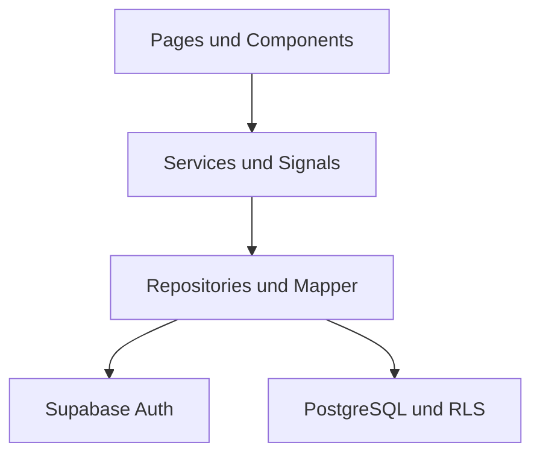

<div align="center">

# JOIN

### Kanban Project Management Tool

Eine responsive Fullstack-Anwendung zur strukturierten Planung, Zuweisung und
Bearbeitung von Aufgaben im Team.

<br>

[](#tech-stack)
[](#tech-stack)
[](#tech-stack)
[](#tech-stack)

[](#qualitätssicherung)
[](#qualitätssicherung)
[](#responsive-design)
[](#team-und-workflow)

<br>

[Über das Projekt](#über-das-projekt) ·
[Features](#features) ·
[Tech Stack](#tech-stack) ·
[Installation](#lokale-einrichtung) ·
[Dokumentation](#projektdokumentation)

</div>

---

## Über das Projekt

**Join** ist eine moderne Kanban-Anwendung zur gemeinsamen Organisation von
Aufgaben. Tasks lassen sich erstellen, bearbeiten, priorisieren, Kontakten
zuweisen und per Drag-and-drop zwischen verschiedenen Bearbeitungsständen
verschieben.

Das Projekt wurde von vier Entwicklern als Angular-Gruppenprojekt in drei
Sprints umgesetzt. Das Frontend ist als Single-Page-Application aufgebaut und
verwendet Supabase für Authentifizierung, PostgreSQL-Datenhaltung und
serverseitige Zugriffsregeln.

| Projektinformation | Stand |
| --- | --- |
| Projekttyp | Fullstack-Gruppenprojekt |
| Vorgehensmodell | Scrum in drei Sprints |
| Frontend | Angular Single-Page-Application |
| Backend | Supabase Auth und PostgreSQL |
| State Management | Angular Signals und RxJS |
| Qualitätssicherung | 214 Unit-Tests in 23 Testdateien |
| Zielgeräte | Smartphone, Tablet und Desktop |
| Designgrundlage | [Join Figma Design](https://www.figma.com/design/3qlJ22yFozngW2gdOfczMe/Join-Version-1?node-id=71348-10337) |

## Features

### Authentifizierung und Zugriff

- Registrierung mit E-Mail und Passwort
- verpflichtende Bestätigung der Datenschutzerklärung
- E-Mail-Bestätigung über Supabase Auth
- Login, Logout und Session-Wiederherstellung
- anonymer Gastzugang über eine echte Supabase-Session
- geschützte interne Routen durch Angular Guards
- verständliche UI-Meldungen für technische Auth-Fehler
- Relation zwischen authentifizierten Benutzern und Kontakten

### Board und Aufgaben

- Kanban-Board mit `To Do`, `In Progress`, `Await Feedback` und `Done`
- Drag-and-drop mit persistierter Status- und Positionsänderung
- Erstellen, Bearbeiten und Löschen von Tasks
- Prioritäten, Kategorien und Fälligkeitsdatum
- Subtasks mit Fortschrittsanzeige
- Zuweisung mehrerer Kontakte
- Suche nach Tasks
- responsive Taskkarten und Detaildialoge
- Loading-, Error- und Empty-States

### Kontakte

- alphabetisch sortierte Kontaktliste
- Erstellen, Bearbeiten und Löschen von Kontakten
- Detailansicht mit Avatar, Initialen und Farbbadge
- Validierung für Namen, E-Mail-Adressen und Telefonnummern
- Relation zu authentifizierten Benutzern
- optimierte Ansichten für Desktop, Tablet und Mobile

### Weitere Bereiche

- Summary-Dashboard mit Aufgabenkennzahlen
- zentrale Add-Task-Seite
- Hilfe, Datenschutzerklärung und Impressum
- Desktop-Sidebar und mobile Navigation
- tastaturbedienbare Formulare, Dialoge und Interaktionen
- konsistente Rückmeldungen bei Lade-, Fehler- und Erfolgszuständen

## Tech Stack

Der Tech-Stack umfasst das vollständige Angular-Frontend, die
Supabase-Anbindung sowie alle zusätzlich installierten Entwicklungs- und
Testpakete.

| Bereich | Technologie | Einsatz |
| --- | --- | --- |
| Framework | Angular 21 | Standalone Components, Routing und Forms |
| Sprache | TypeScript 5.9 | typisierte Anwendungslogik |
| Styling | SCSS | komponentenbasierte responsive Styles |
| State Management | Angular Signals, RxJS | reaktiver Anwendungszustand |
| UI-Interaktion | Angular CDK | Drag-and-drop |
| Backend | Supabase | API, Authentifizierung und Datenzugriff |
| Datenbank | PostgreSQL | persistente relationale Datenhaltung |
| Sicherheit | Grants und Row Level Security | serverseitige Zugriffskontrolle |
| Tests | Vitest, jsdom | Unit- und Integrationstests |
| Tooling | Angular CLI, npm, Prettier | Entwicklung, Build und Formatierung |
| Versionsverwaltung | Git, GitHub | Branches, Pull Requests und Reviews |
| Entwicklung | Visual Studio Code, CLI | lokale Entwicklungsumgebung |

### Verwendete Versionen

```text
Angular CLI: 21.2.18
Angular:     21.2.x
TypeScript:  5.9.x
Node.js:     24.14.0
npm:         11.9.0
```

### Installierte Pakete

Die folgende Liste entspricht dem final verwendeten `package.json`-Stand.

<details>
<summary><strong>Dependencies anzeigen</strong></summary>

<br>

| Paket | Version | Verwendung |
| --- | --- | --- |
| `@angular/cdk` | `^21.2.14` | Drag-and-drop und CDK-Hilfsfunktionen |
| `@angular/common` | `^21.2.0` | Angular-Direktiven und gemeinsame APIs |
| `@angular/compiler` | `^21.2.0` | Angular-Template-Compiler |
| `@angular/core` | `^21.2.0` | Angular-Kernfunktionen und Signals |
| `@angular/forms` | `^21.2.0` | Reactive Forms und Validierung |
| `@angular/platform-browser` | `^21.2.0` | Browser-Plattform |
| `@angular/router` | `^21.2.0` | Routing und Navigation |
| `@supabase/supabase-js` | `^2.110.0` | Authentifizierung und Datenbankzugriff |
| `rxjs` | `~7.8.0` | reaktive Datenverarbeitung |
| `tslib` | `^2.8.1` | TypeScript-Laufzeithelfer |

</details>

<details>
<summary><strong>DevDependencies anzeigen</strong></summary>

<br>

| Paket | Version | Verwendung |
| --- | --- | --- |
| `@angular/build` | `^21.2.18` | Angular-Build-System |
| `@angular/cli` | `^21.2.18` | Angular CLI |
| `@angular/compiler-cli` | `^21.2.0` | Angular-AOT-Kompilierung |
| `jsdom` | `^29.1.1` | simulierte Browserumgebung für Tests |
| `prettier` | `^3.8.1` | Codeformatierung |
| `typescript` | `~5.9.2` | TypeScript-Compiler |
| `vitest` | `^4.1.10` | Unit-Test-Framework |

</details>

Zusätzlich zum Angular-Grundgerüst wurden insbesondere folgende Pakete für die
Projektfunktionen ergänzt:

```bash
npm install @angular/cdk@^21.2.14
npm install @supabase/supabase-js@^2.110.0
npm install --save-dev vitest@^4.1.10 jsdom@^29.1.1
```

Für eine reproduzierbare Installation wird die vorhandene `package-lock.json`
mit `npm ci` verwendet.

## Architektur

Join trennt Darstellung, Anwendungszustand und Datenzugriff klar voneinander.
Components greifen nicht direkt auf Supabase zu.



| Ebene | Verantwortung |
| --- | --- |
| Pages und Components | Darstellung und Benutzerinteraktion |
| Services | reaktiver Zustand, Use Cases und Fehlerstatus |
| Repositories | gekapselte Kommunikation mit Supabase |
| Mapper | Übersetzung externer Daten in Domain-Modelle |
| Guards | clientseitige Steuerung geschützter Navigation |
| Supabase Auth | Benutzer, Sessions und Authentifizierung |
| PostgreSQL, Grants und RLS | Datenhaltung und serverseitige Sicherheit |

Die zentralen Datenbereiche umfassen Kontakte, Tasks, Subtasks,
Kontaktzuweisungen, Taskpositionen und die Relation zwischen Kontakten und
Auth-Benutzern.

> [!IMPORTANT]
> Ein Angular Guard schützt die Navigation, ist aber keine Sicherheitsgrenze.
> Der tatsächliche Datenzugriff wird über PostgreSQL-Grants und Row Level
> Security abgesichert.

## Responsive Design

Die Benutzeroberfläche basiert auf dem vorgegebenen Figma-Design und wurde für
Smartphone, Tablet und Desktop umgesetzt.

Besonderer Fokus liegt auf:

- stabilen Layouts ohne horizontalen Page-Scroll
- getrennten Scrollbereichen in Listen und Dialogen
- mobiler Navigation und touchfreundlichen Interaktionen
- sichtbaren und erreichbaren Dialogaktionen
- konsistenten Hover-, Focus-, Active-, Error- und Disabled-Zuständen
- responsiven Formularen, Dropdowns, Taskkarten und Detailansichten
- Tastaturbedienung und semantisch sinnvollen ARIA-Zuständen

## Lokale Einrichtung

### Voraussetzungen

- Node.js 24
- npm 11
- Git
- ein konfiguriertes Supabase-Projekt

### 1. Repository klonen

```bash
git clone https://github.com/nico-leitz/Join.git
cd Join
```

### 2. Abhängigkeiten installieren

```bash
npm ci
```

### 3. Environment konfigurieren

Die projektspezifischen Supabase-Werte werden lokal in folgenden Dateien
bereitgestellt:

```text
src/environments/environment.ts
src/environments/environment.development.ts
```

Beispiel:

```typescript
export const environment = {
  production: false,
  supabaseUrl: 'YOUR_SUPABASE_PROJECT_URL',
  supabaseAnonKey: 'YOUR_SUPABASE_ANON_KEY',
};
```

Im Frontend ist ausschließlich der öffentliche Supabase-`anon`-Key zulässig.
Der `service_role`-Key umgeht RLS und darf niemals in Angular, GitHub oder ein
Browser-Bundle gelangen.

### 4. Supabase vorbereiten

Vor dem ersten vollständigen Start müssen die versionierten SQL-Migrationen auf
das Supabase-Projekt angewendet werden.

Anschließend sind zu prüfen:

- Tabellen, Constraints, Fremdschlüssel und Indizes
- Auth-Trigger und Kontaktrelation
- Grants und RLS-Policies
- E-Mail-Provider und E-Mail-Bestätigung
- aktivierte Anonymous Sign-ins für den Gastzugang
- Site URL und erlaubte Redirect-URLs

### 5. Entwicklungsserver starten

```bash
npm start
```

Die Anwendung ist standardmäßig unter
[`http://localhost:4200`](http://localhost:4200) erreichbar.

## Verfügbare Befehle

| Befehl | Zweck |
| --- | --- |
| `npm ci` | Abhängigkeiten reproduzierbar aus dem Lockfile installieren |
| `npm start` | lokalen Entwicklungsserver starten |
| `npm run watch` | Development-Build bei Änderungen aktualisieren |
| `npm test -- --watch=false` | vollständigen einmaligen Testlauf ausführen |
| `npm run build` | optimierten Produktions-Build erzeugen |
| `npm run ng -- <command>` | lokale Angular CLI ausführen |
| `git diff --check` | Whitespace-Fehler im Diff prüfen |
| `git status --short` | Arbeitsstand kompakt kontrollieren |

## Qualitätssicherung

Final geprüfter Stand vom **31. Juli 2026**:

| Prüfung | Ergebnis |
| --- | ---: |
| Testdateien | `23 passed` |
| Unit-Tests | `214 passed` |
| Produktions-Build | erfolgreich |
| Build-Error-Budgets | eingehalten |

Die vollständige technische Prüfung erfolgt mit:

```bash
npm test -- --watch=false
npm run build
git diff --check
git status --short
```

Die Tests decken unter anderem Authentifizierung, Services, Repositories,
Formulare, Kontakte, Tasks, Board-Interaktionen und Drag-and-drop-Verhalten ab.

Unit-Tests ersetzen keine manuelle Prüfung von:

- realer Supabase-Kommunikation und RLS
- E-Mail-Bestätigung
- Browserkonsole und Netzwerkrequests
- responsiver Darstellung
- Tastatur- und Screenreader-Bedienung
- realem Drag-and-drop

### Bekannte Buildwarnungen

Der Produktions-Build ist erfolgreich, enthält aber zwei dokumentierte
Budgetwarnungen:

| Bereich | Ergebnis | Warnbudget |
| --- | ---: | ---: |
| Initiales Bundle | `874.15 kB` | `500 kB` |
| `add-task-content.scss` | `15.31 kB` | `15 kB` |

Während einzelner Tests meldet Supabase außerdem mehrere gleichzeitig erzeugte
`GoTrueClient`-Instanzen. Die Tests bestehen; die Client-Erzeugung sollte bei
einem späteren Testrefactoring zentralisiert werden.

## Deployment

Join wird als statische Angular Single-Page-Application veröffentlicht. Im
Produktivbetrieb ist kein laufender Node-Server erforderlich.

```bash
git switch main
git pull origin main
npm ci
npm test -- --watch=false
npm run build
git diff --check
git status --short
```

Veröffentlicht wird die vollständige Browser-Ausgabe des Angular-Builds. Der
tatsächliche Ausgabepfad wird über die Buildausgabe und `angular.json`
kontrolliert; bei der üblichen Angular-Konfiguration liegt er unter:

```text
dist/join/browser/
```

Der Zielserver benötigt einen SPA-Fallback auf `index.html`, damit direkte
Aufrufe und Reloads auf Routen wie `/board` oder `/contacts` keinen 404-Fehler
erzeugen.

Bei einem Deployment unter einem Unterpfad muss die Angular-`base-href` zur
tatsächlichen Ziel-URL passen. Außerdem müssen die veröffentlichte Site URL und
die Auth-Redirect-URLs in Supabase freigegeben sein.

Der vollständige Ablauf steht unter
[Build und Deployment](docs/operations/deployment.md).

## Projektdokumentation

Die zentrale README bietet den Projekteinstieg. Architekturentscheidungen,
Featuredetails und Prüfprozesse sind in zwölf Fachdokumenten beschrieben.

| Bereich | Dokumentation |
| --- | --- |
| Architektur | [Anwendungsarchitektur](docs/architecture/application.md) |
|  | [Datenbank und Sicherheit](docs/architecture/database-security.md) |
|  | [Authentifizierung und Routing](docs/architecture/authentication-routing.md) |
| Features | [Kontakte](docs/features/contacts.md) |
|  | [Tasks und Board](docs/features/tasks-board.md) |
|  | [Formulare und Validierung](docs/features/forms-validation.md) |
| Engineering | [Code-Konventionen](docs/engineering/conventions.md) |
|  | [State- und Fehlerbehandlung](docs/engineering/state-error-handling.md) |
|  | [Styling und Barrierefreiheit](docs/engineering/styling-accessibility.md) |
|  | [Tests](docs/engineering/testing.md) |
| Betrieb | [Entwicklungsworkflow](docs/operations/development-workflow.md) |
|  | [Build und Deployment](docs/operations/deployment.md) |

## Team und Workflow

Join wurde als gemeinsames Projekt von **Basti, Kevin, Oliver und Nico**
umgesetzt.

Der Entwicklungsprozess umfasst:

- `main` als gemeinsam geprüften Produktionsbranch
- persönliche Entwicklungsbranches
- Pull Requests für zusammengehörige Änderungen
- fachlich getrennte Conventional Commits
- verpflichtende Reviews nach dem 6-Augen-Prinzip
- gemeinsame Merge-Entscheidungen im Daily
- Sprint- und Aufgabenplanung über Trello
- Abstimmung vor Änderungen an zentralen Konfigurationsdateien

```text
Featurebranch
    ↓
Pull Request
    ↓
First Check
    ↓
Second Check
    ↓
gemeinsame Merge-Entscheidung
```

Beispiele für Commit-Nachrichten:

```text
feat(auth): add authentication state service
fix(board): persist task order after status change
test(auth): cover sign-up and sign-in
docs(operations): document deployment workflow
```

## Bekannte Grenzen

- Deployment und Datenbankmigrationen erfolgen manuell.
- Eine automatisierte CI/CD-Pipeline ist nicht Bestandteil des Projektstands.
- Auth-Redirects und Anonymous Sign-ins müssen separat in Supabase
  konfiguriert werden.
- E-Mail-Bestätigung, RLS und das reale Deployment benötigen manuelle Tests.
- Unit-Tests mit jsdom prüfen keine responsive Darstellung.
- Die dokumentierten Bundle- und Component-Style-Budgetwarnungen bestehen
  weiterhin.
- Monitoring und automatisierte Rollbacks sind nicht implementiert.

---

<div align="center">

**Join — Kanban Project Management Tool**

Entwickelt als Angular- und Supabase-Gruppenprojekt.

</div>