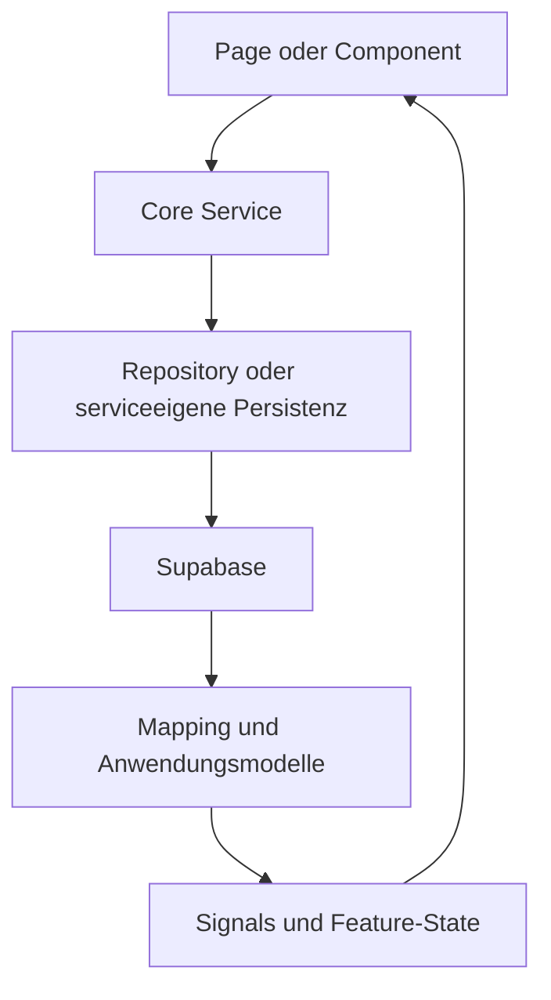

# Anwendungsarchitektur

Dieses Dokument beschreibt den finalen Aufbau der Angular-Anwendung **Join**, die Zuständigkeiten der wichtigsten Bereiche und den grundlegenden Datenfluss. Details zu einzelnen Features, Sicherheit, Styling und Tests werden in den jeweils verlinkten Fachdokumenten behandelt.

## Technische Grundlage

Join ist eine clientseitige Single-Page-Application auf Basis von:

- Angular 21 mit Standalone Components
- TypeScript 5.9
- Angular Signals für reaktiven Zustand
- Angular CDK für Drag-and-drop
- SCSS mit globaler 7–1-orientierter Struktur und komponentenlokalen Partials
- Supabase als Backend für Authentifizierung und relationale Datenhaltung

Die Anwendung wird über `src/main.ts` gestartet. Globale Provider und das Routing werden in `src/app/app.config.ts` und `src/app/app.routes.ts` konfiguriert.

## Projektstruktur

```text
src/
├── app/
│   ├── core/
│   │   ├── constants/
│   │   ├── guards/
│   │   ├── mappers/
│   │   ├── models/
│   │   ├── repositories/
│   │   ├── services/
│   │   ├── supabase/
│   │   └── utils/
│   ├── features/
│   │   ├── add-task/
│   │   ├── auth/
│   │   ├── board/
│   │   ├── contacts/
│   │   ├── help/
│   │   ├── legal/
│   │   └── summary/
│   ├── layout/
│   └── shared/
├── environments/
└── styles/

public/
└── assets/
```

## Verantwortungsbereiche

| Bereich | Verantwortung |
| --- | --- |
| `core` | Anwendungsweite Geschäftslogik, Datenmodelle, Persistenz, Mapping, Authentifizierung, Guards und reine Hilfsfunktionen |
| `features` | Fachlich getrennte Seiten, Komponenten sowie featurelokale Services und Utilities |
| `layout` | Übergreifende Seitenstruktur mit Header, Sidebar, mobiler Navigation und Page Shell |
| `shared` | Wiederverwendbare, fachlich neutrale UI-Komponenten und gemeinsam genutzte Typen |
| `styles` | Globale Designgrundlagen, wiederverwendbare Styles und zentrale SCSS-Einstiegspunkte |
| `public/assets` | Statische Bilder, Logos und SVG-Icons |

### Core

Der `core`-Bereich enthält Logik, die unabhängig von einer einzelnen sichtbaren Komponente benötigt wird:

- `constants`: zentrale fachliche Konstanten
- `guards`: Zugriffsschutz für geschützte Routen
- `mappers`: Umwandlung zwischen Datenbankzeilen, Payloads und Anwendungsmodellen
- `models`: Typen für Authentifizierung, Kontakte, Tasks, Subtasks und Relationen
- `repositories`: gekapselte Supabase-Abfragen für Authentifizierung und Task-Daten
- `services`: Geschäftsabläufe, gemeinsamer Zustand und Koordination mehrerer Datenoperationen
- `supabase`: Client-Konfiguration und versionierte SQL-Migrationen
- `utils`: reine, seiteneffektfreie Berechnungen für Filterung, Sortierung und Zustandsableitungen

Der Task-Bereich trennt Persistenz, Relationslogik und Zustand in `TaskRepository`, `TaskRelationsService`, `TaskStateService` und `TaskService`. Der kompaktere `ContactService` kapselt Kontakt-Persistenz, Mapping und Signal-State direkt. Dadurch richtet sich die Schichtung nach der tatsächlichen Komplexität des jeweiligen Fachbereichs.

### Features

Jedes Verzeichnis unter `features` bildet einen eigenständigen Funktionsbereich ab. Ein Feature kann enthalten:

- `pages` als Einstiegspunkt und Koordinationsschicht
- `components` für abgegrenzte UI-Bausteine
- featurelokale `services` für komplexeren UI- oder Seitenzustand
- featurelokale `utils` für reine Berechnungen

Die Board-Seite delegiert beispielsweise Datenaufbereitung, Dialogzustand, horizontales Scrollen, Navigation und Positionsänderungen an spezialisierte Board-Services. Diese Services werden nur innerhalb des Board-Features bereitgestellt und belasten den globalen Anwendungszustand nicht.

### Layout

`layout` enthält die wiederkehrende Seitenstruktur:

- `header`
- `sidebar`
- `mobile-nav`
- `page-shell`

Layout-Komponenten strukturieren und navigieren die Anwendung. Fachliche CRUD-Logik verbleibt in den zuständigen Features und Core-Services.

### Shared

`shared` enthält nur Elemente, die von mehreren Features wiederverwendet werden. Dazu gehören beispielsweise:

- Button
- Dialog
- Input Field
- User Avatar

Feature-spezifische Komponenten werden nicht vorsorglich nach `shared` verschoben. Eine Wiederverwendung muss tatsächlich bestehen.

## Datenfluss



Components verarbeiten Benutzereingaben und stellen Daten dar. Sie greifen nicht direkt auf Supabase zu. Services koordinieren fachliche Abläufe und aktualisieren den Anwendungszustand. Repositories oder klar abgegrenzte Service-Methoden übernehmen den tatsächlichen Datenzugriff.

Für Task-Daten werden Datenbankzeilen und Anwendungstypen ausdrücklich getrennt:

```text
Supabase Row (snake_case)
        ↓
Mapper
        ↓
Application Model (camelCase)
```

Beim Schreiben erzeugen Payload-Mapper die datenbanknahen Strukturen. Dadurch bleiben Tabellenfelder und Supabase-spezifische Details außerhalb der UI.

## Zustandsaufteilung

Join unterscheidet drei Zustandsbereiche:

| Zustand | Ort | Beispiele |
| --- | --- | --- |
| Anwendungsweiter Fachzustand | Core-Service | Tasks, ausgewählter Task, Kontakte, Authentifizierungsstatus |
| Featurezustand | Feature-Service | Board-Suche, Spaltenableitungen, Dialogauswahl, Drag-and-drop-Status |
| Lokaler UI-Zustand | Component | geöffnetes Menü, Formularzustand, Erfolgsmeldung, sichtbarer Dialog |

Angular Signals speichern veränderlichen Zustand. `computed` wird für abgeleitete Werte wie gefilterte Tasks und Board-Spalten verwendet. Reine Transformationen bleiben in Utilities, damit sie unabhängig von Angular getestet werden können.

## Styling-Struktur

Globale Styles werden über `src/styles/main.scss` gebündelt und nach Verantwortlichkeiten in `abstracts`, `base`, `components`, `layout`, `pages`, `themes`, `utilities` und `vendors` gegliedert.

Umfangreiche Komponentenstyles verwenden zusätzlich lokale `_partials` direkt an der jeweiligen Komponente. Dadurch bleiben featurebezogene Layouts, Animationen und Responsive-Regeln gekapselt, während globale Designgrundlagen zentral gepflegt werden.

Details stehen unter [Styling und Barrierefreiheit](../engineering/styling-accessibility.md).

## Architekturregeln

- Components enthalten Darstellung, Benutzerinteraktion, Formulare und lokalen UI-Zustand.
- Direkte Supabase-Zugriffe bleiben im Core und außerhalb sichtbarer Feature-Components.
- Gemeinsam genutzter Fachzustand liegt in Core-Services.
- Featurebezogener Koordinationszustand bleibt im jeweiligen Feature.
- Datenbankzeilen verwenden `snake_case`, Anwendungsmodelle `camelCase`.
- Mapper übernehmen Formatwechsel zwischen Datenbank und Anwendung.
- Utilities sind rein und haben keine Abhängigkeit zu Angular oder Supabase.
- Wiederverwendbarer Code wird erst bei tatsächlicher Mehrfachnutzung nach `shared` verschoben.
- SCSS-Partials werden nach ihrer fachlichen Verantwortung getrennt.

## Weiterführende Dokumentation

- [Authentifizierung und Routing](authentication-routing.md)
- [Datenbank und Sicherheit](database-security.md)
- [Kontakte](../features/contacts.md)
- [Tasks und Board](../features/tasks-board.md)
- [State- und Fehlerbehandlung](../engineering/state-error-handling.md)
- [Styling und Barrierefreiheit](../engineering/styling-accessibility.md)
- [Tests](../engineering/testing.md)