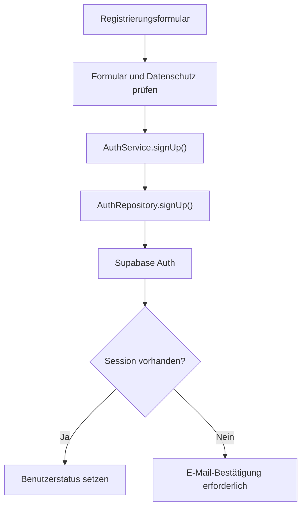
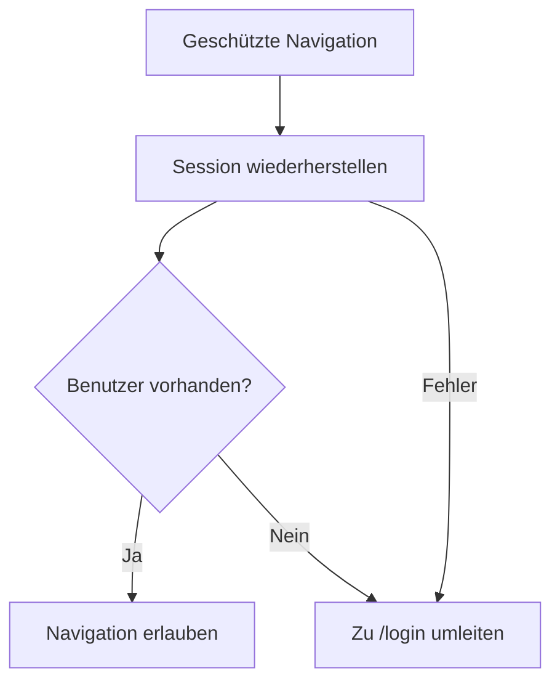

# Authentifizierung und Routing

Dieses Dokument beschreibt die finale Authentifizierungsarchitektur von **Join**, die Verwaltung der Supabase-Session und den Zugriffsschutz der Angular-Routen. Datenbankrechte und Row Level Security werden getrennt unter [Datenbank und Sicherheit](database-security.md) dokumentiert.

## Funktionsumfang

Join unterstützt drei Zugriffszustände:

| Zustand | Supabase-Session | Zugriff auf geschützte Routen |
| --- | --- | --- |
| Nicht angemeldeter Besucher | nein | nein |
| Registrierter Benutzer | ja | ja |
| Anonym angemeldeter Gast | ja | ja |

Ein Gastzugang ist kein ungeschützter Frontend-Modus. `signInAnonymously()` erzeugt eine echte Supabase-Session, die technisch der Datenbankrolle `authenticated` zugeordnet wird.

## Zuständige Dateien

```text
src/app/
├── app.routes.ts
├── core/
│   ├── guards/
│   │   ├── auth.guard.ts
│   │   └── auth.guard.spec.ts
│   ├── mappers/
│   │   ├── auth-error.mapper.ts
│   │   └── auth.mapper.ts
│   ├── models/
│   │   └── auth.model.ts
│   ├── repositories/
│   │   └── auth.repository.ts
│   └── services/
│       └── auth.service.ts
└── features/
    └── auth/
        ├── auth-page/
        └── pages/
            ├── login/
            └── signup/
```

## Verantwortlichkeiten

| Baustein | Verantwortung |
| --- | --- |
| `AuthPage` | Gemeinsamer Router-Rahmen für Login und Registrierung |
| `Login` | Formularvalidierung, Benutzer- und Gastanmeldung sowie Navigation zur Summary |
| `Signup` | Registrierungsformular, Datenschutzbestätigung und Reaktion auf die E-Mail-Bestätigung |
| `AuthService` | Authentifizierungsabläufe, Session-State, Lade- und Fehlerzustand |
| `AuthRepository` | Direkter Zugriff auf die Supabase-Auth-API |
| `auth.mapper.ts` | Umwandlung von Supabase-Benutzern und Registrierungsmetadaten |
| `auth-error.mapper.ts` | Übersetzung technischer Auth-Fehler in sichere UI-Meldungen |
| `authGuard` | Wiederherstellung der Session und Schutz der Anwendungsrouten |
| `app.routes.ts` | Zentrale Zuordnung öffentlicher und geschützter Routen |

Feature-Komponenten greifen nicht direkt auf `supabase.auth` zu. Sämtliche Auth-Operationen laufen über `AuthService` und `AuthRepository`.

## Authentifizierungsmodell

Das Anwendungsmodell trennt Supabase-Typen von den Daten, die Components tatsächlich benötigen:

```typescript
interface AuthUser {
  id: string;
  email: string | null;
  fullName: string;
  isAnonymous: boolean;
}
```

Zusätzlich existieren eigene Typen für:

- Login-Daten aus E-Mail-Adresse und Passwort
- Registrierungsdaten einschließlich akzeptierter Datenschutzerklärung
- Registrierungsergebnis einschließlich erforderlicher E-Mail-Bestätigung

`mapAuthUser()` wandelt den Supabase-Benutzer in `AuthUser` um. Der Anzeigename wird aus `full_name` oder den getrennten Namensfeldern der User-Metadaten ermittelt. Anonyme Benutzer erhalten als Rückfallwert `Guest`.

## Authentifizierungsabläufe

### Registrierung



Vor dem Request prüft `AuthService`, ob die Datenschutzerklärung akzeptiert wurde. Das Repository normalisiert die E-Mail-Adresse und übermittelt den vollständigen Namen als strukturierte Metadaten.

Bei aktivierter E-Mail-Bestätigung liefert Supabase nach der Registrierung einen Benutzer, aber noch keine Session. In diesem Fall:

- bleibt `isAuthenticated` auf `false`
- enthält das Ergebnis `requiresEmailConfirmation: true`
- muss der Benutzer seine E-Mail bestätigen und sich anschließend anmelden

Der Datenbank-Trigger für die Verknüpfung mit `contacts` wird unter [Datenbank und Sicherheit](database-security.md) beschrieben.

### Anmeldung mit E-Mail und Passwort

Das Login-Formular prüft Pflichtfelder und das E-Mail-Format. Vor der Übergabe werden Leerzeichen an der E-Mail-Adresse entfernt und die Adresse in Kleinbuchstaben umgewandelt.

```text
Login Component
    ↓
AuthService.signIn()
    ↓
AuthRepository.signIn()
    ↓
supabase.auth.signInWithPassword()
    ↓
AuthUser und aktive Session
    ↓
Navigation zu /summary
```

Eine erfolgreiche Anmeldung wird nur akzeptiert, wenn Supabase sowohl einen Benutzer als auch eine Session zurückliefert.

### Gastanmeldung

Die Gastanmeldung verwendet denselben geschützten Datenfluss:

```text
Login Component
    ↓
AuthService.signInAsGuest()
    ↓
AuthRepository.signInAnonymously()
    ↓
anonymer Supabase-Benutzer mit Session
    ↓
Navigation zu /summary
```

`isGuest` wird aus `user.is_anonymous` abgeleitet. Der Gast erhält Zugriff auf die gemeinsamen Demo-Daten, jedoch nicht aufgrund einer offenen `anon`-Policy.

### Abmeldung

`AuthService.signOut()` beendet die aktive Supabase-Session. Erst nach erfolgreicher Antwort wird der lokale Benutzerstatus auf `null` gesetzt. Schlägt die Abmeldung fehl, bleibt der bisherige Status bestehen und die UI erhält eine sichere Fehlermeldung.

## Session-State

`AuthService` verwaltet den Authentifizierungszustand mit Angular Signals:

| Signal | Bedeutung |
| --- | --- |
| `currentUser` | Aktueller `AuthUser` oder `null` |
| `isLoading` | Laufender Authentifizierungsrequest |
| `isInitialized` | Session-Wiederherstellung wurde abgeschlossen |
| `errorMessage` | Benutzerfreundliche Auth-Fehlermeldung oder `null` |
| `isAuthenticated` | Abgeleitet aus einem vorhandenen Benutzer |
| `isGuest` | Abgeleitet aus `isAnonymous` |

Zusätzlich kann der Service die nach Login oder Gastanmeldung vorgesehene Summary-Begrüßung einmalig vormerken und nach der Anzeige wieder verwerfen.

Parallele Login-, Registrierungs- oder Logout-Requests werden durch den Ladezustand blockiert. Beim Start eines neuen Requests wird eine veraltete Fehlermeldung entfernt.

## Session-Wiederherstellung

`initialize()` stellt eine bereits lokal gespeicherte Supabase-Session wieder her und registriert den Listener für spätere Auth-Änderungen.

Die Initialisierung:

- wird durch eine gemeinsame Promise höchstens einmal ausgeführt
- startet genau einen `onAuthStateChange`-Listener
- liest die bestehende Session über `getSession()`
- aktualisiert den Benutzerstatus bei Login, Tokenänderung und Logout
- setzt `isInitialized` auch dann, wenn die Wiederherstellung fehlschlägt
- beendet den Listener beim Zerstören des Services

Die einmalige Promise verhindert doppelte Session-Abfragen, wenn mehrere geschützte Navigationen nahezu gleichzeitig stattfinden.

## Route Guard

`authGuard` ist als funktionaler Angular Guard umgesetzt. Er entscheidet nicht allein anhand des initialen Signalwerts, sondern wartet zuerst auf `AuthService.initialize()`.



Damit führt ein Seiten-Reload auf `/board`, `/contacts` oder einer anderen geschützten Route nicht vorschnell zum Login, solange noch eine gültige persistierte Session geprüft wird.

## Routenübersicht

| Route | Komponente | Zugriff |
| --- | --- | --- |
| `/` | Redirect zu `/login` | öffentlich |
| `/login` | `Login` innerhalb von `AuthPage` | öffentlich |
| `/signup` | `Signup` innerhalb von `AuthPage` | öffentlich |
| `/summary` | `Summary` | geschützt |
| `/add-task` | `AddTaskPage` | geschützt |
| `/board` | `Board` | geschützt |
| `/contacts` | `Contacts` | geschützt |
| `/help` | `Help` | geschützt |
| `/legal-notice` | `LegalNotice` | öffentlich |
| `/privacy-policy` | `PrivacyPolicy` | öffentlich |
| unbekannter Pfad | Redirect zu `/contacts` | anschließend durch Guard geschützt |

Die geschützten Seiten sind als gemeinsame Route-Gruppe mit `canActivateChild: [authGuard]` definiert. Dadurch muss der Guard nicht an jeder einzelnen Route wiederholt werden.

Rechtliche Seiten bleiben öffentlich erreichbar, damit Datenschutz und Impressum auch vor einer Anmeldung gelesen werden können.

## Navigation nach Auth-Aktionen

- Erfolgreicher Login führt zu `/summary`.
- Erfolgreicher Gastlogin führt zu `/summary`.
- Eine Registrierung ohne Session wartet auf die E-Mail-Bestätigung.
- Ein nicht authentifizierter Zugriff auf eine geschützte Route führt zu `/login`.
- Eine fehlgeschlagene Session-Wiederherstellung führt zu `/login`.
- Unbekannte Pfade werden zu `/contacts` geleitet und unterliegen dort dem Guard.

## Fehlerbehandlung

Supabase-Fehler werden nicht ungefiltert in der Oberfläche angezeigt. `mapAuthErrorMessage()` ordnet bekannte Fehlercodes verständlichen Meldungen zu, beispielsweise:

- ungültige Zugangsdaten
- nicht bestätigte E-Mail-Adresse
- bereits vorhandenes Benutzerkonto
- zu schwaches Passwort
- deaktivierter Gastzugang
- zu viele Anfragen
- abgelaufene oder fehlende Session

Unbekannte technische Fehler erhalten eine allgemeine Rückfallmeldung. Dadurch werden keine internen Fehlerdetails oder Backend-Strukturen an den Benutzer ausgegeben.

## Sicherheitsregeln

- Eine geschützte Route wird erst nach abgeschlossener Session-Wiederherstellung freigegeben.
- Registrierte Benutzer und Gäste benötigen eine gültige Supabase-Session.
- Authentifizierung im Angular-Frontend ersetzt keine RLS-Prüfung in der Datenbank.
- Rechtliche Pflichtseiten sind ohne Anmeldung erreichbar.
- Supabase-Fehler werden vor der Anzeige gemappt.
- Das Frontend speichert oder verwendet keinen `service_role`-Schlüssel.
- Components verwenden den Auth-Service und greifen nicht direkt auf den Supabase-Client zu.

## Tests

Der Authentifizierungsbereich wird auf mehreren Ebenen geprüft:

- Mapper-Tests für Benutzer und Metadaten
- Repository-Tests für Supabase-Aufrufe und Fehlerweitergabe
- Service-Tests für Registrierung, Login, Gastzugang, Session-Wiederherstellung, Fehlerfälle und Logout
- Guard-Tests für registrierte Benutzer, Gäste, Besucher, verzögerte Initialisierung und Initialisierungsfehler
- Component-Tests für Login und Registrierung

Details zum gesamten Testaufbau stehen unter [Tests](../engineering/testing.md).

## Weiterführende Dokumentation

- [Anwendungsarchitektur](application.md)
- [Datenbank und Sicherheit](database-security.md)
- [Formulare und Validierung](../features/forms-validation.md)
- [State- und Fehlerbehandlung](../engineering/state-error-handling.md)
- [Tests](../engineering/testing.md)
- [Build und Deployment](../operations/deployment.md)