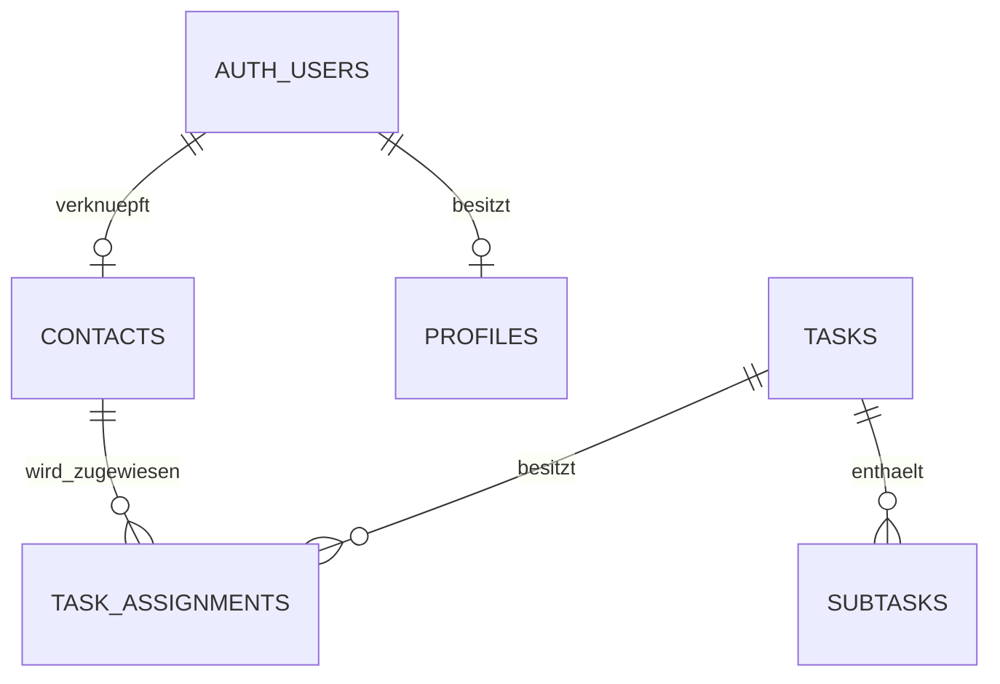

# Datenbank und Sicherheit

Dieses Dokument beschreibt das finale Supabase-Datenmodell von **Join**, die wichtigsten Relationen, die versionierten SQL-Migrationen und den umgesetzten Zugriffsschutz durch Tabellenrechte und Row Level Security.

## Technische Grundlage

Supabase stellt für Join zwei Backend-Bereiche bereit:

- Supabase Auth für registrierte Benutzer und anonyme Gast-Sessions
- PostgreSQL für Profile, Kontakte, Tasks, Subtasks und Kontaktzuweisungen

Die Angular-Anwendung verwendet ausschließlich den öffentlichen Supabase-Client. Ein `service_role`-Schlüssel wird nicht an das Frontend ausgeliefert. Die tatsächliche Zugriffskontrolle liegt deshalb in PostgreSQL-Grants und RLS-Policies.

## Datenmodell



Die Projektdaten sind normalisiert. Tasks speichern weder eingebettete Subtasks noch vollständige Kontaktdaten. Beziehungen werden über Fremdschlüssel und die Relationstabelle `task_assignments` abgebildet.

## Tabellen

### `profiles`

`profiles` bildet den benutzerbezogenen Anwendungsdatensatz zu einem Eintrag aus `auth.users` ab. Die Profil-ID entspricht der Supabase-User-ID. Der Zugriff ist auf das eigene Profil begrenzt.

Profile sind nicht mit Rollen oder Berechtigungsstufen verbunden. Join unterscheidet im finalen Projekt weder Administratoren noch weitere Benutzerrollen.

### `contacts`

| Feld | Typ | Bedeutung |
| --- | --- | --- |
| `id` | `uuid` | Primärschlüssel |
| `first_name` | `text` | Vorname |
| `last_name` | `text` | Nachname |
| `email` | `text` | E-Mail-Adresse |
| `phone` | `text` oder `null` | Telefonnummer |
| `badge_color` | `text` | Farbe des Kontakt-Badges |
| `auth_user_id` | `uuid` oder `null` | Optionale Verbindung zu `auth.users` |
| `created_at` | `timestamptz` | Erstellzeitpunkt |
| `updated_at` | `timestamptz` | Letzte Änderung |

`auth_user_id` ist eindeutig und verweist mit `ON DELETE CASCADE` auf `auth.users.id`. Bestehende, rein fachliche Kontakte bleiben über den nullable Fremdschlüssel unabhängig von einem Login nutzbar.

### `tasks`

| Feld | Typ | Bedeutung |
| --- | --- | --- |
| `id` | `uuid` | Primärschlüssel |
| `title` | `text` | Titel der Aufgabe |
| `description` | `text` | Beschreibung |
| `due_date` | `date` | Fälligkeitsdatum |
| `priority` | `text` | Priorität |
| `category` | `text` | Kategorie |
| `status` | `text` | Board-Spalte |
| `sort_order` | `integer` | Position innerhalb der Spalte |
| `created_at` | `timestamptz` | Erstellzeitpunkt |
| `updated_at` | `timestamptz` | Letzte Änderung |

Die Datenbank begrenzt zentrale Werte durch Check Constraints:

| Feld | Erlaubte Werte |
| --- | --- |
| `priority` | `urgent`, `medium`, `low` |
| `category` | `technical_task`, `user_story` |
| `status` | `todo`, `in_progress`, `awaiting_feedback`, `done` |

Zusätzlich müssen Titel nach dem Trimmen Inhalt besitzen und `sort_order` darf nicht negativ sein.

### `subtasks`

| Feld | Typ | Bedeutung |
| --- | --- | --- |
| `id` | `uuid` | Primärschlüssel |
| `task_id` | `uuid` | Zugehöriger Task |
| `title` | `text` | Bezeichnung des Subtasks |
| `is_completed` | `boolean` | Erledigungsstatus |
| `sort_order` | `integer` | Reihenfolge innerhalb des Tasks |
| `created_at` | `timestamptz` | Erstellzeitpunkt |
| `updated_at` | `timestamptz` | Letzte Änderung |

`subtasks.task_id` verweist auf `tasks.id`. Durch `ON DELETE CASCADE` werden die Subtasks eines gelöschten Tasks automatisch entfernt.

### `task_assignments`

| Feld | Typ | Bedeutung |
| --- | --- | --- |
| `task_id` | `uuid` | Zugehöriger Task |
| `contact_id` | `uuid` | Zugewiesener Kontakt |
| `created_at` | `timestamptz` | Zeitpunkt der Zuweisung |

Der zusammengesetzte Primärschlüssel aus `task_id` und `contact_id` verhindert doppelte Zuweisungen. Beide Fremdschlüssel verwenden `ON DELETE CASCADE`. Beim Löschen eines Tasks oder Kontakts werden die zugehörigen Relationseinträge automatisch bereinigt.

## Relationen und Löschverhalten

| Relation | Kardinalität | Löschverhalten |
| --- | --- | --- |
| `auth.users` → `profiles` | 1 : 0..1 | Benutzerbezogener Profildatensatz |
| `auth.users` → `contacts` | 1 : 0..1 | Verknüpfter Kontakt wird mit dem Auth-Benutzer entfernt |
| `tasks` → `subtasks` | 1 : n | Subtasks werden mit dem Task entfernt |
| `tasks` → `task_assignments` | 1 : n | Zuweisungen werden mit dem Task entfernt |
| `contacts` → `task_assignments` | 1 : n | Zuweisungen werden mit dem Kontakt entfernt |

Ein Kontakt kann mehreren Tasks und ein Task mehreren Kontakten zugewiesen werden. `task_assignments` bildet diese Many-to-Many-Beziehung ohne redundante Kontaktdaten ab.

## Verknüpfung von Authentifizierung und Kontakten

Die Migration `18_add_auth_contact_relation.sql` ergänzt die optionale Auth-Verknüpfung und registriert den Trigger `on_auth_user_created` auf `auth.users`.

Die Funktion `public.handle_new_auth_user()`:

- läuft als `SECURITY DEFINER`
- verwendet einen leeren `search_path`
- wird nach dem Erstellen eines Auth-Benutzers ausgeführt
- erzeugt für registrierte Benutzer einen verknüpften Kontakt
- überspringt anonyme Benutzer und Datensätze ohne E-Mail-Adresse
- verwendet `Unknown`, wenn kein Nachname ermittelt werden kann
- erzeugt aus der User-ID eine reproduzierbare Badge-Farbe

Die direkte Ausführung der Triggerfunktion ist für `public`, `anon` und `authenticated` widerrufen. Sie wird ausschließlich durch den Datenbank-Trigger aufgerufen.

## Row Level Security

RLS ist auf allen öffentlichen Anwendungstabellen aktiviert:

- `profiles`
- `contacts`
- `tasks`
- `subtasks`
- `task_assignments`

Der finale Zugriff lautet:

| Tabelle | `anon` | `authenticated` | Einschränkung |
| --- | --- | --- | --- |
| `profiles` | kein Zugriff | `SELECT` | nur der eigene Datensatz über `auth.uid()` |
| `contacts` | kein Zugriff | CRUD | gemeinsamer Projektdatenbestand |
| `tasks` | kein Zugriff | CRUD | gemeinsamer Projektdatenbestand |
| `subtasks` | kein Zugriff | CRUD | gemeinsamer Projektdatenbestand |
| `task_assignments` | kein Zugriff | CRUD | gemeinsamer Projektdatenbestand |

Für die vier fachlichen Projekttabellen existieren getrennte Policies für `SELECT`, `INSERT`, `UPDATE` und `DELETE`. Sie gelten ausschließlich für `authenticated`. Unangemeldete Requests mit der Datenbankrolle `anon` besitzen weder passende Policies noch Tabellenrechte.

## Gastzugang

Der Gastzugang verwendet Supabase Anonymous Sign-In. Dabei entsteht eine echte Auth-Session mit eigener User-ID. Eine solche Session wird bei Datenbankzugriffen als `authenticated` behandelt, obwohl der Benutzer fachlich ein Gast bleibt.

Dadurch gilt:

- Besucher ohne Session können keine Projektdaten lesen oder verändern.
- Registrierte Benutzer können die gemeinsamen Demo-Daten verwenden.
- Angemeldete Gäste können dieselben Demo-Daten verwenden.
- Ein Fallback auf ungeschützten `anon`-Zugriff existiert nicht.

## Sicherheitsgrenze des Demo-Projekts

Die RLS-Policies schützen die Daten vor Zugriffen ohne gültige Session. Sie trennen die Projektdaten jedoch nicht nach einzelnen Benutzern oder Mandanten.

Jede gültige registrierte oder anonyme Session kann den gemeinsamen Bestand aus Kontakten, Tasks, Subtasks und Zuweisungen lesen und verändern. Eine produktive Mehrbenutzeranwendung müsste zusätzlich Eigentums- oder Workspace-Beziehungen in Tabellen und Policies prüfen.

## Migrationen

Die SQL-Dateien liegen unter:

```text
src/app/core/supabase/migrations/
```

Der finale Stand umfasst 24 geordnete Migrationen und Prüfskripte:

| Bereich | Dateien | Zweck |
| --- | --- | --- |
| Grundschema | `01`–`10` | Tabellen, Testdaten und Relationsprüfungen |
| Task-RLS und Nachweise | `11`–`16` | erste Policies, Testdaten sowie CRUD- und Cascade-Delete-Prüfung |
| Auth-Verknüpfung | `17`–`19` | Vorabprüfung, Auth-Kontakt-Relation und Nachweis |
| Profile | `20`–`22` | Profiltabelle sowie Profil- und Benutzerprüfung |
| Finale Absicherung | `23`–`24` | authentifizierter Kontaktzugriff und Entfernung des verbleibenden `anon`-Zugriffs |

Die frühen offenen Demo-Policies aus den Migrationen `01` sowie `11`–`13` beschreiben nicht den finalen Sicherheitszustand. Sie werden durch die späteren Absicherungsmigrationen ersetzt. Maßgeblich ist immer der nach `24_change_restrict_data_access.sql` geprüfte Datenbankstand.

## Sicherheitsregeln

- Im Angular-Frontend wird kein `service_role`-Schlüssel verwendet.
- Der öffentliche Supabase-Schlüssel ersetzt keine RLS-Prüfung.
- Projektdaten sind nur mit einer gültigen Supabase-Session erreichbar.
- `anon` erhält keine Tabellenrechte auf öffentliche Anwendungstabellen.
- Profilzugriff wird mit `auth.uid()` auf den eigenen Datensatz begrenzt.
- Triggerfunktionen erhalten nur die minimal notwendigen Ausführungsrechte.
- Fremdschlüssel und Cascade Deletes verhindern verwaiste Relationsdaten.
- Schema- und Policy-Änderungen werden als nummerierte SQL-Dateien versioniert.

## Weiterführende Dokumentation

- [Anwendungsarchitektur](application.md)
- [Authentifizierung und Routing](authentication-routing.md)
- [Kontakte](../features/contacts.md)
- [Tasks und Board](../features/tasks-board.md)
- [Build und Deployment](../operations/deployment.md)