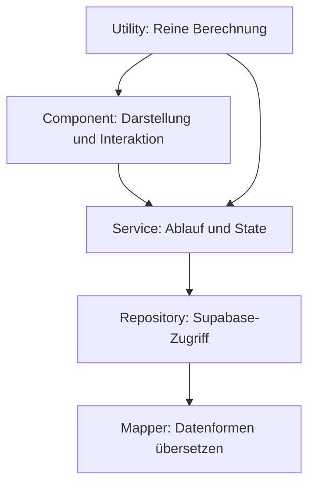

# Code-Konventionen

Dieses Dokument beschreibt die gemeinsamen Code-Konventionen des finalen **Join**-Projekts. Es legt fest, wie Angular-, TypeScript-, SCSS- und Supabase-Code benannt, strukturiert und voneinander getrennt wird.

Die Schichten und ihre fachlichen Beziehungen werden unter [Anwendungsarchitektur](../architecture/application.md) ausführlich beschrieben. Dieses Dokument konzentriert sich auf die konkreten Regeln für die tägliche Implementierung.

## Geltungsbereich

Die Konventionen gelten für:

- TypeScript-Dateien unter `src/app`
- Angular Components, Services und Guards
- Models, Mapper, Repositories, Constants und Utilities
- Component-Templates und Component-SCSS
- globale SCSS-Dateien unter `src/styles`
- Unit-Tests
- technische Dokumentation
- Git-Commits und prüfbare Änderungen

Generierte Dateien, externe Bibliotheken und Supabase-interne Implementierungen werden nicht nach diesen Regeln umgebaut.

## Technische Grundlage

Der finale Projektstand verwendet:

| Bereich | Grundlage |
| --- | --- |
| Framework | Angular 21 |
| Sprache | TypeScript 5.9 |
| Styling | SCSS |
| Reaktivität | Angular Signals und RxJS |
| Formulare | Angular Reactive Forms |
| Datenzugriff | Supabase JavaScript Client 2 |
| Tests | Angular Test Runner mit Vitest und jsdom |
| Paketverwaltung | npm 11 |
| Laufzeit | Node.js 24 |

Neue Implementierungen orientieren sich an den APIs und Strukturen dieses Projektstands. Veraltete Angular-Muster werden nicht zusätzlich eingeführt, wenn bereits eine moderne, im Projekt verwendete Lösung existiert.

## Grundprinzip

Jede Datei und jede Klasse besitzt eine klar erkennbare Hauptverantwortung:



| Baustein | Verantwortung |
| --- | --- |
| Component | Darstellung, Eingaben, lokale UI-Zustände und Benutzeraktionen |
| Feature-Service | Feature-spezifische Koordination und abgeleiteter Zustand |
| Core-Service | Gemeinsame fachliche Abläufe und anwendungsweiter Zustand |
| Repository | Direkte Datenbank- und Auth-Abfragen |
| Mapper | Umwandlung zwischen Datenbank- und Anwendungsformat |
| Model | Typdefinitionen für einen klar abgegrenzten Datenbereich |
| Constant | Zentrale unveränderliche Werte und Zuordnungen |
| Utility | Seiteneffektfreie Berechnung, Sortierung oder Filterung |
| Guard | Entscheidung über den Zugriff auf eine Route |

Wenn eine Datei mehrere dieser Verantwortungen gleichzeitig übernimmt, wird die Logik aufgeteilt oder an die passende Schicht verschoben.

## Sprache

Für das Projekt gelten folgende Sprachregeln:

| Inhalt | Sprache |
| --- | --- |
| Variablen, Methoden, Typen und Dateinamen | Englisch |
| Code-Kommentare | Englisch |
| sichtbare UI-Texte | entsprechend dem bestehenden Join-Design |
| technische Dokumentation | Deutsch |
| Commit-Messages | Englisch |

Ein Feature mischt sichtbare Begriffe nicht ohne fachlichen Grund. Bereits etablierte Bezeichnungen wie `To do`, `Await feedback`, `Technical Task` oder `User Story` bleiben konsistent.

## Benennung

### Dateien und Ordner

Datei- und Ordnernamen verwenden `kebab-case`:

```text
task.service.ts
task.repository.ts
task-payload.mapper.ts
task-status.constants.ts
board-data-state.service.ts
contact-create-dialog/
forms-validation.md
```

Der Suffix beschreibt die Rolle der Datei:

| Suffix | Inhalt |
| --- | --- |
| `.service.ts` | Service oder koordinierter State |
| `.repository.ts` | direkter externer Datenzugriff |
| `.model.ts` | Types und Interfaces |
| `.mapper.ts` | Datenumwandlung |
| `.constants.ts` | zentrale Konstanten |
| `.utils.ts` | reine Hilfsfunktionen |
| `.guard.ts` | Route Guard |
| `.spec.ts` | Testdatei |

Nichtssagende Namen werden vermieden:

```text
helper.ts
utils2.ts
new-file.ts
logic.ts
data.ts
test2.ts
```

Eine allgemeine Bezeichnung wie `utils` ist nur als Suffix zulässig, wenn der fachliche Bereich davor eindeutig ist, zum Beispiel `task-order.utils.ts`.

### Klassen, Interfaces und Types

Klassen, Interfaces und Type Aliases verwenden `PascalCase`:

```typescript
export class TaskService {}
export class BoardRouteService {}

export interface Task {}
export interface TaskRow {}
export interface CreateTask {}

export type TaskStatus =
  | 'todo'
  | 'in_progress'
  | 'awaiting_feedback'
  | 'done';
```

Interfaces erhalten kein vorangestelltes `I`. Datenbanktypen werden durch einen beschreibenden Suffix wie `Row` gekennzeichnet.

### Variablen und Methoden

Variablen, Properties, Parameter und Methoden verwenden `camelCase`:

```typescript
allTasks
selectedContact
errorMessage
loadBoardData()
createTask()
toggleSubtaskCompletion()
```

Methoden beginnen mit einem Verb und beschreiben die ausgeführte Aktion. Namen wie `doStuff()`, `handleData()` oder `process()` sind ohne weiteren fachlichen Kontext zu ungenau.

Boolesche Werte und Signals verwenden nach Möglichkeit ein lesbares Präfix:

```typescript
isLoading
isAuthenticated
hasCreatedTask
canSubmit
shouldSuppressCardClick
```

### Konstanten

Exportierte, unveränderliche fachliche Konstanten verwenden `UPPER_SNAKE_CASE`:

```typescript
export const TASK_STATUS_OPTIONS = [];
export const TASK_STATUS_ORDER = {};
```

Lokale unveränderliche Klassen-Properties bleiben in `camelCase`:

```typescript
private readonly taskTableName = 'tasks';
```

## TypeScript-Regeln

### Strikter Compiler-Modus

Das Projekt verwendet den TypeScript- und Angular-Compiler im strikten Modus. Maßgeblich sind unter anderem:

```json
{
  "compilerOptions": {
    "strict": true,
    "noImplicitOverride": true,
    "noPropertyAccessFromIndexSignature": true,
    "noImplicitReturns": true,
    "noFallthroughCasesInSwitch": true
  },
  "angularCompilerOptions": {
    "strictInjectionParameters": true,
    "strictInputAccessModifiers": true,
    "strictTemplates": true
  }
}
```

Compilerfehler werden nicht durch das pauschale Abschwächen dieser Einstellungen umgangen.

### Explizite Typen

Öffentliche Methodenschnittstellen und asynchrone Methoden erhalten einen expliziten Rückgabetyp:

```typescript
async loadContacts(): Promise<Contact[]> {
  return this.repository.getContacts();
}

openDialog(): void {
  this.isDialogOpen.set(true);
}
```

Lokale Variablen dürfen die TypeScript-Typinferenz verwenden, wenn der Typ eindeutig ist:

```typescript
const normalizedEmail = email.trim().toLowerCase();
```

### `any` vermeiden

`any` wird nicht als schnelle Lösung für Typfehler verwendet. Unbekannte Werte beginnen als `unknown` und werden geprüft oder an einer klaren Systemgrenze gezielt eingegrenzt.

```typescript
function getErrorMessage(error: unknown): string {
  return error instanceof Error
    ? error.message
    : 'Unknown error';
}
```

Type Assertions sind vor allem an technischen Grenzen zulässig, an denen eine externe Bibliothek präzisere Projektinformationen nicht selbst ableiten kann:

```typescript
return (data ?? []) as TaskRow[];
```

Die Assertion ersetzt keine notwendige Validierung beliebiger Benutzereingaben oder URL-Parameter.

### `readonly`

Abhängigkeiten, Signal-Referenzen, Inputs, Outputs und abgeleitete Werte werden als `readonly` deklariert, wenn ihre Referenz nach der Initialisierung nicht ersetzt wird:

```typescript
private readonly repository = inject(TaskRepository);

readonly isLoading = signal(false);
readonly filteredTasks = computed(() => {
  return filterTasks(this.allTasks(), this.searchTerm());
});
```

`readonly` schützt bei einem Signal nur die Property-Referenz. Der Signalwert kann weiterhin bewusst über `set()` oder `update()` verändert werden.

### Null und optionale Werte

Fehlende fachliche Werte werden im Typ sichtbar gemacht:

```typescript
readonly selectedTask = signal<Task | null>(null);

export interface UpdateTask {
  title?: string;
  dueDate?: string;
}
```

`null`, `undefined` und leere Arrays besitzen unterschiedliche Bedeutungen und werden nicht beliebig gegeneinander ausgetauscht. Bei Relationsupdates gilt beispielsweise:

```text
Eigenschaft nicht übermittelt
→ Relationsbereich unverändert lassen

leeres Array übermittelt
→ alle bisherigen Relationen entfernen
```

### Create- und Update-Typen

Lesemodelle werden nicht direkt als Schreibpayload verwendet. Für Schreiboperationen existieren eigene Typen:

```typescript
interface Task {}
interface CreateTask {}
interface UpdateTask {}
interface CreateTaskWithRelationsInput {}
interface UpdateTaskWithRelationsInput {}
```

Dadurch bleiben servergenerierte Felder wie IDs und Zeitstempel aus Create-Payloads heraus. Update-Payloads können gezielt nur übermittelte Werte ändern.

## Import-Konventionen

Imports stehen am Anfang der Datei. Externe Framework- und Bibliotheksimports werden vor projektinternen Imports platziert.

```typescript
import { Component, computed, input, output } from '@angular/core';

import { Contact } from '../../../../core/models/contact.model';
import { Task } from '../../../../core/models/task.model';
```

Für mehrere Exporte aus derselben Datei wird ein gemeinsamer Import verwendet. Ungenutzte Imports werden vor dem Commit entfernt.

Standalone-Components tragen ihre Template-Abhängigkeiten direkt in `imports` ein:

```typescript
@Component({
  selector: 'app-task-card',
  standalone: true,
  imports: [SlicePipe],
  templateUrl: './task-card.html',
  styleUrl: './task-card.scss',
})
export class TaskCard {}
```

Eine Component importiert keinen Service in das `imports`-Array. Services werden über Dependency Injection eingebunden.

## Dependency Injection

Abhängigkeiten werden im finalen Projekt überwiegend mit `inject()` bezogen:

```typescript
@Injectable({
  providedIn: 'root',
})
export class TaskService {
  private readonly repository = inject(TaskRepository);
}
```

Die Abhängigkeit bleibt `private`, wenn nur die Klasse selbst sie benötigt. Eine injizierte Instanz wird nicht nachträglich ersetzt.

Services mit anwendungsweiter Verantwortung verwenden:

```typescript
@Injectable({
  providedIn: 'root',
})
```

Feature-spezifischer State bleibt trotzdem in einem Feature-Service, wenn er nicht zur öffentlichen Core-Schnittstelle gehört.

## Components

Components sind für Darstellung und Benutzerinteraktion zuständig.

Erlaubte Verantwortungen:

- Inputs anzeigen
- Outputs auslösen
- Formulare und UI-Validierung verwalten
- lokale Dialog-, Menü- und Animationszustände halten
- Service-Methoden aufrufen
- Lade- und Fehlermeldungen darstellen
- Werte für das Template ableiten

Nicht vorgesehen:

- direkte Supabase-Abfragen
- Verwendung von Datenbankfeldnamen im Template
- eigenständige Synchronisierung mehrerer Tabellen
- globale Geschäftslogik
- mehrfach kopierte Sortier- oder Mappinglogik

### Aufbau einer Component

Die Klassenmitglieder werden möglichst in dieser Reihenfolge angeordnet:

1. injizierte Abhängigkeiten
2. Inputs und Outputs
3. öffentliche oder geschützte Signals und berechnete Werte
4. private Zustände
5. Lifecycle-Methoden
6. Methoden für das Template
7. Event-Handler
8. private Helper

Beispiel:

```typescript
@Component({
  selector: 'app-task-card',
  imports: [],
  templateUrl: './task-card.html',
  styleUrl: './task-card.scss',
})
export class TaskCard {
  private readonly taskService = inject(TaskService);

  readonly task = input.required<Task>();
  readonly opened = output<string>();

  protected readonly isMenuOpen = signal(false);

  protected openTask(): void {
    this.opened.emit(this.task().id);
  }

  private closeMenu(): void {
    this.isMenuOpen.set(false);
  }
}
```

Die Reihenfolge ist eine Lesbarkeitsregel und kein Ersatz für eine sinnvolle Aufteilung.

### Inputs

Signal-Inputs werden für Daten verwendet, die eine Parent-Component bereitstellt:

```typescript
readonly task = input.required<Task>();
readonly subtasks = input<Subtask[]>([]);
```

Ein Input wird nicht direkt verändert. Benötigt die Component einen bearbeitbaren Zustand, erzeugt sie eine lokale Kopie mit klarer Synchronisierung.

### Outputs

Outputs melden Benutzeraktionen oder fachlich vorbereitete Eingaben an die koordinierende Parent-Component:

```typescript
readonly cancelled = output<void>();
readonly submitted = output<CreateContact>();
readonly taskDeleted = output<string>();
```

Ein Output beschreibt das eingetretene Ereignis oder die angeforderte Aktion. Child-Components greifen nicht auf Parent-State zu.

### Zugriffssichtbarkeit

Für Klassenmitglieder gilt:

| Sichtbarkeit | Verwendung |
| --- | --- |
| `private` | ausschließlich innerhalb der TypeScript-Klasse |
| `protected` | durch die Klasse und ihr Angular-Template |
| öffentlich | bewusste externe Klassenschnittstelle oder bestehende Template-Schnittstelle |

Interne Helper bleiben `private`. Reine Template-Methoden und Template-State können `protected` sein.

## Templates

Templates enthalten Darstellung, Bindings und überschaubare Bedingungen. Komplexe Berechnungen werden in ein `computed()`-Signal, eine klar benannte Methode oder eine Utility ausgelagert.

Unübersichtlich:

```html
@if (
  task().status === 'todo' &&
  subtasks().length > 0 &&
  assignedContacts().length > 0 &&
  !isLoading()
) {
  <!-- ... -->
}
```

Lesbarer:

```html
@if (shouldShowTaskMeta()) {
  <!-- ... -->
}
```

Für wiederholte Daten wird eine stabile Identität verwendet:

```html
@for (task of tasks(); track task.id) {
  <app-task-card [task]="task" />
}
```

Klickbare Aktionen verwenden semantische Elemente. Ein `div` erhält nicht nur deshalb einen Click-Handler, weil es optisch wie ein Button gestaltet wurde. Wenn eine komplexe Karte selbst interaktiv sein muss, erhält sie zusätzlich eine passende Tastaturbedienung und ARIA-Beschriftung.

## Services

Services koordinieren fachliche Abläufe und State. Sie kapseln wiederverwendbare Logik vor Components.

Typische Aufgaben:

- Daten laden
- Create-, Update- und Delete-Abläufe koordinieren
- mehrere Repository-Aufrufe verbinden
- gemeinsamen Zustand aktualisieren
- Lade- und Fehlerzustände verwalten
- persistierte Antworten in Anwendungsmodelle überführen lassen
- nach Teilfehlern einen definierten Wiederherstellungsablauf starten

### Aufbau eines Services

Empfohlene Reihenfolge:

1. injizierte Abhängigkeiten
2. private interne State-Signals
3. öffentliche Signals und `computed()`-Werte
4. öffentliche Ladeoperationen
5. öffentliche Schreiboperationen
6. öffentliche Relations- oder Spezialoperationen
7. private Koordinations- und State-Helper
8. private Fehler- und Ladehelper

Beispiel:

```typescript
@Injectable({
  providedIn: 'root',
})
export class ContactService {
  private readonly repository = inject(ContactRepository);
  private readonly contactsState = signal<Contact[]>([]);

  readonly allContacts = this.contactsState.asReadonly();
  readonly isLoading = signal(false);

  async loadContacts(): Promise<Contact[]> {
    this.isLoading.set(true);

    try {
      const contacts = await this.repository.getContacts();
      this.contactsState.set(contacts);
      return contacts;
    } finally {
      this.isLoading.set(false);
    }
  }
}
```

Ein Service muss nicht jede lokale Darstellung kennen. Zustände wie ein Hover-Effekt, ein aktuell geöffnetes kleines Menü oder eine laufende CSS-Schließanimation bleiben in der Component.

### State nicht von außen verändern

Components lesen Service-State und rufen fachliche Methoden auf. Sie verändern den Zustand eines Services nicht direkt:

```typescript
await this.taskService.updateTask(taskId, input);
```

Nicht vorgesehen:

```typescript
this.taskService.allTasks.set(updatedTasks);
```

Wo der bestehende Service ein schreibbares Signal öffentlich bereitstellt, bleibt dessen Mutation trotzdem Aufgabe des Services.

### Dateigröße und Aufteilung

Für TypeScript-Dateien gilt ein Richtwert von ungefähr 400 Zeilen. Eine leichte Überschreitung ist kein eigenständiger Fehler. Entscheidend ist, ob die Datei noch eine zusammenhängende Verantwortung besitzt.

Eine Aufteilung ist erforderlich, wenn beispielsweise:

- ein Service unabhängige State-, Relations- und Persistenzbereiche vermischt
- eine Component mehrere eigenständige UI-Abläufe koordiniert
- private Helper fachlich eine eigene Utility bilden
- dieselbe Logik von mehreren Stellen benötigt wird
- die Datei nur noch schwer testbar oder reviewbar ist

Die finale Task-Struktur trennt deshalb unter anderem `TaskService`, `TaskRelationsService`, `TaskStateService` und mehrere Board-Feature-Services.

## Repositories und Supabase

Direkte Supabase-Aufrufe liegen in Repositories oder in einer ausdrücklich datenbanknahen Auth-Abstraktion:

```typescript
const { data, error } = await this.supabase
  .from(this.taskTableName)
  .select('*');

if (error) {
  throw error;
}
```

Repositories:

- kennen Tabellen- und Datenbankfeldnamen
- führen Queries und Mutationen aus
- prüfen Supabase-Fehler
- geben typisierte Rows oder gemappte Ergebnisse zurück
- enthalten keine Dialog-, Routing- oder Darstellungslogik

Components injizieren weder den Supabase-Client noch einen globalen Supabase-Service.

## Models und Mapper

Join trennt Datenbank- und Anwendungsmodelle:

```typescript
interface TaskRow {
  due_date: string;
  sort_order: number;
}

interface Task {
  dueDate: string;
  sortOrder: number;
}
```

### Row-Models

Row-Models:

- bilden die relevanten Datenbankspalten ab
- verwenden die tatsächlichen `snake_case`-Feldnamen
- bleiben auf Repository-, Mapper- und datenbanknaher Service-Ebene
- werden nicht direkt an sichtbare Components gebunden

Typische Namen:

```text
TaskRow
SubtaskRow
TaskAssignmentRow
ContactRow
```

### Anwendungsmodelle

Anwendungsmodelle:

- verwenden `camelCase`
- beschreiben die Daten aus Sicht der Anwendung
- werden von Services und Components verwendet
- enthalten keine Supabase-spezifischen Response-Typen

### Lese- und Schreibmapper

Lesemapper übersetzen Rows in Anwendungsmodelle:

```text
snake_case Row
→ camelCase Application Model
```

Payload-Mapper übersetzen Create- oder Update-Eingaben in Datenbankpayloads:

```text
camelCase Input
→ normalisiertes snake_case Payload
```

Mappinglogik wird nicht in mehreren Components wiederholt. Normalisierung wie Trimmen oder das Setzen von `updated_at` erfolgt an der dafür festgelegten Grenze.

## Signals und State

Der Speicherort eines Zustands richtet sich nach seiner Reichweite:

| Zustand | Ziel |
| --- | --- |
| anwendungsweit verwendete Fachdaten | Core-Service |
| Feature-Daten und abgeleitete Feature-Sichten | Feature-Service |
| ausschließlich lokaler UI-Zustand | Component |
| rein berechneter Wert | `computed()` oder Utility |

Beispiele:

```typescript
readonly allTasks = signal<Task[]>([]);
readonly selectedTask = signal<Task | null>(null);
readonly searchTerm = signal('');

readonly filteredTasks = computed(() => {
  return filterTasks(this.allTasks(), this.searchTerm());
});
```

Abgeleitete Werte werden nicht parallel als eigener veränderbarer State gespeichert, wenn sie zuverlässig aus bestehenden Signals berechnet werden können.

Mutationen von Arrays und Objekten erzeugen neue Werte:

```typescript
this.allTasks.update((tasks) => {
  return tasks.map((task) => {
    return task.id === updatedTask.id
      ? updatedTask
      : task;
  });
});
```

Ein bestehendes Signal-Array wird nicht außerhalb eines kontrollierten State-Updates direkt verändert.

## Formulare

Sichtbare Formulare verwenden Angular Reactive Forms. Die Component ist zuständig für:

- `FormGroup` und Controls
- synchrone UI-Validatoren
- Touched- und Submitted-State
- feldbezogene Fehlermeldungen
- das Erzeugen eines fachlichen Create- oder Update-Inputs

Vor einem ungültigen Submit:

```typescript
if (this.form.invalid) {
  this.form.markAllAsTouched();
  return;
}
```

Der Service erhält keine ungeprüften Datenbankpayloads aus dem Template. Components erzeugen Anwendungsinputs in `camelCase`; der Payload-Mapper erzeugt daraus Datenbankfelder.

Mehrstufige fachliche Schutzprüfungen dürfen zusätzlich im Service oder in Supabase liegen. Frontend-Validierung ersetzt keine Auth-Regel, RLS-Policy oder Datenbank-Constraint.

Die vollständigen Formularregeln stehen unter [Formulare und Validierung](../features/forms-validation.md).

## Asynchrone Abläufe

Asynchrone Methoden geben `Promise<T>` oder `Promise<void>` explizit an:

```typescript
async deleteTask(taskId: string): Promise<void> {
  await this.repository.deleteTask(taskId);
}
```

Ladezustände werden vor dem Request gesetzt und in `finally` zuverlässig zurückgesetzt:

```typescript
this.isLoading.set(true);

try {
  await this.repository.updateTask(taskId, input);
} finally {
  this.isLoading.set(false);
}
```

Während einer laufenden Schreiboperation verhindern Components oder Services doppelte Submits und kollidierende Änderungen.

Unabhängige Requests dürfen parallel ausgeführt werden:

```typescript
const [tasks, relations, contacts] = await Promise.all([
  this.taskService.getTasks(),
  this.taskService.getBoardRelations(),
  this.contactService.getContacts(),
]);
```

Abhängige Requests bleiben sequenziell. Subtasks können beispielsweise erst erstellt werden, nachdem die ID des neuen Tasks vorliegt.

## Fehlerbehandlung

Jede Schicht behandelt nur den Teil des Fehlers, für den sie verantwortlich ist:

| Schicht | Verantwortung |
| --- | --- |
| Repository | technischen Fehler erkennen und werfen |
| Service | fachliche Meldung setzen, Wiederherstellung koordinieren und Fehler weitergeben |
| Component | Dialog-, Formular- und Interaktionsverhalten festlegen |
| Mapper | bekannte externe Fehler in sichere Anwendungswerte übersetzen |

Beispiel:

```typescript
try {
  const updatedTask =
    await this.repository.updateTask(taskId, input);

  this.replaceTaskInState(updatedTask);
  return updatedTask;
} catch (error) {
  this.errorMessage.set('Task could not be updated.');
  throw error;
}
```

Technische Supabase-Meldungen werden nicht ungefiltert als Auth- oder Sicherheitsmeldung in der UI ausgegeben.

Lokaler Fach-State wird grundsätzlich erst aus einer erfolgreichen Repository-Antwort aktualisiert. Wenn ein Ablauf bewusst vorläufig lokal aktualisiert wird, benötigt er einen definierten Rollback oder ein Neuladen des persistierten Zustands.

Weitere Regeln stehen unter [State- und Fehlerbehandlung](state-error-handling.md).

## Methoden und Helper

Eine Methode erfüllt möglichst eine klar erkennbare Aufgabe. Wenn eine Methode gleichzeitig validiert, mappt, persistiert, navigiert, Dialoge schließt und mehrere State-Bereiche aktualisiert, werden fachlich benannte Helper oder eigene Services extrahiert.

Gut getrennt:

```typescript
async submit(): Promise<void> {
  if (!this.canSubmit()) {
    return;
  }

  const input = this.createTaskInput();
  await this.saveTask(input);
}
```

Die reine Zeilenzahl ist dabei weniger wichtig als eine klare Verantwortung und ein nachvollziehbarer Kontrollfluss.

Private Helper werden nach ihrem Ergebnis oder Zweck benannt:

```text
createTaskInput()
replaceTaskInState()
restorePersistedTask()
closeContactsMenu()
normalizePhoneNumber()
```

## Utilities

Utilities enthalten reine Funktionen. Eine Utility:

- erhält alle benötigten Daten als Parameter
- gibt ein Ergebnis zurück
- verändert keinen externen State
- verwendet keine Angular-Injection
- führt keinen Supabase-Request aus
- greift nicht auf DOM oder Routing zu

Beispiele:

```text
calculateSubtaskProgress()
filterTasks()
sortTasks()
calculateTaskPositionUpdates()
getUniqueIds()
```

Reine Berechnungen werden bevorzugt als Utilities umgesetzt, wenn sie unabhängig von Angular und Supabase getestet werden können.

## Kommentare und Dokumentation

Kommentare werden auf Englisch geschrieben und erklären den Grund für nicht offensichtlichen Code:

```typescript
// Reloads persisted tasks because position updates are not transactional.
```

Nicht sinnvoll:

```typescript
// Set loading to true.
this.isLoading.set(true);
```

Kommentare sind vor allem sinnvoll für:

- bewusste Fallbacks
- Rollback- und Wiederherstellungslogik
- technische Einschränkungen
- ungewöhnliche Browser- oder Pointer-Behandlung
- Sicherheitsgrenzen
- Entscheidungen, die aus dem Code allein nicht erkennbar sind

Auskommentierter alter Code bleibt nicht als Archiv in der Datei. Die Versionsgeschichte liegt in Git.

Öffentliche Typen und Methoden erhalten sprechende Namen. Zusätzliche JSDoc-Kommentare werden verwendet, wenn Parameter, Rückgabewert, Seiteneffekte oder Fehlerverhalten durch Typ und Name nicht ausreichend verständlich sind.

Technische Dokumentation wird zusammen mit relevanten Architektur-, Datenmodell- oder Workflowänderungen aktualisiert.

## SCSS

Component-spezifisches Styling bleibt grundsätzlich bei der Component:

```text
task-card.ts
task-card.html
task-card.scss
```

Große Component-Styles dürfen in fachlich benannte Partials zerlegt und über `@use` eingebunden werden:

```scss
@use 'add-task-layout';
@use 'add-task-fields';
@use 'add-task-responsive';
```

Globale SCSS-Regeln werden nur verwendet, wenn sie tatsächlich von mehreren Bereichen gemeinsam benötigt werden. Dazu gehören beispielsweise:

- Design-Tokens
- wiederverwendete Mixins
- Reset und Basistypografie
- bewusst gemeinsame Dialogregeln
- globale Layout-Grundlagen

Nicht ohne Teamabstimmung geändert werden:

- globale Breakpoints
- zentrale Farben und Abstände
- Reset-Regeln
- globale Typografie
- anwendungsweite Layout- oder Dialogregeln

Eine nur optisch ähnliche Regel wird nicht vorschnell globalisiert. Feature-spezifische Abweichungen bleiben lokal, solange kein stabiler gemeinsamer Anwendungsfall besteht.

Details stehen unter [Styling und Barrierefreiheit](styling-accessibility.md).

## Barrierefreiheit

Barrierefreiheit ist Teil der Component-Definition und kein nachträgliches Styling.

Grundregeln:

- echte Buttons für Aktionen verwenden
- Icon-Buttons eindeutig beschriften
- dekorative Icons mit leerem `alt` oder `aria-hidden="true"` versehen
- sichtbare Fokuszustände erhalten
- Formulareingaben und Fehlertexte miteinander verknüpfen
- Tastaturbedienung für interaktive Karten und Menüs bereitstellen
- Zustände nicht ausschließlich über Farbe kommunizieren
- während laufender Requests nicht verfügbare Aktionen deaktivieren

Beispiel:

```html
<button
  type="button"
  aria-label="Close dialog"
  (click)="closeDialog()"
>
  
</button>
```

## Tests

Testdateien liegen bei der getesteten Implementierung und verwenden den Suffix `.spec.ts`:

```text
auth.service.ts
auth.service.spec.ts

task-order.utils.ts
task-order.utils.spec.ts
```

Tests beschreiben beobachtbares Verhalten. Sie prüfen nicht nur private Implementierungsdetails.

Besonders geeignet für isolierte Tests sind:

- Mapper
- Utilities
- Validatoren
- Service-State
- Auth- und Guard-Entscheidungen
- Component-Inputs, Outputs und Submit-Verhalten
- Erfolgs-, Fehler- und Wiederherstellungsfälle

Ein Bugfix erhält nach Möglichkeit einen Test, der den zuvor fehlerhaften Fall reproduziert.

Der vollständige Testaufbau und die Prüfkommandos stehen unter [Tests](testing.md).

## Konfiguration und Secrets

Echte Supabase-Werte bleiben in lokalen Environment-Dateien:

```text
src/environments/environment.ts
src/environments/environment.development.ts
```

Commitbar ist ausschließlich die neutrale Vorlage:

```text
src/environments/environment.example.ts
```

Im Frontend wird nur der öffentliche `anon`-Key verwendet. Ein `service_role`-Key darf niemals im Angular-Code, in einem Commit oder in einer ausgelieferten Environment-Datei stehen.

Konfigurationsdateien werden wegen ihrer projektweiten Auswirkungen nur nach Teamabstimmung geändert. Dazu gehören unter anderem:

```text
angular.json
package.json
package-lock.json
tsconfig*.json
vitest.config.ts
```

Sicherheitsregeln für Supabase stehen unter [Datenbank und Sicherheit](../architecture/database-security.md).

## Git- und Review-Konventionen

Commits verwenden:

```text
type(scope): message
```

Beispiele:

```text
feat(tasks): add task create flow
fix(contacts): keep selected contact after update
docs(engineering): document code conventions
style(board): align responsive task cards
refactor(tasks): extract relation synchronization
test(auth): cover guarded route access
chore(config): update test setup
```

Zulässige Typen sind insbesondere:

| Typ | Zweck |
| --- | --- |
| `feat` | neues Verhalten |
| `fix` | Fehlerbehebung |
| `docs` | Dokumentation |
| `style` | Styling ohne fachliche Logikänderung |
| `refactor` | strukturelle Änderung ohne neues Verhalten |
| `test` | Tests und Testkonfiguration |
| `chore` | Wartung, Setup oder Konfiguration |

Commits bleiben fachlich klein und nachvollziehbar. Unabhängige Features, Refactorings und Stylingänderungen werden nicht ohne Grund in einem Commit vermischt.

Der vollständige Branch-, Pull-Request- und Review-Ablauf steht unter [Entwicklungsworkflow](../operations/development-workflow.md).

## Qualitätsprüfung vor Review

Vor einem Review oder Pull Request wird mindestens geprüft:

```bash
npm test -- --watch=false
npm run build
git diff --check
git status --short
```

Nach einem Merge oder einer Konfliktauflösung werden verbliebene Konfliktmarker ausgeschlossen:

```bash
git grep -n "<<<<<<<\|=======\|>>>>>>>"
```

Zusätzlich wird kontrolliert:

- keine ungewollten Dateien im Commit
- keine echten Environment-Werte
- keine ungenutzten Imports
- kein temporäres `console.log`-Debugging
- kein auskommentierter Altcode
- keine neuen direkten Supabase-Zugriffe in Components
- keine Datenbankfeldnamen in sichtbaren Components
- Dokumentation bei relevanten Änderungen aktualisiert

Build-Warnungen werden bewusst bewertet. Build-Fehler und fehlgeschlagene Tests müssen vor dem Review behoben werden.

## Entscheidungshilfe

| Frage | Ziel |
| --- | --- |
| Beeinflusst die Logik ausschließlich Darstellung oder Interaktion? | Component |
| Ist es ein lokaler Dialog-, Menü- oder Animationszustand? | Component |
| Koordiniert die Logik einen Feature-Ablauf? | Feature-Service |
| Verwenden mehrere Features denselben fachlichen State? | Core-Service |
| Wird Supabase direkt aufgerufen? | Repository oder Auth-Repository |
| Wird `snake_case` in `camelCase` übersetzt? | Lesemapper |
| Wird `camelCase` in ein Datenbankpayload übersetzt? | Payload-Mapper |
| Ist die Berechnung rein und seiteneffektfrei? | Utility |
| Ist der Wert zentral und unveränderlich? | Constants-Datei |
| Entscheidet die Logik ausschließlich über Routenzugriff? | Guard |
| Beschreibt die Datei ausschließlich Datentypen? | Model |

## Häufige No-Gos

- Supabase direkt in einer sichtbaren Component verwenden
- Datenbankfelder wie `due_date` oder `first_name` im Template nutzen
- `any` verwenden, um einen Typfehler zu verstecken
- Inputs direkt verändern
- Service-State von einer Component direkt überschreiben
- denselben Mapper oder dieselbe Sortierung mehrfach implementieren
- abgeleiteten State parallel manuell pflegen
- mehrere Verantwortungen in einer großen Methode oder Datei vermischen
- komplexe Fachlogik in ein Template schreiben
- globale SCSS-Regeln ohne gemeinsamen Anwendungsfall ergänzen
- technische Backend-Fehler ungefiltert anzeigen
- echte Secrets oder lokale Environment-Dateien committen
- ungenutzte Imports, Konfliktmarker oder Debug-Code committen

## Weiterführende Dokumentation

- [Anwendungsarchitektur](../architecture/application.md)
- [Datenbank und Sicherheit](../architecture/database-security.md)
- [Authentifizierung und Routing](../architecture/authentication-routing.md)
- [Formulare und Validierung](../features/forms-validation.md)
- [State- und Fehlerbehandlung](state-error-handling.md)
- [Styling und Barrierefreiheit](styling-accessibility.md)
- [Tests](testing.md)
- [Entwicklungsworkflow](../operations/development-workflow.md)
- [Build und Deployment](../operations/deployment.md)