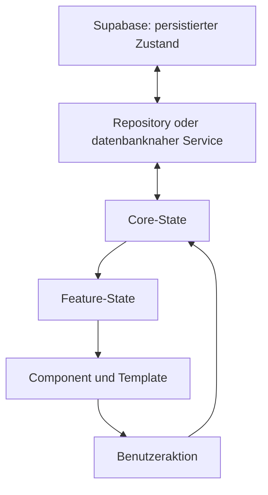
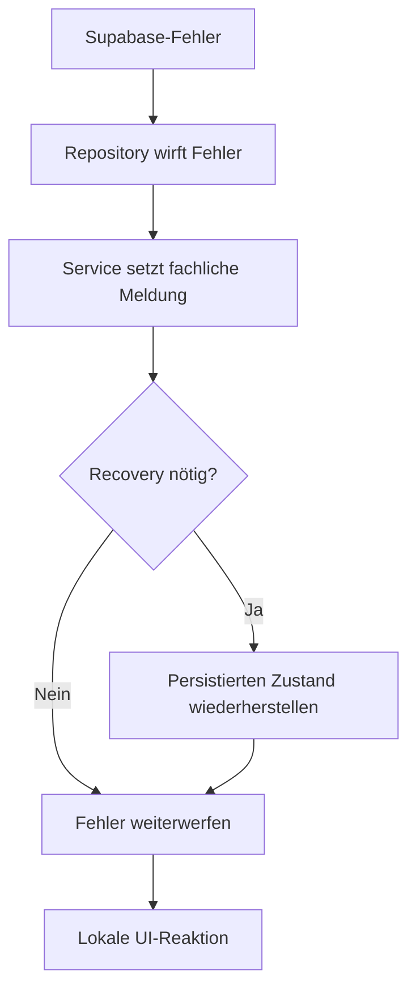

# State- und Fehlerbehandlung

Dieses Dokument beschreibt die Zustandsverwaltung sowie den Lade-, Erfolgs- und Fehlerfluss des finalen **Join**-Projekts. Im Mittelpunkt stehen Angular Signals, die Trennung zwischen gemeinsamem Fach-State und lokalem UI-State, die Synchronisierung nach Supabase-Operationen sowie die Wiederherstellung nach fehlgeschlagenen mehrstufigen Requests.

Die allgemeine Schichtung steht unter [Anwendungsarchitektur](../architecture/application.md). Konkrete Formularzustände werden unter [Formulare und Validierung](../features/forms-validation.md) beschrieben.

## Grundprinzip

Join unterscheidet fünf Zustandsarten:

| Zustandsart | Beispiele | Eigentümer |
| --- | --- | --- |
| persistierter Zustand | Tasks, Subtasks, Kontakte, Zuweisungen und Auth-Session | Supabase |
| gemeinsamer Anwendungs-State | Taskliste, Kontaktliste und aktuelle Auswahl | Core-Service |
| Feature-State | Board-Suche, Board-Relationen und geöffneter Task-Dialog | Feature-Service oder Page |
| lokaler UI- und Formular-State | Eingaben, Menüs, Animationen, Touched-State und temporäre Fehler | Component |
| abgeleiteter Zustand | gefilterte Tasks, Board-Spalten, Zähler und Fortschritt | `computed()` oder Utility |

Der persistierte Zustand ist die dauerhafte Quelle. Der Angular-State bildet die für die aktuelle Sitzung benötigte Anwendungssicht ab.



Für Schreiboperationen gilt grundsätzlich:

```text
Benutzeraktion
    ↓
lokale Eingaben prüfen
    ↓
Request ausführen
    ↓
persistierte Antwort abwarten
    ↓
Anwendungs-State aktualisieren
    ↓
Erfolgsreaktion auslösen
```

Ein Dialog wird nicht geschlossen und eine Erfolgsmeldung wird nicht angezeigt, solange der speichernde Request nicht erfolgreich abgeschlossen ist.

## Eindeutige State-Quelle

Fachliche Daten erhalten eine klar erkennbare Quelle:

| Datenbereich | Maßgeblicher State |
| --- | --- |
| angemeldeter Benutzer | `AuthService.currentUser` |
| Authentifizierungsstatus | `AuthService.isAuthenticated` und `AuthService.isGuest` |
| Kontaktbestand | `ContactService.allContacts` |
| ausgewählter Kontakt | `ContactService.selectedContact` |
| Taskbestand | `TaskStateService.allTasks`, bereitgestellt durch `TaskService` |
| ausgewählter Task | `TaskStateService.selectedTask`, bereitgestellt durch `TaskService` |
| Subtasks des ausgewählten Tasks | `TaskStateService.selectedSubtasks` |
| Kontakte des ausgewählten Tasks | `TaskStateService.assignedContacts` |
| vollständige Board-Relationen | `BoardDataStateService` |
| aktuell geöffnete Dialogdaten | `BoardDialogStateService` |
| Formularentwurf | jeweilige Formular-Component |

Components referenzieren gemeinsamen State, statt dauerhaft eine zweite vollständige Datenquelle aufzubauen:

```typescript
readonly tasks = this.taskService.allTasks;
readonly selectedContact = this.contactService.selectedContact;
```

Lokale Kopien sind nur für einen klar begrenzten Zweck vorgesehen, zum Beispiel:

- ein noch nicht gespeichertes Formular
- bearbeitbare Subtasks im Task-Dialog
- ausgewählte Kontakt-IDs vor dem Submit
- ein temporärer Fehler- oder Animationszustand

Nach Abschluss der Aktion wird eine solche Kopie entweder verworfen oder mit einer erfolgreichen Service-Antwort synchronisiert.

## Signal-Eigentum

Die Klasse, die einen State fachlich besitzt, kontrolliert auch seine Mutation.

```typescript
readonly allTasks = signal<Task[]>([]);

setTasks(tasks: Task[]): void {
  this.allTasks.set(sortTasks(tasks));
}
```

Andere Bereiche lesen das Signal oder rufen eine fachliche Methode auf:

```typescript
await this.taskService.updateTask(taskId, input);
```

Sie ersetzen nicht eigenständig den vollständigen Service-State:

```typescript
// Nicht vorgesehen
this.taskService.allTasks.set(localTasks);
```

Einige bestehende Signals sind technisch schreibbar nach außen verfügbar. Das ändert nichts an der fachlichen Zuständigkeit: Änderungen sollen über die dafür vorgesehene Service- oder Feature-Methode erfolgen.

## Unveränderliche Updates

Arrays und Objekte werden beim Aktualisieren ersetzt. Ein vorhandenes Signal-Array wird nicht unkontrolliert verändert.

```typescript
this.allTasks.update((tasks) => {
  return tasks.map((task) => {
    return task.id === updatedTask.id
      ? updatedTask
      : task;
  });
});
```

Neue oder aktualisierte Collections werden anschließend fachlich sortiert. Der Task-State sortiert nach Status und `sortOrder`; der Kontakt-State nach Vor- und Nachname.

Dieses Vorgehen:

- erzeugt eindeutige Signal-Änderungen
- hält Sortierung und Auswahl konsistent
- verhindert versteckte Mutationen zwischen Components
- vereinfacht Tests und Fehlerwiederherstellung

## Abgeleiteter State

Werte, die vollständig aus anderem State entstehen, werden nicht parallel als zweite veränderbare Quelle gespeichert.

Das Board leitet aus `allTasks` und `searchTerm` unter anderem ab:

```typescript
readonly filteredTasks = computed(() => {
  return filterTasksBySearchTerm(
    this.taskService.allTasks(),
    this.searchTerm(),
  );
});

readonly todo = computed(() => {
  return filterTasksByStatus(
    this.filteredTasks(),
    'todo',
  );
});
```

Weitere Beispiele:

- Tasks pro Board-Status
- aktive Suche
- Summary-Zähler
- nächster anstehender Task
- sichtbare zugewiesene Kontakte
- Subtasks pro Task
- Subtask-Fortschritt
- Authentifizierungs- und Gaststatus

`computed()` führt keine Requests und keine State-Mutationen aus. Aufwendige reine Berechnungen liegen in Utilities und werden aus einem `computed()`-Signal aufgerufen.

## Auth-State

`AuthService` besitzt interne schreibbare Signals und stellt daraus öffentliche, schreibgeschützte Zustände bereit:

| Signal | Bedeutung |
| --- | --- |
| `currentUser` | gemappter Benutzer oder `null` |
| `isLoading` | laufender Login-, Registrierungs-, Gast- oder Logout-Request |
| `isInitialized` | abgeschlossene Prüfung der gespeicherten Session |
| `errorMessage` | sichere Auth-Fehlermeldung oder `null` |
| `isAuthenticated` | aus `currentUser` berechneter Auth-Status |
| `isGuest` | aus dem Benutzer berechneter Gaststatus |

`initialize()` verwendet ein gemeinsames Promise. Dadurch wird die Session-Wiederherstellung nur einmal gestartet, auch wenn Guard und Components gleichzeitig initialisieren.

Der Auth-Listener aktualisiert `currentUser`, wenn Supabase eine neue Session, eine geänderte Session oder eine Abmeldung meldet. `isInitialized` ist vom normalen Request-Loading getrennt, damit ein Route Guard gezielt auf die erstmalige Sessionprüfung warten kann.

### Auth-Requests

Login, Registrierung, Gastzugang und Logout laufen über einen gemeinsamen Request-Wrapper:

```text
bereits laufender Auth-Request?
    ├─ ja → typsicheren Rückfallwert zurückgeben
    └─ nein
        ↓
        alten Fehler löschen
        ↓
        isLoading = true
        ↓
        Request ausführen
        ↓
        Erfolg oder gemappten Fehler anwenden
        ↓
        isLoading = false
```

Auth-Fehler werden nicht an die Formular-Component weitergeworfen. Der Service:

- mappt bekannte Supabase-Codes auf sichere UI-Texte
- setzt `errorMessage`
- gibt je nach Methode `false` oder `null` zurück
- lässt den bisherigen Benutzer-State bestehen, wenn eine Abmeldung fehlschlägt

Die Component navigiert nur bei einem erfolgreichen Rückgabewert.

Details stehen unter [Authentifizierung und Routing](../architecture/authentication-routing.md).

## Kontakt-State

`ContactService` verwaltet:

| Signal | Bedeutung |
| --- | --- |
| `allContacts` | geladener und alphabetisch sortierter Kontaktbestand |
| `selectedContact` | aktuell ausgewählter Kontakt oder `null` |

Der Service besitzt im finalen Stand keinen gemeinsamen `isLoading`- oder `errorMessage`-State. Lade- und Darstellungszustände bleiben deshalb bei den aufrufenden Kontakt-Components.

### Kontaktliste laden

`ContactList` hält:

```typescript
isLoading = signal(true);
errorMessage = signal('');
```

Beim Laden:

1. wird `isLoading` gesetzt
2. wird eine vorherige Fehlermeldung entfernt
3. werden Kontakte über den Service geladen
4. wird `allContacts` nur mit dem erfolgreichen Ergebnis ersetzt
5. wird bei einem Fehler `Contacts could not be loaded.` gesetzt
6. wird `isLoading` in `finally` zurückgesetzt

Der Ladefehler bleibt damit auf den Bereich begrenzt, der ihn darstellen kann.

### Kontakt schreiben

Create, Update und Delete verändern den lokalen Kontakt-State erst nach einer erfolgreichen Supabase-Antwort:

| Operation | State-Änderung nach Erfolg |
| --- | --- |
| Create | Kontakt einfügen, sortieren und auswählen |
| Update | Kontakt ersetzen, sortieren und Auswahl aktualisieren |
| Delete | Kontakt entfernen und betroffene Auswahl leeren |

Der `ContactService` wirft Schreibfehler weiter. Die koordinierende Page führt Dialogschluss, erneutes Laden und Erfolgsmeldung erst nach dem erfolgreichen `await` aus. Schlägt der Request vorher fehl, wird diese Erfolgssequenz nicht erreicht.

Im Gegensatz zum Auth- und Task-Bereich existiert kein gemeinsames gemapptes Kontakt-Fehlersignal. Diese Grenze darf in Components nicht durch eine fälschliche Erfolgsmeldung verdeckt werden.

Details stehen unter [Kontakte](../features/contacts.md).

## Task-State

Der Task-Bereich trennt Zustand, Persistenz und Relationslogik.

### `TaskStateService`

`TaskStateService` besitzt den gemeinsamen In-Memory-State:

| Signal | Bedeutung |
| --- | --- |
| `allTasks` | vollständiger sortierter Taskbestand |
| `selectedTask` | aktuell ausgewählter Task oder `null` |
| `selectedSubtasks` | Subtasks der aktuellen Auswahl |
| `assignedContacts` | Kontakte der aktuellen Auswahl |

Er bietet fachliche State-Operationen für:

- vollständiges Setzen der Taskliste
- Auswählen und Leeren eines Tasks
- Einfügen, Ersetzen und Entfernen eines Tasks
- Anwenden mehrerer Positionsupdates
- Setzen und Aktualisieren ausgewählter Subtasks
- Setzen ausgewählter Kontaktzuweisungen
- gemeinsames Anwenden eines erfolgreichen Create oder Update

Beim Leeren einer Task-Auswahl werden gleichzeitig Task, Subtasks und Kontakte entfernt:

```text
selectedTask = null
selectedSubtasks = []
assignedContacts = []
```

Dadurch bleiben keine Relationen eines zuvor geöffneten Tasks sichtbar.

### `TaskService`

`TaskService` stellt den State nach außen bereit und koordiniert Repository, Relationsservice und Fehlerbehandlung.

Zusätzlich besitzt er:

| Signal | Bedeutung |
| --- | --- |
| `isLoading` | laufender, durch `execute()` verwalteter Task-Request |
| `errorMessage` | allgemeine Meldung der letzten fehlgeschlagenen Task-Operation |

Der gemeinsame Request-Wrapper:

```typescript
private async execute<T>(
  message: string,
  request: () => Promise<T>,
): Promise<T> {
  this.isLoading.set(true);
  this.errorMessage.set('');

  try {
    return await request();
  } catch (error) {
    this.errorMessage.set(message);
    throw error;
  } finally {
    this.isLoading.set(false);
  }
}
```

Anders als der Auth-Service wirft der `TaskService` den ursprünglichen Fehler weiter. Dadurch kann die aufrufende Component zusätzlich entscheiden:

- ob ein Dialog geöffnet bleibt
- ob ein lokaler Fehler angezeigt wird
- ob eine Checkbox zurückgesetzt wird
- ob ein Relations-Refresh erforderlich ist
- ob Navigation oder Erfolgsmeldung ausbleibt

`isLoading` ist ein gemeinsames Boolean-Signal und kein Request-Zähler. Feature-Components verhindern deshalb kollidierende Schreibaktionen zusätzlich mit eigenen Zuständen wie `isSubmitting`, `isSaving`, `isDeleting` oder `isUpdating`.

## Board-Feature-State

Board-Zustände bleiben im Board-Feature, wenn sie nicht anwendungsweit benötigt werden.

### `BoardDataStateService`

Der Service hält:

- alle für Karten benötigten Subtasks
- alle Assignment-Zeilen
- die gemeinsame Kontaktliste als Referenz
- den Suchbegriff
- gruppierte Relationen als berechnete Maps
- die vier gefilterten Board-Spalten

Die Taskliste selbst wird nicht dupliziert. Sie stammt weiterhin aus `TaskService.allTasks`.

### `BoardDialogStateService`

Der Dialog-State hält:

- geöffnet oder geschlossen
- den dargestellten Task
- dessen dargestellte Subtasks
- dessen dargestellte Kontakte

Beim Öffnen werden diese Daten zusätzlich als gemeinsame Task-Auswahl gesetzt. Beim Schließen werden Dialogdaten und Auswahl geleert.

Der eigentliche Bearbeitungsentwurf bleibt in `BoardCardsDialog`. Dadurch verändert das Tippen in einem Formular weder den Dialog-Input noch den zentralen Task-State.

### `Board`

Die Board-Page koordiniert lokale Zustände:

| Signal | Bedeutung |
| --- | --- |
| `isBoardLoading` | initiales Laden von Tasks, Relationen und Kontakten |
| `isBoardUpdating` | laufende Positionsspeicherung aus dem Positionsservice |
| `boardError` | Fehler oder Teilfehler des Board-Ablaufs |
| `isDragging` | aktive CDK-Drag-Geste |
| `isAddTaskDialogOpen` | lokaler Dialogzustand |
| `addTaskStatus` | Zielstatus für einen neuen Task |

Ein Board-Fehler ist bewusst vom allgemeinen `TaskService.errorMessage` getrennt. Das Board kann dadurch auch zusammengesetzte Situationen ausdrücken, zum Beispiel:

```text
Task was created, but the board could not be refreshed completely.
```

Der Task wurde in diesem Fall erfolgreich gespeichert. Nur das anschließende Laden der vollständigen Board-Relationen ist fehlgeschlagen. Eine solche Meldung darf nicht fälschlich behaupten, der Create-Request sei gescheitert.

## Lokaler Dialog- und Formular-State

Formularwerte sind vor dem Submit kein persistierter Fach-State.

Der Bearbeitungsmodus des Task-Dialogs hält unter anderem:

- `editForm`
- `editableSubtasks`
- `selectedContactIds`
- `newSubtaskTitle`
- `contactsMenuOpen`
- `isEditing`
- `isSaving`
- `isDeleting`
- `updatingSubtaskId`
- `errorMessage`

Beim Start des Bearbeitungsmodus werden Task, Subtasks und Kontakte in lokale bearbeitbare Werte kopiert. Abbrechen verwirft diese Kopien. Erst ein erfolgreicher Submit ersetzt den gemeinsamen State.

Add Task verwaltet Formular, ausgewählte Kontakte, Kontaktsuche und Subtask-Entwürfe ebenfalls lokal. Während `isSubmitting` aktiv ist, werden weitere Submits ignoriert.

Diese Trennung verhindert:

- halbfertige Taskdaten im Board
- sichtbare Änderungen vor dem Speichern
- Verlust des letzten persistierten Zustands bei Abbruch
- konkurrierende Submits desselben Formulars

## Ladezustände

Join verwendet keinen einzelnen globalen Loading-State. Jeder Request-Zustand gehört zu dem Bereich, dessen Interaktion er steuert.

| Zustand | Bereich | Wirkung |
| --- | --- | --- |
| `AuthService.isLoading` | Login, Registrierung, Gastzugang und Logout | blockiert parallele Auth-Requests und deaktiviert Aktionen |
| `AuthService.isInitialized` | Session-Wiederherstellung | lässt Guards auf die erste Prüfung warten |
| `TaskService.isLoading` | allgemeine Task-Operationen | stellt einen gemeinsamen fachlichen Request-Zustand bereit |
| `ContactList.isLoading` | Laden der Kontakte | zeigt den Ladebereich der Liste |
| `Board.isBoardLoading` | initiales Board-Laden | trennt Gesamtladung von einzelnen Task-Aktionen |
| `BoardTaskPositionService.isUpdating` | Drag-and-drop und mobiles Verschieben | blockiert weitere Positionsänderungen |
| `AddTaskContent.isSubmitting` | Task-Erstellung | verhindert Doppel-Submit |
| `BoardCardsDialog.isSaving` | Task-Bearbeitung | blockiert erneutes Speichern und Dialogschluss |
| `BoardCardsDialog.isDeleting` | Task-Löschung | blockiert kollidierende Dialogaktionen |
| `BoardCardsDialog.updatingSubtaskId` | einzelne Checkbox | kennzeichnet den gerade gespeicherten Subtask |

Ein Loading-State wird vor dem Request gesetzt und in `finally` zurückgesetzt:

```typescript
this.isSaving.set(true);

try {
  await this.persistChanges();
} finally {
  this.isSaving.set(false);
}
```

Dadurch bleibt die Oberfläche auch nach einer Exception bedienbar.

## Initiales Laden

### Board

`BoardDataStateService.load()` lädt parallel:

- Tasks
- alle Subtasks und Assignment-Zeilen
- Kontakte

Die Board-Page setzt währenddessen `isBoardLoading`. Ein Fehler in einem der Bereiche erzeugt:

```text
Board data could not be loaded.
```

Nach dem Versuch wird der Ladezustand in `finally` beendet. Routenabhängiges Scrollen wird anschließend unabhängig vom Ergebnis geplant.

Die parallelen Requests bilden keine atomare Ladeoperation. Ein bereits erfolgreich geladener Teilbereich kann seinen eigenen State aktualisiert haben, obwohl das Board den Gesamtvorgang als fehlgeschlagen meldet.

### Summary

Die Summary liest `allTasks`, `isLoading` und `errorMessage` direkt aus dem `TaskService`. Zähler, dringende Tasks und die nächste Deadline werden daraus berechnet.

Schlägt `getTasks()` fehl, setzt der Service die sichtbare allgemeine Fehlermeldung und wirft den technischen Fehler weiter. Die Summary protokolliert diesen Fehler, ohne einen Erfolg vorzutäuschen.

### Kontakte

Die Kontaktliste steuert ihren Lade- und Fehlerzustand selbst. Ein fehlgeschlagener Lesezugriff ersetzt den vorhandenen Kontakt-State nicht durch ein angeblich erfolgreiches Teilergebnis.

### Authentifizierung

Die Session-Wiederherstellung besitzt mit `isInitialized` einen eigenen Abschlusszustand. Ein Fehler führt zu einer sicheren Auth-Meldung; die geschützte Route wird nicht allein aufgrund eines ungeprüften initialen Signals freigegeben.

## State nach erfolgreichen CRUD-Operationen

### Create

Nach erfolgreichem Erstellen:

```text
persistierte Antwort
    ↓
Datensatz mappen
    ↓
Collection ergänzen und sortieren
    ↓
neuen Datensatz auswählen
    ↓
UI-Erfolg auslösen
```

Bei Tasks mit Relationen wird der gemeinsame State erst angewendet, nachdem Task, Subtasks und Kontaktzuweisungen erfolgreich verarbeitet wurden.

### Update

Ein erfolgreich aktualisierter Datensatz ersetzt seine vorherige Version:

```text
alter Datensatz mit gleicher ID
    ↓
persistierte Antwort einsetzen
    ↓
Collection erneut sortieren
    ↓
betroffene Auswahl aktualisieren
```

Nicht betroffene Einträge behalten ihre vorhandenen Werte.

### Delete

Nach erfolgreichem Löschen:

- wird der Datensatz aus der Collection entfernt
- wird eine betroffene Auswahl geleert
- entfernt das Board lokale Relationsdaten des gelöschten Tasks
- wird die UI-Erfolgssequenz ausgeführt

Die lokale Löschung erfolgt erst, nachdem die Datenbankoperation bestätigt wurde.

### Relationsupdate

Bei einem vollständigen Relationspayload gilt:

```text
leeres Array
→ alle bisherigen Relationen entfernen

Eigenschaft nicht übermittelt
→ Relationsbereich unverändert lassen
```

Nach erfolgreichem Ersatz werden die tatsächlich persistierten Subtasks oder Kontakte erneut geladen und in den Auswahl-State übernommen.

## Fehlerfluss nach Schicht

Jede Schicht übernimmt nur den Teil, den sie zuverlässig behandeln kann:

| Schicht | Verantwortung |
| --- | --- |
| Repository | Supabase-Fehler erkennen, fehlende Mutationsantworten ablehnen und technische Fehler werfen |
| Mapper | Datenformen übersetzen und bekannte externe Fehlercodes sicher abbilden |
| Core-Service | fachliche Operation koordinieren, gemeinsamen State schützen und gegebenenfalls Recovery ausführen |
| Feature-Service oder Page | featurebezogenen Lade-, Teilfehler- und Wiederherstellungsablauf steuern |
| Component | Eingaben erhalten, lokale Aktionen blockieren und sichtbares UI-Verhalten festlegen |
| Template | verständliche Meldung, Loader und deaktivierte Aktionen darstellen |

Der normale Task-Fehlerfluss lautet:



Ein Service darf einen Fehler nur dann bewusst nicht weiterwerfen, wenn seine öffentliche Schnittstelle ein anderes dokumentiertes Fehlerergebnis verwendet. Das trifft im finalen Projekt insbesondere auf den `AuthService` zu, der `false` oder `null` zurückgibt.

## Benutzerfreundliche Fehlermeldungen

Sichtbare Meldungen beschreiben die fehlgeschlagene Aktion:

```text
Tasks could not be loaded.
Task could not be updated.
Task positions could not be saved.
Contacts could not be loaded.
Invalid email or password.
```

Nicht direkt angezeigt werden:

- Supabase-interne Fehlermeldungen
- Stack Traces
- Tabellen- oder Spaltennamen
- technische Response-Objekte
- ungeprüfte Inhalte eines `unknown`-Fehlers

Auth-Fehler durchlaufen `mapAuthErrorMessage()`. Bekannte Codes erhalten konkrete sichere Texte; unbekannte Fehler erhalten:

```text
Authentication failed. Please try again.
```

Task-, Board- und Kontaktbereiche verwenden feste fachliche Texte an der Stelle, die den Kontext der Operation kennt.

## Veraltete Fehler entfernen

Eine alte Request-Meldung darf nicht unbegrenzt neben einem neuen Versuch stehen bleiben.

Deshalb werden Fehler je nach Feature entfernt:

- beim Start eines neuen Requests
- beim Ändern einer Auth-Eingabe
- beim Wechsel in den Task-Bearbeitungsmodus
- beim Abbrechen einer lokalen Bearbeitung
- vor einer neuen Board-Aktion
- durch eine ausdrückliche `clearError()`-Methode

Feldbezogene Validierungsfehler bleiben davon getrennt. Sie richten sich weiterhin nach Control-Status, Touched-State und Submit-Versuch.

## Mehrstufige Task-Erstellung

Ein Task mit Subtasks und Zuweisungen wird in mehreren Schritten erstellt:

```text
Task einfügen
    ↓
Subtasks einfügen
    ↓
Kontaktzuweisungen einfügen
    ↓
Kontakte laden
    ↓
gesamten erfolgreichen Zustand anwenden
```

Diese Schritte bilden keine gemeinsame Datenbanktransaktion.

Schlägt ein Relationsschritt nach dem Task-Insert fehl:

1. merkt sich der Service die bereits erzeugte Task-ID
2. versucht er den Task wieder zu löschen
3. entfernt die Datenbank durch Cascade bereits angelegte Relationen
4. bleibt der gemeinsame Task-State unverändert
5. wird der ursprüngliche Fehler weitergeworfen

Der Rollback ist ein Best-Effort-Versuch. Schlägt auch das Löschen fehl, verdeckt dieser zweite Fehler nicht die ursprüngliche Ursache.

## Mehrstufiges Task-Update

Beim Bearbeiten werden Task, Subtasks und Kontaktzuweisungen nacheinander synchronisiert.

```text
Task aktualisieren
    ↓
optionale Subtasks synchronisieren
    ↓
optionale Zuweisungen synchronisieren
    ↓
gemeinsamen State anwenden
```

Auch dieser Ablauf ist nicht atomar. Ein später Fehler kann auftreten, nachdem ein vorheriger Teilschritt bereits gespeichert wurde.

In diesem Fall versucht `TaskService`:

1. den aktuellen Task erneut aus Supabase zu laden
2. den Task im lokalen State zu ersetzen
3. bei geöffneter Auswahl zusätzlich Subtasks und Kontakte neu zu laden
4. danach den ursprünglichen Fehler an die Component weiterzugeben

Die UI bleibt im Bearbeitungsmodus. Der Benutzer sieht `Task could not be updated.` und kann den tatsächlich wiederhergestellten Zustand prüfen.

Scheitert auch der Recovery-Request, wird dessen Fehler nicht anstelle der ursprünglichen Ursache geworfen. Die ursprüngliche Operation bleibt als Fehler maßgeblich.

## Drag-and-drop und Positionsfehler

Positionsänderungen werden zunächst als reine Liste von `TaskPositionUpdate`-Objekten berechnet.

`BoardTaskPositionService`:

1. blockiert eine weitere Verschiebung, solange `isUpdating` aktiv ist
2. übergibt die berechneten Änderungen an `TaskService.updateTaskPositions()`
3. übernimmt erst die erfolgreich von Supabase zurückgegebenen Tasks in den gemeinsamen State
4. lädt bei einem Fehler den vollständigen Taskbestand erneut
5. gibt `Task positions could not be saved.` an das Board zurück
6. setzt `isUpdating` in `finally` zurück

Die einzelnen Positionsupdates sind keine gemeinsame Datenbanktransaktion. Der Reload ist deshalb erforderlich, wenn nur ein Teil der Requests erfolgreich war.

Während einer aktiven Suche ist Drag-and-drop zusätzlich deaktiviert. Die sichtbaren Kartenindizes bilden in diesem Zustand nicht den vollständigen Spaltenbestand ab.

## Fehler nach erfolgreichem Hauptrequest

Ein Folgefehler macht einen bereits bestätigten Hauptrequest nicht rückgängig.

Beispiel:

```text
Task erfolgreich aktualisiert
    ↓
vollständige Board-Relationen erneut laden
    ↓
Relations-Refresh schlägt fehl
```

Das Board zeigt dann:

```text
Task was saved, but the board could not be refreshed completely.
```

Die Meldung unterscheidet bewusst zwischen:

- fehlgeschlagener Speicherung
- erfolgreicher Speicherung mit fehlgeschlagener Aktualisierung der Darstellung

Dasselbe Prinzip gilt nach dem Erstellen eines Tasks. Die UI darf keinen zweiten Create-Request auslösen, nur weil der anschließende Relations-Refresh fehlgeschlagen ist.

## Subtask-Status

Beim Ändern einer Subtask-Checkbox merkt sich der Dialog die ID des laufenden Subtasks.

Erst nach erfolgreicher Persistenz:

- ersetzt `TaskStateService` den Subtask
- aktualisiert das Board seine Relationsansicht
- aktualisiert der Dialog seine dargestellten Subtasks

Bei einem Fehler:

- bleibt der vorherige persistierte Wert maßgeblich
- wird der lokale Checkboxzustand zurückgesetzt
- zeigt der Dialog `Subtask could not be updated.`
- wird `updatingSubtaskId` zuverlässig geleert

Andere Dialogaktionen bleiben vor kollidierenden Speicher- oder Löschvorgängen geschützt.

## Erfolg und Fehler in Components

Eine Component führt Erfolgsaktionen ausschließlich innerhalb des erfolgreichen Kontrollflusses aus:

```typescript
try {
  await this.save();
  this.closeDialog();
  this.showSuccessMessage();
} catch (error) {
  this.errorMessage.set('Data could not be saved.');
}
```

Nicht vorgesehen:

```typescript
await this.save().catch(() => undefined);
this.closeDialog();
this.showSuccessMessage();
```

Bei einem fehlgeschlagenen Formularrequest bleiben nach Möglichkeit erhalten:

- FormGroup-Werte
- ausgewählte Kontakte
- Subtask-Entwürfe
- Bearbeitungsmodus
- geöffneter Dialog

Zurückgesetzt werden sie erst nach Erfolg oder einer bewussten Abbruchaktion.

## Fehlerprotokollierung

`console.error` ist zulässig, wenn ein Fehler zusätzlich fachlich behandelt wird, beispielsweise:

- eine sichtbare Meldung wird gesetzt
- ein Recovery-Request wird gestartet
- ein sicherer Rückgabewert wird erzeugt
- der Fehler wird weitergeworfen

Temporäre Debug-Ausgaben werden nicht committed:

```typescript
console.log(data);
console.log('test');
```

Ein bloßes Loggen ohne sichtbare Reaktion, Fehlerweitergabe oder dokumentierten Fallback gilt nicht als ausreichende Fehlerbehandlung.

## Navigation und Dialogzustand

Navigation und Dialoge hängen vom Ergebnis der fachlichen Operation ab:

| Ergebnis | Erwartetes Verhalten |
| --- | --- |
| Auth erfolgreich | zur vorgesehenen Route navigieren |
| Auth fehlgeschlagen | auf dem Formular bleiben und Auth-Meldung anzeigen |
| Task erstellt | Formular zurücksetzen, Erfolg anzeigen und gegebenenfalls Board öffnen |
| Task-Create fehlgeschlagen | Eingaben erhalten und keine Erfolgsnavigation ausführen |
| Task aktualisiert | Dialogdaten ersetzen und Bearbeitungsmodus beenden |
| Task-Update fehlgeschlagen | Bearbeitungsmodus und Eingaben erhalten |
| Task gelöscht | Auswahl und Relationsdaten leeren, Dialog schließen |
| Delete fehlgeschlagen | Dialog geöffnet lassen und Fehler anzeigen |
| Kontaktoperation erfolgreich | Dialog schließen, Liste synchronisieren und Erfolg anzeigen |
| Kontaktoperation fehlgeschlagen | nachfolgende Erfolgssequenz nicht ausführen |

Während `isSaving` aktiv ist, kann der Task-Dialog nicht geschlossen werden. Während `isDeleting` oder `isSaving` aktiv ist, startet keine kollidierende Dialogaktion.

## State nach Reload

Persistente Daten müssen nach einem Browser-Reload vollständig aus Supabase wiederhergestellt werden können:

- Auth-Session
- Kontakte
- Tasks
- Subtasks
- Task-Zuweisungen

Nicht wiederhergestellt werden:

- offener Dialog
- Suchbegriff
- Hover- oder Menüstatus
- laufende Schließanimation
- Formular-Touched-State
- temporäre Erfolgsmeldung
- nicht abgesendete Formulareingaben

Die Auth-Session ist die Ausnahme unter den UI-nahen Zuständen: Supabase persistiert sie clientseitig, und `AuthService.initialize()` baut daraus den Benutzer-State erneut auf.

## Barrierefreiheit

Lade- und Fehlerzustände werden nicht nur visuell durch Farbe vermittelt.

Der finale Stand verwendet je nach Bereich:

- deaktivierte Buttons während laufender Requests
- Textmeldungen für Lade- und Fehlerzustände
- `role="alert"` für relevante Formular- und Request-Fehler
- `aria-live` für Auth-Fehlermeldungen
- klar zugeordnete Feldfehler
- weiterhin sichtbare Fokuszustände
- echte Buttons für wiederholbare Aktionen

Ein deaktivierter Button verhindert Doppelaktionen, ersetzt aber keine verständliche Rückmeldung bei einem fehlgeschlagenen Request.

## Tests

State- und Fehlerverhalten wird auf mehreren Ebenen geprüft:

| Testbereich | Beispiele |
| --- | --- |
| Auth-Service | Initialzustand, parallele Request-Sperre, sichere Fehlertexte, Session-Restore und Logout |
| Auth-Guard | Warten auf Initialisierung und Navigation abhängig vom Session-State |
| Task-State und Utilities | Sortierung, Ersetzen, Entfernen und Positionsberechnung |
| Task-Service | CRUD-State, Relationsabläufe, Rollback und Recovery |
| Board-Components | Dialogzustand, Subtask-Update, Löschen sowie Erfolgs- und Fehlerfälle |
| Kontaktliste | Ladezustand, Fehlerzustand und Auswahl |
| Formulare | kein Service-Aufruf bei ungültigen Daten, Submit-Sperre und Erhalt der Eingaben bei Fehlern |

Für asynchrone Tests wird jeweils geprüft:

- Zustand vor dem Request
- Zustand während eines kontrolliert offenen Promises
- Zustand nach Erfolg
- Zustand nach Fehler
- Zurücksetzen in `finally`
- ausgeführte oder unterdrückte UI-Folgeaktionen

Der vollständige Testaufbau steht unter [Tests](testing.md).

## Entscheidungshilfe

| Frage | Ziel |
| --- | --- |
| Muss der Wert nach einem Reload bestehen bleiben? | Supabase oder Auth-Session |
| Wird der fachliche Datensatz von mehreren Bereichen verwendet? | Core-Service |
| Gehört der Zustand nur zum Board? | Board-Feature-Service oder Board-Page |
| Beschreibt der Wert nur ein geöffnetes Menü oder eine Animation? | Component |
| Ist der Wert ein ungespeicherter Formularentwurf? | Formular-Component |
| Kann der Wert vollständig aus anderem State berechnet werden? | `computed()` oder Utility |
| Muss ein technischer Fehler in eine sichere Meldung übersetzt werden? | Mapper oder fachlicher Service |
| Ist nach einem Teilfehler unklar, was bereits gespeichert wurde? | persistierten Zustand neu laden |
| Wurde ein Hauptrequest bestätigt, aber ein Refresh ist fehlgeschlagen? | Erfolg beibehalten und Teilfehler gesondert melden |
| Kann dieselbe Schreibaktion doppelt gestartet werden? | lokalen Request-Zustand prüfen und Aktion deaktivieren |

## Häufige Fehler vermeiden

- vollständige Task- oder Kontaktlisten parallel in mehreren Components pflegen
- Formularfelder direkt in den gemeinsamen Fach-State schreiben
- ein `computed()`-Ergebnis zusätzlich manuell speichern
- Arrays innerhalb eines Signals direkt mutieren
- lokalen State vor einer erfolgreichen Persistenz endgültig ersetzen
- Dialoge oder Formulare trotz fehlgeschlagenem Request schließen
- Erfolgsmeldungen außerhalb des erfolgreichen Kontrollflusses auslösen
- technische Supabase-Fehler ungefiltert anzeigen
- Auth-Fehler wie normale geworfene Task-Fehler behandeln
- Task-Fehler abfangen, ohne den lokalen UI-Zustand zu stabilisieren
- bei einem Teilfehler den möglicherweise veralteten In-Memory-State als sicher annehmen
- mehrere Positionsänderungen während `isUpdating` starten
- einen Folgefehler als fehlgeschlagenen Hauptrequest darstellen
- Loading-State ohne `finally` zurücksetzen
- Recovery-Fehler die ursprüngliche Ursache verdecken lassen
- temporäre Debug-Ausgaben committen

## Weiterführende Dokumentation

- [Anwendungsarchitektur](../architecture/application.md)
- [Authentifizierung und Routing](../architecture/authentication-routing.md)
- [Datenbank und Sicherheit](../architecture/database-security.md)
- [Kontakte](../features/contacts.md)
- [Tasks und Board](../features/tasks-board.md)
- [Formulare und Validierung](../features/forms-validation.md)
- [Code-Konventionen](conventions.md)
- [Styling und Barrierefreiheit](styling-accessibility.md)
- [Tests](testing.md)
- [Entwicklungsworkflow](../operations/development-workflow.md)