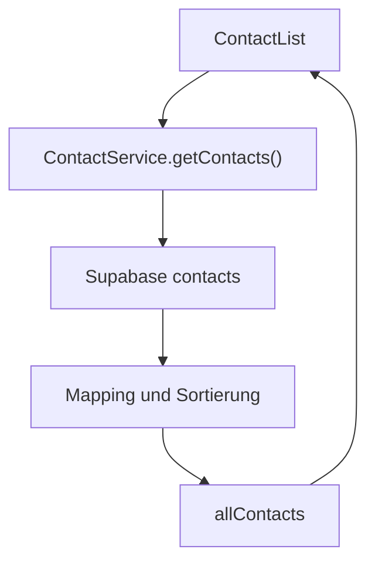
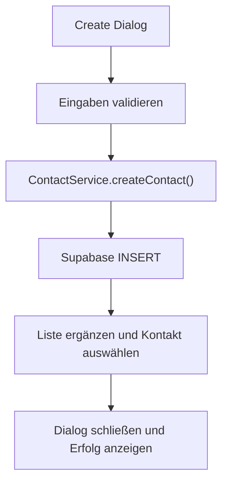

# Kontakte

Dieses Dokument beschreibt die finale Kontaktverwaltung von **Join**. Dazu gehören die Kontaktliste, die Detailansicht, das Erstellen, Bearbeiten und Löschen von Kontakten sowie die gemeinsame Nutzung der Kontaktdaten in Tasks.

Formularregeln und Fehlermeldungen werden ausführlich unter [Formulare und Validierung](forms-validation.md) dokumentiert. Tabellenstruktur, Auth-Verknüpfung und RLS-Policies stehen unter [Datenbank und Sicherheit](../architecture/database-security.md).

## Funktionsumfang

Die Kontaktverwaltung unterstützt:

- Laden und alphabetisches Gruppieren aller Kontakte
- Auswahl eines Kontakts
- Anzeige von Name, E-Mail-Adresse und Telefonnummer
- Erstellen neuer Kontakte
- Bearbeiten bestehender Kontakte
- Löschen von Kontakten
- farbige Avatare mit Initialen
- Desktop-, Tablet- und Mobile-Darstellung
- Verwendung der Kontakte als Task-Zuweisungen

Die Route `/contacts` ist durch den zentralen Auth Guard geschützt. Ein Datenzugriff ist nur mit einer gültigen registrierten oder anonymen Supabase-Session möglich.

## Zuständige Dateien

```text
src/app/
├── core/
│   ├── models/
│   │   └── contact.model.ts
│   └── services/
│       └── contact.service.ts
└── features/
    └── contacts/
        ├── components/
        │   ├── contact-create-dialog/
        │   ├── contact-detail/
        │   ├── contact-edit-dialog/
        │   ├── contact-list/
        │   └── contact-success-overlay/
        └── pages/
            └── contacts/
```

## Komponenten und Verantwortlichkeiten

| Baustein | Verantwortung |
| --- | --- |
| `Contacts` | Koordiniert Liste, Detailansicht, Dialoge, Erfolgsmeldungen und Body-Scroll-Lock |
| `ContactList` | Lädt Kontakte, zeigt Lade- und Fehlerzustand, gruppiert die Liste und setzt die Auswahl |
| `ContactDetail` | Zeigt den ausgewählten Kontakt und stellt Bearbeiten-, Löschen- und Zurück-Aktionen bereit |
| `ContactCreateDialog` | Erfasst und validiert die Daten eines neuen Kontakts |
| `ContactEditDialog` | Initialisiert das Formular mit bestehenden Daten und ermöglicht Speichern oder Löschen |
| `ContactSuccessOverlay` | Bestätigt erfolgreiches Erstellen, Aktualisieren oder Löschen |
| `ContactService` | Kapselt Supabase-Zugriff, Mapping, Sortierung, Badge-Erzeugung und gemeinsamen Signal-State |

Die Page-Komponente führt keine eigenen Supabase-Abfragen aus. Sie reagiert auf Outputs der Unterkomponenten und delegiert fachliche Datenoperationen an den `ContactService`.

## Kontaktmodell

Join trennt die Datenbankdarstellung von den im Frontend verwendeten Modellen.

### Datenbankzeile

`ContactRow` bildet die Spalten der Tabelle `contacts` mit `snake_case` ab:

```typescript
interface ContactRow {
  id: string;
  first_name: string;
  last_name: string;
  email: string;
  phone: string | null;
  badge_color: string;
  auth_user_id: string | null;
  created_at: string;
  updated_at: string;
}
```

### Anwendungsmodell

`Contact` verwendet die TypeScript-Konvention `camelCase`:

```typescript
interface Contact {
  id: string;
  firstName: string;
  lastName: string;
  email: string;
  phone: string | null;
  badgeColor: string;
  authUserId: string | null;
  createdAt: string;
  updatedAt: string;
}
```

Für Schreiboperationen existieren getrennte Payload-Typen:

| Typ | Verwendung |
| --- | --- |
| `CreateContact` | Pflichtdaten für einen neuen Kontakt |
| `UpdateContact` | Optional änderbare Felder eines bestehenden Kontakts |

Der Service übernimmt das Mapping zwischen beiden Darstellungen. Supabase-Feldnamen werden dadurch nicht bis in die sichtbaren Components weitergereicht.

## Signal-State

`ContactService` stellt zwei gemeinsam genutzte Signals bereit:

| Signal | Bedeutung |
| --- | --- |
| `allContacts` | Aktuell geladener und sortierter Kontaktbestand |
| `selectedContact` | Ausgewählter Kontakt oder `null` |

`allContacts` wird nicht nur von der Kontaktseite verwendet. Add Task und Board greifen ebenfalls darauf zu, um Kontakte auszuwählen und zugewiesene Personen darzustellen.

Die Komponenten verwalten nur zusätzlichen UI-Zustand:

- Lade- und Fehlermeldung der Kontaktliste
- geöffneter Erstellen- oder Bearbeiten-Dialog
- mobiler Aktionsmenüstatus
- Schließanimationen
- temporäre Erfolgsmeldung

## Laden und Auswählen

Beim Initialisieren ruft `ContactList` die Kontakte über `ContactService.getContacts()` ab.



Der Request sortiert nach:

1. `first_name`
2. `last_name`

Der Service sortiert das gemappte Ergebnis zusätzlich im Frontend nach denselben Kriterien. Die Liste erzeugt einen Buchstaben-Header, sobald sich der erste Buchstabe des Vornamens gegenüber dem vorherigen Eintrag ändert.

Beim Anklicken eines Kontakts wird das vollständige Objekt in `selectedContact` gespeichert. Die Detailkomponente liest dasselbe Signal und aktualisiert ihre Darstellung dadurch ohne zusätzlichen Einzelrequest.

Während des Ladens zeigt die Liste einen Ladehinweis. Schlägt der Request fehl, wird eine allgemeine Fehlermeldung angezeigt und kein unvollständiger Zustand als erfolgreiche Liste behandelt.

## Kontakt erstellen

Der Erstellen-Ablauf lautet:



Vor dem Speichern:

- werden Vorname, Nachname, E-Mail-Adresse und Telefonnummer getrimmt
- wird ein vollständiger Name in Vor- und Nachname aufgeteilt
- wird bei nur einem Namensbestandteil `Unknown` als Nachname verwendet
- wird die Telefonnummer auf erlaubte Zeichen normalisiert
- erzeugt der Service eine Badge-Farbe

Der Service liest die bereits verwendeten Badge-Farben und versucht eine neue HSL-Farbe zu erzeugen. Nach erfolgreichem Insert wird der Kontakt:

- in `allContacts` eingefügt
- erneut alphabetisch einsortiert
- als `selectedContact` gesetzt

Anschließend schließt die Page den Dialog und zeigt die Erfolgsmeldung `Contact successfully created`.

## Kontakt bearbeiten

`ContactEditDialog` erhält den ausgewählten Kontakt als Input und übernimmt seine Werte in ein Reactive Form.

Nach erfolgreicher Validierung:

1. erzeugt der Dialog ein `UpdateContact`-Payload
2. ruft die Page `ContactService.updateContact()` auf
3. aktualisiert Supabase den Datensatz und `updated_at`
4. ersetzt der Service den Kontakt in `allContacts`
5. wird `selectedContact` auf den aktualisierten Datensatz gesetzt
6. schließt die Page den Dialog und zeigt die Erfolgsmeldung

Die Badge-Farbe bleibt beim Bearbeiten unverändert.

## Kontakt löschen

Ein Kontakt kann über die Detailansicht oder den Bearbeiten-Dialog gelöscht werden.

`ContactService.deleteContact()` entfernt den Datensatz zuerst in Supabase. Nur nach einem erfolgreichen Request wird der lokale Zustand angepasst:

- der Kontakt wird aus `allContacts` entfernt
- `selectedContact` wird geleert, wenn der gelöschte Kontakt ausgewählt war
- die mobile Detailansicht kehrt zur Liste zurück

Zugehörige Einträge aus `task_assignments` werden durch die Datenbankrelation mit `ON DELETE CASCADE` entfernt. Tasks selbst bleiben bestehen.

Nach einem Löschvorgang aus dem Bearbeiten-Dialog zeigt die Page `Contact successfully deleted`.

## Validierung

Erstellen- und Bearbeiten-Dialog verwenden Angular Reactive Forms mit denselben fachlichen Regeln:

| Feld | Zentrale Regel |
| --- | --- |
| Name | Pflichtfeld; Buchstaben, Leerzeichen, Bindestriche und Apostrophe |
| E-Mail | Pflichtfeld; gültiges E-Mail-Format |
| Telefon | Pflichtfeld; Ziffern, Leerzeichen und optional ein führendes `+` |

Fehler werden erst nach Benutzerinteraktion oder einem Absendeversuch sichtbar. Die Fehlerbereiche besitzen reservierten Platz, damit Fehlermeldungen das Dialoglayout nicht verschieben.

Die vollständige Validierungslogik steht unter [Formulare und Validierung](forms-validation.md).

## Responsive Verhalten

### Desktop und Tablet

- Kontaktliste und Detailansicht stehen nebeneinander.
- Nur die Kontaktliste besitzt einen eigenen Scrollbereich.
- Der ausgewählte Listeneintrag erhält einen aktiven Zustand.
- Bearbeiten und Löschen sind direkt in der Detailansicht erreichbar.
- Erstellen- und Bearbeiten-Dialog erscheinen als modale Overlays.

### Mobile

- Die Kontaktliste nutzt zunächst die verfügbare Breite.
- Nach der Auswahl wird die Liste ausgeblendet und die Detailansicht als mobile Vollansicht dargestellt.
- Ein Zurück-Button entfernt die Auswahl und zeigt wieder die Liste.
- Bearbeiten und Löschen liegen in einem eigenen mobilen Aktionsmenü.
- Der Add-Contact-Button wird als Floating Action Button dargestellt.
- Dialoge und Erfolgsmeldungen werden mobil von unten eingeblendet.

Beim Öffnen eines Dialogs setzt die Page die Klasse `dialog-open` auf dem `body`. Dadurch bleibt der Hintergrund gesperrt. Die Klasse wird nach dem Schließen sowie beim Zerstören der Page entfernt.

## Avatare und Badge-Farben

Kontaktavatare bestehen aus:

- dem ersten Buchstaben des Vornamens
- dem ersten Buchstaben des Nachnamens
- einer für den Kontakt gespeicherten Hintergrundfarbe

Die Initialen werden in Großbuchstaben angezeigt. Dieselben Kontaktdaten und Farben werden in der Kontaktliste, Detailansicht, Task-Auswahl und auf Board-Karten verwendet.

Bei automatisch aus einer Registrierung erzeugten Kontakten vergibt der Datenbank-Trigger eine reproduzierbare Farbe aus der Auth-User-ID. Manuell erstellte Kontakte erhalten ihre Farbe durch den `ContactService`.

## Verwendung in Tasks

Kontakte und Tasks sind über `task_assignments` als Many-to-Many-Beziehung verbunden:

```text
Contact
   ↓
task_assignments
   ↓
Task
```

Add Task verwendet `allContacts`, um mehrere Kontakte auszuwählen. Das Board lädt die zugehörigen Kontakte für Karten und Detaildialoge. Die Kontaktverwaltung speichert keine Task-IDs im Kontaktdatensatz; alle Zuweisungen bleiben in der Relationstabelle.

Details stehen unter [Tasks und Board](tasks-board.md).

## Auth-Verknüpfung und Sicherheitsgrenze

Ein Kontakt kann über `auth_user_id` optional mit einem Supabase-Benutzer verbunden sein. Der Datenbank-Trigger erzeugt für einen neu registrierten Benutzer einen solchen Kontakt. Anonyme Gastbenutzer werden dabei übersprungen.

Die Auth-Verknüpfung:

- verhindert mehrere Kontaktprofile für denselben Auth-Benutzer
- ermöglicht eine spätere Zuordnung zwischen Login und fachlichem Kontakt
- erzeugt im finalen Projekt keine Benutzerrollen
- begrenzt den gemeinsamen Kontaktbestand nicht auf den jeweiligen Benutzer

Jede gültige registrierte oder anonyme Session kann den gemeinsamen Demo-Kontaktbestand lesen und verändern. Diese Grenze wird ausführlich unter [Datenbank und Sicherheit](../architecture/database-security.md) beschrieben.

## Fehler- und Zustandsregeln

- Der lokale Kontaktbestand wird erst nach einem erfolgreichen Supabase-Request verändert.
- Lesefehler erzeugen einen sichtbaren Fehlerzustand in der Kontaktliste.
- Fehlgeschlagene Schreiboperationen dürfen nicht als Erfolg bestätigt werden.
- Nach Erstellen und Bearbeiten bleibt der betroffene Kontakt ausgewählt.
- Nach dem Löschen eines ausgewählten Kontakts wird die Auswahl entfernt.
- Sortierung und Auswahl werden zentral über den `ContactService` konsistent gehalten.
- Components greifen nicht direkt auf die Tabelle `contacts` zu.

## Weiterführende Dokumentation

- [Anwendungsarchitektur](../architecture/application.md)
- [Datenbank und Sicherheit](../architecture/database-security.md)
- [Authentifizierung und Routing](../architecture/authentication-routing.md)
- [Tasks und Board](tasks-board.md)
- [Formulare und Validierung](forms-validation.md)
- [State- und Fehlerbehandlung](../engineering/state-error-handling.md)
- [Styling und Barrierefreiheit](../engineering/styling-accessibility.md)
- [Tests](../engineering/testing.md)