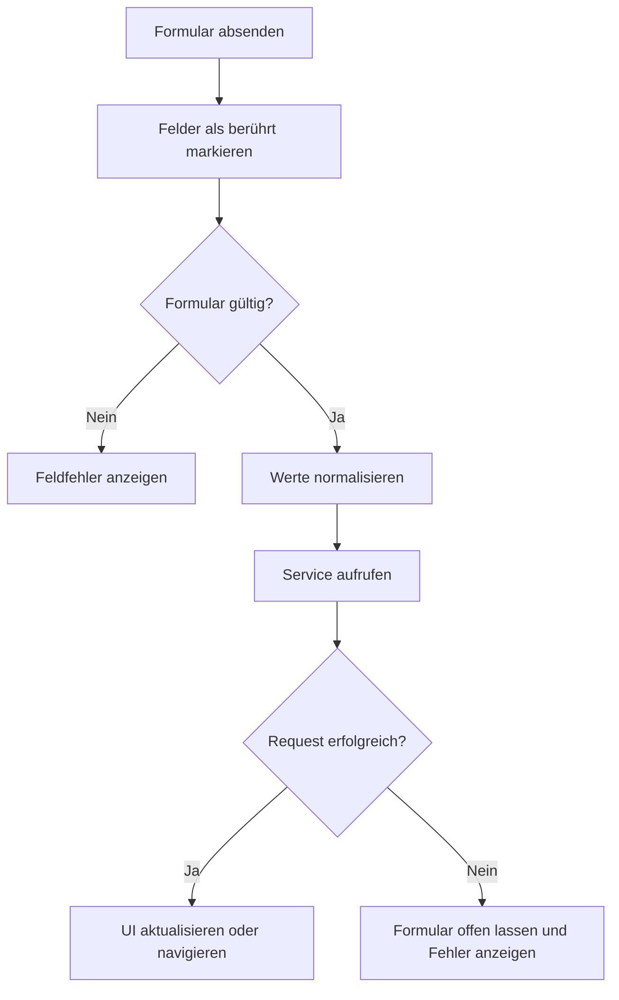

# Formulare und Validierung

Dieses Dokument beschreibt den finalen Formularaufbau von **Join**. Es umfasst Login, Registrierung, Kontaktverwaltung, Add Task und das Bearbeiten bestehender Tasks. Dokumentiert werden Validierungsregeln, Normalisierung, Payload-Erzeugung, Fehleranzeige und Absendeverhalten.

Die fachlichen CRUD-Abläufe stehen unter [Kontakte](contacts.md) und [Tasks und Board](tasks-board.md). Authentifizierungsabläufe und Backend-Fehler werden unter [Authentifizierung und Routing](../architecture/authentication-routing.md) eingeordnet.

## Geltungsbereich

Join verwendet Angular Reactive Forms in folgenden Bereichen:

| Formular | Component | Zweck |
| --- | --- | --- |
| Login | `Login` | Anmeldung mit E-Mail-Adresse und Passwort |
| Registrierung | `Signup` | Erstellen eines Supabase-Benutzerkontos |
| Kontakt erstellen | `ContactCreateDialog` | Erstellen eines Kontakts |
| Kontakt bearbeiten | `ContactEditDialog` | Aktualisieren eines Kontakts |
| Task erstellen | `AddTaskContent` | Gemeinsames Formular für Add-Task-Seite und Board-Dialog |
| Task bearbeiten | `BoardCardsDialog` | Aktualisieren eines Tasks samt Subtasks und Zuweisungen |

Sucheingaben auf dem Board und in Kontakt-Drop-downs sind lokale Filter und keine speichernden Formulare.

## Zuständige Dateien

```text
src/app/
├── core/
│   ├── mappers/
│   │   ├── auth-error.mapper.ts
│   │   └── task-payload.mapper.ts
│   ├── models/
│   │   ├── auth.model.ts
│   │   ├── contact.model.ts
│   │   ├── task-persistence.model.ts
│   │   └── task.model.ts
│   └── services/
│       ├── auth.service.ts
│       ├── contact.service.ts
│       └── task.service.ts
└── features/
    ├── add-task/
    │   └── components/
    │       └── add-task-content/
    ├── auth/
    │   └── pages/
    │       ├── login/
    │       └── signup/
    ├── board/
    │   └── components/
    │       └── board-cards-dialog/
    └── contacts/
        └── components/
            ├── contact-create-dialog/
            └── contact-edit-dialog/
```

## Verantwortlichkeiten

Die Validierung ist auf mehrere Ebenen verteilt:

| Ebene | Verantwortung |
| --- | --- |
| Component | Form Controls, UI-Validatoren, Touched- und Submitted-State, sichtbare Fehlermeldungen und fachliche Payload-Erzeugung |
| Service | Geschäftsablauf, Lade- und Fehlerzustand, zusätzliche fachliche Schutzprüfungen und Zustandsaktualisierung |
| Mapper | Normalisierung zwischen Anwendungsmodell und Datenbank-Payload |
| Supabase | Authentifizierungsregeln, Constraints, Fremdschlüssel, RLS und persistente Datenintegrität |

Eine erfolgreiche Frontend-Validierung bedeutet nicht, dass Supabase den Request zwingend akzeptiert. Eindeutigkeit, Passwortsicherheit, Tabellenregeln und Zugriffsrechte werden weiterhin im Backend geprüft.

Sichtbare Components verwenden `camelCase`-Modelle. Datenbankfelder wie `due_date`, `sort_order` oder `first_name` werden nicht direkt aus einem Formular erzeugt.

## Gemeinsamer Submit-Ablauf

Die Formulare folgen grundsätzlich diesem Ablauf:



Ein ungültiges Formular ruft keinen speichernden Service auf. `markAllAsTouched()` macht nach einem fehlgeschlagenen Submit auch Fehler in bisher unberührten Pflichtfeldern sichtbar.

Mehrere Formulare setzen zusätzlich ein `submitted`-Signal. Dadurch können Fehler nach dem ersten Absendeversuch sichtbar bleiben, auch wenn ein Control noch keinen eigenen Blur ausgelöst hat.

## Fehleranzeige

Join unterscheidet Feldfehler und Request-Fehler:

| Fehlertyp | Beispiel | Darstellung |
| --- | --- | --- |
| Feldfehler | Pflichtfeld leer, E-Mail ungültig | Direkt am betroffenen Feld |
| Formularfehler | Pflichtangaben oder Subtasks unvollständig | Allgemeine Meldung innerhalb des Formulars |
| Request-Fehler | Supabase-Request fehlgeschlagen | Allgemeine Meldung im Formular oder Dialog |

Kontakt-, Add-Task- und Task-Edit-Formulare zeigen Feldfehler nach dem Berühren des Controls an. Login und Registrierung verwenden die Bedingung:

```typescript
control.invalid && (control.touched || submitted())
```

Bei den dafür vorgesehenen Formularen verhindert `novalidate` native Browser-Pop-ups. Die Anwendung kontrolliert Fehlermeldungen und Fehlerzustände dadurch selbst.

Fehlerbereiche besitzen eine feste oder minimale Höhe. Neue Fehlermeldungen verschieben nachfolgende Felder und Buttons deshalb nicht unnötig.

## Login

Das Login-Formular besitzt zwei Controls:

| Control | Validatoren |
| --- | --- |
| `email` | `required`, `email` |
| `password` | `required` |

Beim Absenden:

1. wird `submitted` auf `true` gesetzt
2. werden bei einem ungültigen Formular alle Controls als berührt markiert
3. wird die E-Mail-Adresse getrimmt und in Kleinbuchstaben umgewandelt
4. bleibt das Passwort unverändert
5. wird `AuthService.signIn()` aufgerufen

Das erzeugte Payload lautet:

```typescript
interface LoginCredentials {
  email: string;
  password: string;
}
```

Die Component prüft nicht selbst, ob die Zugangsdaten existieren. Supabase führt die eigentliche Anmeldung aus. Technische Auth-Fehler werden im Auth-Service in sichere Meldungen wie `Invalid email or password.` übersetzt.

Sobald der Benutzer das Formular nach einem Backend-Fehler erneut verändert, wird die veraltete Request-Meldung entfernt.

Login- und Gast-Button sind während einer laufenden Auth-Operation deaktiviert. Die Gastanmeldung verwendet kein Formularpayload und kann unabhängig vom Zustand der E-Mail- und Passwortfelder gestartet werden.

## Registrierung

Das Registrierungsformular verwendet:

| Control | Validatoren |
| --- | --- |
| `fullName` | `required`, mindestens ein Nicht-Leerzeichen |
| `email` | `required`, `email` |
| `password` | `required` |
| `confirmPassword` | `required` |
| `privacyAccepted` | `requiredTrue` |
| gesamtes Formular | `passwordsMatchValidator` |

Der Formular-Validator vergleicht `password` und `confirmPassword`. Stimmen beide Werte nicht überein, erhält die FormGroup den Fehler `passwordMismatch`.

Die Bestätigung wird nur im Frontend verwendet und nicht an Supabase übertragen:

```typescript
interface SignUpCredentials {
  fullName: string;
  email: string;
  password: string;
  privacyAccepted: boolean;
}
```

Vor dem Service-Aufruf:

- wird der vollständige Name getrimmt
- wird die E-Mail-Adresse getrimmt und kleingeschrieben
- bleibt das Passwort unverändert
- wird die bestätigte Datenschutzerklärung übernommen

`AuthService.signUp()` prüft `privacyAccepted` zusätzlich. Dadurch wird eine Registrierung auch dann abgelehnt, wenn die Component-Prüfung umgangen und der Service direkt mit `false` aufgerufen wird.

### Passwortprüfung

Die finale Frontend-Implementierung prüft:

- Passwort ist nicht leer
- Passwortbestätigung ist nicht leer
- beide Werte stimmen überein

Eine eigene Mindestlänge oder Komplexitätsregel ist nicht im Angular-Formular hinterlegt. Die Passwortstärke wird durch Supabase geprüft. Eine Ablehnung wird über den Fehlercode `weak_password` in eine benutzerfreundliche Meldung übersetzt.

### Navigation nach Registrierung

Nach erfolgreicher Registrierung entscheidet das Ergebnis des Auth-Service:

```text
E-Mail-Bestätigung erforderlich
→ Navigation zu /login

Session direkt vorhanden
→ Navigation zu /summary
```

Bei einem ungültigen Formular oder einem Supabase-Fehler findet keine Erfolgsnavigation statt.

## Kontaktformulare

Erstellen und Bearbeiten verwenden dieselben Controls und Regeln:

| Control | Validatoren |
| --- | --- |
| `fullName` | `required`, eigener Namensvalidator |
| `email` | `required`, `email` |
| `phone` | `required`, Pattern für Ziffern, Leerzeichen und optionales führendes `+` |

Beide Dialoge:

- markieren beim Submit alle Controls als berührt
- normalisieren die Telefonnummer
- aktualisieren anschließend die Gültigkeit
- erzeugen nur bei einem gültigen Formular ein Payload
- schließen bei einer ungültigen Eingabe nicht

### Namensvalidierung

Das unterstützte Namensmuster erlaubt:

- Buchstaben einschließlich deutscher und weiterer lateinischer Sonderzeichen
- Leerzeichen
- Bindestriche
- Apostrophe

Zahlen erzeugen den eigenen Fehler `nameHasNumber`. Andere nicht unterstützte Zeichen erzeugen `invalidName`.

Nach erfolgreicher Prüfung wird `fullName` getrimmt und an Leerzeichen aufgeteilt:

```text
"Max Paul Mustermann"
→ firstName: "Max"
→ lastName: "Paul Mustermann"
```

Besteht der Name nur aus einem Teil, setzt die Component:

```text
firstName: "Max"
lastName: "Unknown"
```

Die Kontaktformulare erzeugen dadurch direkt `CreateContact` oder `UpdateContact` im Anwendungsformat.

### E-Mail-Adresse

Die E-Mail-Adresse wird mit `Validators.email` geprüft und vor dem Erzeugen des Payloads getrimmt. Eine Änderung der Groß- und Kleinschreibung findet in den Kontaktformularen nicht statt.

### Telefonnummer

Das verwendete Pattern lautet:

```typescript
/^\+?[0-9 ]+$/
```

Die Eingabe wird bereits während der Bearbeitung und erneut vor dem Submit normalisiert:

1. nicht unterstützte Zeichen werden entfernt
2. mehrere Leerzeichen werden zusammengefasst
3. führende Leerzeichen werden entfernt
4. höchstens ein `+` bleibt erhalten
5. das `+` darf nur am Anfang stehen
6. der finale Wert wird vor dem Payload getrimmt

Beispiele für normalisierte Werte:

```text
"+49 170 1234567" → "+49 170 1234567"
"0170-1234567"    → "01701234567"
"0170   1234567"  → "0170 1234567"
```

Telefon ist im finalen Kontaktformular ein Pflichtfeld und wird nicht als `null` übermittelt.

### Bearbeiten und Löschen

Das Bearbeiten-Formular wird mit dem ausgewählten Kontakt initialisiert. Beim Speichern wird ein vollständiges `UpdateContact`-Payload für Name, E-Mail-Adresse und Telefon ausgegeben. Die bestehende Badge-Farbe wird durch das Formular nicht neu erzeugt.

Löschen ist keine Formularvalidierung. Der Delete-Button sendet die Kontakt-ID als eigene Aktion und ruft keinen Submit des Edit-Formulars aus.

## Add Task

`AddTaskContent` wird sowohl auf `/add-task` als auch innerhalb des Board-Dialogs verwendet. Beide Darstellungen verwenden dieselbe FormGroup und dieselben Regeln.

| Control | Ausgangswert | Validatoren |
| --- | --- | --- |
| `title` | leer | `required`, mindestens ein Nicht-Leerzeichen, maximal 120 Zeichen |
| `description` | leer | maximal 1000 Zeichen |
| `dueDate` | leer | `required`, nicht in der Vergangenheit |
| `priority` | `medium` | `required` |
| `category` | leer | `required` |

Kontaktzuweisungen und Subtasks liegen nicht als Form Controls vor. Sie werden als lokale Signals verwaltet und beim Submit mit dem Formularwert zusammengeführt.

### Titel und Beschreibung

Ein Titel, der ausschließlich aus Leerzeichen besteht, wird durch `Validators.pattern(/\S/)` abgelehnt. Titel und Beschreibung werden vor dem Erzeugen des Payloads getrimmt.

Die Längenbegrenzungen bestehen sowohl im Formularmodell als auch über `maxlength` an den sichtbaren Feldern:

```text
Titel:        maximal 120 Zeichen
Beschreibung: maximal 1000 Zeichen
```

Die Beschreibung ist optional und wird bei leerer Eingabe als leerer String übertragen.

### Fälligkeitsdatum

Das minimale Datum des Date Inputs wird beim Erzeugen der Component auf den aktuellen lokalen Kalendertag gesetzt.

Zusätzlich prüft `dateNotInPastValidator()` den Wert unabhängig vom sichtbaren `min`-Attribut:

```text
leerer Wert            → required
Datum vor heute        → dateInPast
heute oder später      → gültig
```

Der Vergleich erfolgt gegen den lokalen Tagesbeginn. Das Datenbankpayload verwendet weiterhin das Format `YYYY-MM-DD`.

### Priorität und Kategorie

Priorität ist technisch ein Pflicht-Control, besitzt mit `medium` aber bereits einen gültigen Ausgangswert. Erlaubt sind:

```text
urgent
medium
low
```

Die Kategorie startet leer und muss aktiv ausgewählt werden:

```text
technical_task → Technical Task
user_story     → User Story
```

Gespeichert wird jeweils der technische Wert, nicht der sichtbare Anzeigetext.

### Kontaktzuweisungen

Ausgewählte Kontakte werden ausschließlich als IDs gesammelt:

```typescript
contactIds: string[]
```

Die Auswahl ist optional. Die Kontaktsuche trimmt den Suchbegriff, ignoriert Groß- und Kleinschreibung und durchsucht Vorname, Nachname und E-Mail-Adresse.

Mehrfachauswahl und Suchtext sind lokaler UI-Zustand. Vollständige Kontaktobjekte werden nur für Namen und Badges verwendet und nicht in den Task-Datensatz geschrieben.

### Subtasks

Neue Subtasks werden zunächst als lokale Entwürfe gespeichert:

```typescript
interface DraftSubtask {
  title: string;
}
```

Beim Hinzufügen oder Speichern einer Bearbeitung wird der Titel getrimmt. Leere oder ausschließlich aus Leerzeichen bestehende Subtasks werden nicht übernommen.

Enter im Subtask-Feld führt nicht zum Submit des Hauptformulars:

```text
Enter
→ Standard-Submit verhindern
→ Subtask zur lokalen Liste hinzufügen
```

Beim Erzeugen des Task-Payloads erhält jeder Subtask seine Position als `sortOrder`. Die `taskId` wird erst nach dem erfolgreichen Task-Insert im `TaskService` ergänzt.

### Create-Payload

Nach erfolgreicher Validierung erzeugt die Component:

```typescript
interface CreateTaskWithRelationsInput {
  task: {
    title: string;
    description: string;
    dueDate: string;
    priority: TaskPriority;
    category: TaskCategory;
    status: TaskStatus;
    sortOrder: number;
  };
  subtasks: {
    title: string;
    sortOrder: number;
  }[];
  contactIds: string[];
}
```

`status` stammt aus dem Component-Input und ist standardmäßig `todo`. `sortOrder` entspricht beim Erstellen der aktuellen Anzahl von Tasks in der Zielspalte.

Während `isSubmitting` aktiv ist, werden weitere Submits ignoriert und die Formularaktionen deaktiviert.

Nach erfolgreichem Erstellen werden FormGroup, Kontaktwahl, Kontaktsuche, Subtasks, offene Menüs und temporäre Fehler zurückgesetzt. Auf der Add-Task-Seite setzt der sekundäre Button das Formular zurück; im Dialog sendet er eine Abbruchaktion.

## Task bearbeiten

Der Bearbeitungsmodus des `BoardCardsDialog` initialisiert seine FormGroup aus dem geöffneten Task:

| Control | Validatoren |
| --- | --- |
| `title` | `required`, mindestens ein Nicht-Leerzeichen, maximal 120 Zeichen |
| `description` | maximal 1000 Zeichen |
| `dueDate` | `required` |
| `priority` | `required` |
| `category` | `required` |

Titel und Beschreibung werden vor dem Update getrimmt. Priorität und Kategorie verwenden dieselben technischen Werte wie Add Task.

Im finalen Edit-Formular besitzt `dueDate` keinen `dateNotInPastValidator`. Die Prüfung auf vergangene Daten gilt daher nur beim Erstellen eines Tasks. Beim Bearbeiten muss ein Datum vorhanden sein, es wird jedoch nicht zusätzlich gegen den aktuellen Tag geprüft.

### Subtasks im Edit-Modus

Bestehende und neue Subtasks liegen gemeinsam im lokalen `editableSubtasks`-State:

```typescript
interface EditableSubtask {
  id?: string;
  title: string;
  isCompleted: boolean;
}
```

Vor dem Speichern prüft `hasInvalidSubtask()`, ob ein Titel nach dem Trimmen leer ist. Sobald ein ungültiger Subtask existiert, wird das gesamte Update verhindert.

Beim Payload-Mapping:

- behalten bestehende Subtasks ihre ID
- besitzen neue Subtasks keine ID
- werden Titel getrimmt
- bleibt der Erledigt-Status erhalten
- bestimmt die Array-Reihenfolge den neuen `sortOrder`

### Vollständiger Relationszustand

Das Edit-Formular übermittelt den gewünschten Endzustand für beide Relationsbereiche:

```typescript
interface UpdateTaskWithRelationsInput {
  task: UpdateTask;
  subtasks: UpdateTaskSubtaskInput[];
  contactIds: string[];
}
```

Damit gilt für dieses Formular:

```text
subtasks: []
→ alle bisherigen Subtasks entfernen

contactIds: []
→ alle bisherigen Kontaktzuweisungen entfernen
```

Der Service ermittelt anschließend, welche Relationen erstellt, aktualisiert oder gelöscht werden müssen. Die Component führt keine einzelnen Supabase-Operationen pro entfernten Eintrag aus.

Während des Speicherns blockiert `isSaving` weitere Updates und das Schließen des Dialogs. Bei einem Fehler bleibt der Edit-Modus mit den eingegebenen Werten geöffnet und zeigt `Task could not be updated.`.

## Normalisierung und Payload-Grenze

Die wichtigsten Umwandlungen vor einem Service-Aufruf sind:

| Eingabe | Normalisierung |
| --- | --- |
| Auth-E-Mail | trimmen und kleinschreiben |
| Kontakt-E-Mail | trimmen |
| vollständiger Kontaktname | trimmen und in Vor- und Nachname aufteilen |
| Telefonnummer | Zeichen bereinigen, Leerzeichen und `+` normalisieren, trimmen |
| Task-Titel | trimmen |
| Task-Beschreibung | trimmen |
| Subtask-Titel | trimmen |
| Kontaktauswahl | vollständige Kontakte auf IDs reduzieren |

Danach übernehmen Service und Mapper die nächste Grenze:

```text
Formularwerte
    ↓
Anwendungspayload in camelCase
    ↓
Service und Payload-Mapper
    ↓
Datenbankpayload in snake_case
```

Formulare setzen keine servergenerierten IDs, Zeitstempel oder Auth-User-IDs.

## Lade-, Erfolgs- und Fehlerzustände

- Login und Registrierung verwenden den zentralen Ladezustand des `AuthService`.
- Add Task verwendet getrennte Zustände für das Laden der Ausgangsdaten und das Erstellen.
- Der Task-Dialog trennt Speichern, Löschen und Subtask-Aktualisierung.
- Kontaktformulare geben gültige Payloads an die koordinierende Page weiter; Erfolgsmeldung und Dialogschluss erfolgen dort.
- Ein neuer Submit entfernt veraltete formularbezogene Fehler.
- Fehlgeschlagene Requests dürfen keinen Erfolg auslösen.
- Formulardaten bleiben bei fehlgeschlagenen Task- oder Auth-Requests für einen erneuten Versuch erhalten.

Ein erfolgreicher Service-Request kann abhängig vom Feature:

- zu `/summary` navigieren
- zu `/login` navigieren
- das Formular zurücksetzen
- einen Dialog schließen
- ein Success-Overlay anzeigen
- Board-Relationen erneut laden

## Barrierefreiheit

Die finalen Formulare verwenden je nach Darstellung:

- sichtbare oder visuell versteckte Labels
- `aria-describedby` zur Zuordnung von Fehlertexten
- `aria-invalid` bei Auth-Eingaben
- klar sichtbare Fehlerklassen an ungültigen Feldern
- `role="alert"` für relevante Formular- und Request-Fehler
- `aria-live` für Auth-Fehlermeldungen
- echte Buttons für Absenden, Abbrechen, Löschen und Icon-Aktionen
- `type="button"` für Aktionen, die das Formular nicht absenden dürfen
- deaktivierte Aktionen während laufender Requests
- eine logische Tastaturreihenfolge

Dekorative Icons besitzen leere Alternativtexte oder `aria-hidden="true"`. Enter in einem Subtask-Feld wird gezielt behandelt, damit nicht versehentlich der vollständige Task gespeichert wird.

Weitere Regeln stehen unter [Styling und Barrierefreiheit](../engineering/styling-accessibility.md).

## Sicherheitsgrenzen

- Frontend-Validierung verbessert Bedienung und Datenqualität, ersetzt aber keine Datenbankregeln.
- Eine gültige Angular Form umgeht weder RLS noch Tabellenrechte.
- Passwortstärke und Zugangsdaten werden von Supabase geprüft.
- `AuthService` prüft die Datenschutzannahme zusätzlich zur Component.
- Supabase-Fehler werden vor der Anzeige gemappt.
- Formulare greifen nicht direkt auf den Supabase-Client zu.
- Technische Datenbankfeldnamen werden nicht aus sichtbaren Components übermittelt.

## Tests

Der finale Testlauf enthält eigene Component-Tests für alle zentralen Formularbereiche:

| Testdatei | Anzahl | Schwerpunkt |
| --- | ---: | --- |
| `login.spec.ts` | 11 | Pflichtfelder, E-Mail, Normalisierung, Login, Gastzugang und Navigation |
| `signup.spec.ts` | 13 | Pflichtfelder, Passwortvergleich, Datenschutz, Payload und Navigation |
| `content-create-dialog.spec.ts` | 12 | Kontaktvalidierung, Normalisierung und Create-Payload |
| `contact-edit.spec.ts` | 5 | Initialwerte, E-Mail-Validierung und Update-Payload |
| `add-task-content.spec.ts` | 14 | Formregeln, Datumsvalidator, Kontakte, Subtasks, Payload und Reset |
| `board-card.spec.ts` | 21 | Dialogzustand, Task-Update, Subtasks sowie Erfolgs- und Fehlerfälle |

Die Formulartests sind Teil des finalen Testlaufs mit insgesamt 214 bestandenen Tests. Aufbau, Kommandos und weitere Testbereiche stehen unter [Tests](../engineering/testing.md).

## Weiterführende Dokumentation

- [Anwendungsarchitektur](../architecture/application.md)
- [Authentifizierung und Routing](../architecture/authentication-routing.md)
- [Datenbank und Sicherheit](../architecture/database-security.md)
- [Kontakte](contacts.md)
- [Tasks und Board](tasks-board.md)
- [State- und Fehlerbehandlung](../engineering/state-error-handling.md)
- [Styling und Barrierefreiheit](../engineering/styling-accessibility.md)
- [Tests](../engineering/testing.md)