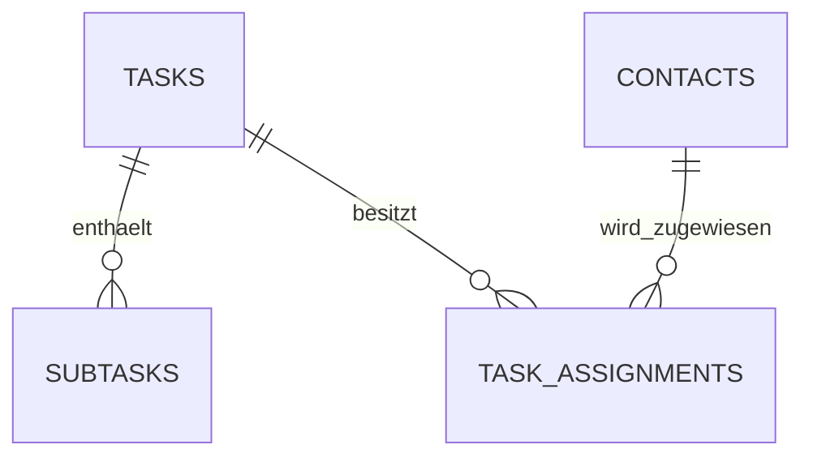
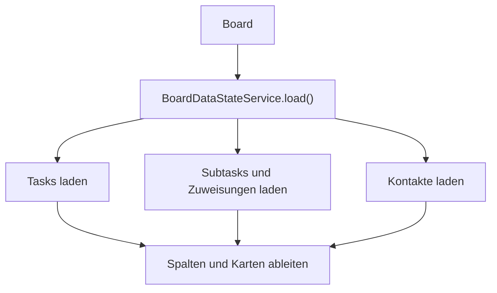
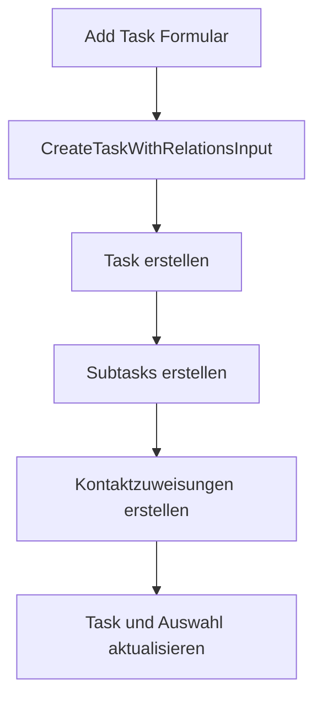
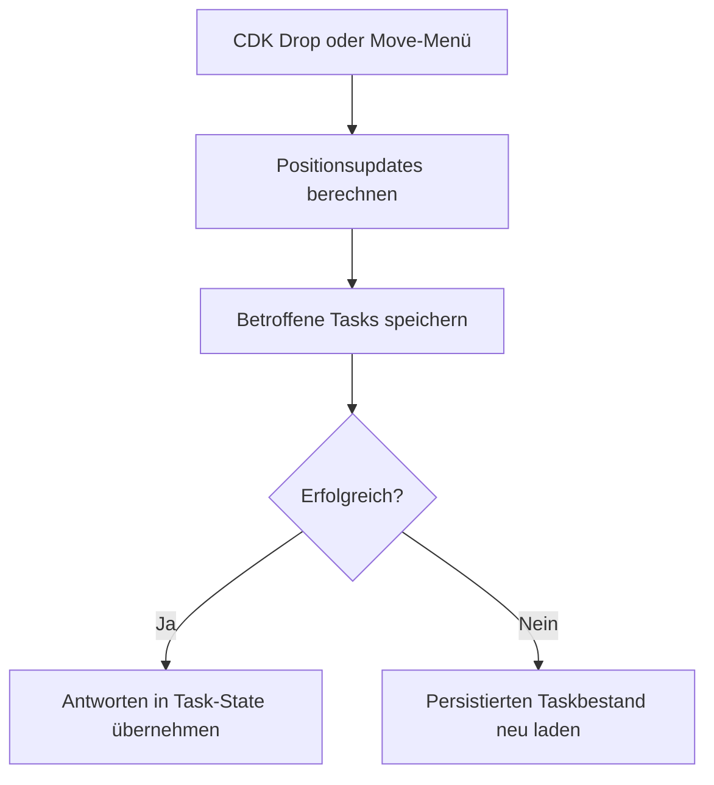

# Tasks und Board

Dieses Dokument beschreibt die finale Task-Verwaltung von **Join**. Dazu gehören das Task-Datenmodell, Add Task, Board-Karten, Suche, Detail- und Bearbeitungsdialog, Subtasks, Kontaktzuweisungen sowie die persistente Sortierung per Drag-and-drop.

Formularregeln werden ausführlich unter [Formulare und Validierung](forms-validation.md) dokumentiert. Tabellen, Relationen und Zugriffsregeln stehen unter [Datenbank und Sicherheit](../architecture/database-security.md).

## Funktionsumfang

Der Task-Bereich unterstützt:

- Erstellen von Tasks als eigene Seite oder Board-Dialog
- Bearbeiten und Löschen bestehender Tasks
- vier Board-Statusspalten
- Sortieren innerhalb einer Spalte
- Verschieben zwischen Spalten
- mobile Statusänderung ohne Drag-and-drop
- Suche nach Titel und Beschreibung
- mehrere Subtasks pro Task
- direkte Aktualisierung des Subtask-Status
- mehrere Kontaktzuweisungen pro Task
- Subtask-Fortschritt und Kontakt-Badges auf Board-Karten
- Öffnen eines Tasks über einen URL-Parameter

Die Routen `/add-task` und `/board` sind durch den zentralen Auth Guard geschützt. Der Datenbankzugriff benötigt eine gültige registrierte oder anonyme Supabase-Session.

## Zuständige Dateien

```text
src/app/
├── core/
│   ├── constants/
│   │   └── task-status.constants.ts
│   ├── mappers/
│   │   ├── task.mapper.ts
│   │   └── task-payload.mapper.ts
│   ├── models/
│   │   ├── subtask.model.ts
│   │   ├── task-assignment.model.ts
│   │   ├── task-persistence.model.ts
│   │   ├── task-relations.model.ts
│   │   └── task.model.ts
│   ├── repositories/
│   │   └── task.repository.ts
│   ├── services/
│   │   ├── task-relations.service.ts
│   │   ├── task-state.service.ts
│   │   └── task.service.ts
│   └── utils/
│       ├── subtask-progress.utils.ts
│       ├── task-filter.utils.ts
│       ├── task-order.utils.ts
│       └── task-state.utils.ts
└── features/
    ├── add-task/
    │   ├── components/
    │   │   ├── add-task-content/
    │   │   └── add-task-dialog/
    │   └── pages/
    │       └── add-task-page/
    └── board/
        ├── components/
        │   ├── board-cards-dialog/
        │   └── task-card/
        ├── pages/
        │   └── board/
        ├── services/
        │   ├── board-data-state.service.ts
        │   ├── board-dialog-state.service.ts
        │   ├── board-horizontal-scroll.service.ts
        │   ├── board-route.service.ts
        │   └── board-task-position.service.ts
        └── utils/
            └── board-data.utils.ts
```

## Verantwortlichkeiten

| Baustein | Verantwortung |
| --- | --- |
| `AddTaskContent` | Gemeinsames Task-Formular für Seite und Dialog |
| `AddTaskPage` | Stellt Add Task als eigene Route dar |
| `AddTaskDialog` | Stellt denselben Create-Flow als Board-Overlay dar |
| `Board` | Koordiniert Spalten, Dialoge, Drag-and-drop, Routing und Fehleranzeige |
| `TaskCard` | Rendert einen Task mit Fortschritt, Badges und Priorität |
| `BoardCardsDialog` | Zeigt, bearbeitet und löscht einen Task und aktualisiert Subtasks |
| `BoardDataStateService` | Lädt Board-Daten und leitet Suche, Spalten und Relationen ab |
| `BoardDialogStateService` | Verwaltet den aktuell geöffneten Task samt Relationen |
| `BoardTaskPositionService` | Berechnet und persistiert Status- und Positionsänderungen |
| `BoardHorizontalScrollService` | Koordiniert responsives Spalten-Scrolling und Pointer-Gesten |
| `BoardRouteService` | Verarbeitet Task- und Statusparameter der Board-Route |
| `TaskService` | Koordiniert CRUD-Abläufe, Fehlerzustand und gemeinsame Task-Operationen |
| `TaskRelationsService` | Synchronisiert Subtasks und Kontaktzuweisungen |
| `TaskStateService` | Verwaltet Tasks und aktuelle Auswahl mit Angular Signals |
| `TaskRepository` | Führt die tatsächlichen Supabase-Abfragen aus |

Sichtbare Components erhalten Anwendungsmodelle über Inputs oder Feature-State. Sie verwenden weder Datenbankfeldnamen noch direkte Supabase-Aufrufe.

## Task-Modell

Join trennt Datenbankzeilen und Anwendungsmodelle.

### Datenbankzeile

```typescript
interface TaskRow {
  id: string;
  title: string;
  description: string;
  due_date: string;
  priority: TaskPriority;
  category: TaskCategory;
  status: TaskStatus;
  sort_order: number;
  created_at: string;
  updated_at: string;
}
```

### Anwendungsmodell

```typescript
interface Task {
  id: string;
  title: string;
  description: string;
  dueDate: string;
  priority: TaskPriority;
  category: TaskCategory;
  status: TaskStatus;
  sortOrder: number;
  createdAt: string;
  updatedAt: string;
}
```

`task.mapper.ts` wandelt gelesene Zeilen in Anwendungsmodelle um. `task-payload.mapper.ts` erzeugt beim Schreiben die Datenbankfelder, trimmt Textwerte und setzt `updated_at` bei Änderungen.

Für Create- und Update-Abläufe existieren getrennte Typen. Dadurch kann ein Update gezielt einzelne Task-Felder ändern, ohne nicht übermittelte Werte zu überschreiben.

## Kategorien, Prioritäten und Status

| Bereich | Erlaubte Werte |
| --- | --- |
| Kategorie | `technical_task`, `user_story` |
| Priorität | `urgent`, `medium`, `low` |
| Status | `todo`, `in_progress`, `awaiting_feedback`, `done` |

Das Board stellt die Statuswerte in dieser festen Reihenfolge dar:

1. To do
2. In progress
3. Await feedback
4. Done

Die Anzeigetexte werden zentral in `task-status.constants.ts` den technischen Statuswerten zugeordnet.

## Relationen

Tasks speichern weder Subtask-Arrays noch Kontakt-Arrays:



Ein Subtask referenziert seinen Task über `task_id`. Kontaktzuweisungen werden durch `task_assignments` mit `task_id` und `contact_id` abgebildet.

Das Frontend verwendet:

- `Subtask` mit `taskId`, `isCompleted` und `sortOrder`
- `TaskAssignmentRow` zum Zuordnen von Task- und Kontakt-IDs
- vollständige `Contact`-Modelle erst nach dem Auflösen der Relation

Beim Löschen eines Tasks entfernt die Datenbank zugehörige Subtasks und Zuweisungen durch `ON DELETE CASCADE`.

## Task-State

`TaskStateService` verwaltet den anwendungsweiten Task-Zustand:

| Signal | Bedeutung |
| --- | --- |
| `allTasks` | Vollständiger, nach Status und Position sortierter Taskbestand |
| `selectedTask` | Aktuell ausgewählter Task oder `null` |
| `selectedSubtasks` | Subtasks des ausgewählten Tasks |
| `assignedContacts` | Kontakte des ausgewählten Tasks |

`TaskService` stellt diese Signals nach außen bereit und ergänzt:

| Signal | Bedeutung |
| --- | --- |
| `isLoading` | Laufende Task-Operation |
| `errorMessage` | Allgemeine Meldung zur letzten fehlgeschlagenen Operation |

Board-spezifischer Zustand bleibt im Feature. `BoardDataStateService` verwaltet alle geladenen Subtasks, Assignment-Zeilen und den Suchbegriff. `BoardDialogStateService` hält ausschließlich die Daten des geöffneten Dialogs.

## Board laden

Beim Initialisieren lädt das Board drei Datenbereiche parallel:



`TaskRepository` sortiert Tasks zunächst nach `sort_order` und `created_at`. Der lokale State stellt zusätzlich die feste Statusreihenfolge sicher.

Subtasks, Zuweisungen und Kontakte werden in Maps nach IDs gruppiert. Dadurch kann das Board für jede Karte die zugehörigen Relationen auflösen, ohne pro Task weitere Datenbankrequests auszuführen.

Während des Ladens ist `isBoardLoading` aktiv. Ein fehlgeschlagener Request erzeugt die Board-Fehlermeldung `Board data could not be loaded.`.

## Board-Spalten und Suche

Die vier Spalten sind `computed`-Signals. Ausgangspunkt ist der vollständige Taskbestand:

```text
allTasks
   ↓
Suche nach Titel und Beschreibung
   ↓
Filterung nach Status
   ↓
vier Board-Spalten
```

Die Suche:

- trimmt den Suchbegriff
- vergleicht ohne Beachtung der Groß- und Kleinschreibung
- durchsucht Titel und Beschreibung
- verändert keine persistenten Daten

Bei leerem Suchbegriff werden alle Tasks angezeigt. Während einer aktiven Suche ist Drag-and-drop deaktiviert, weil die sichtbaren Kartenindizes nicht mehr zuverlässig dem vollständigen Spaltenzustand entsprechen.

## Task-Karten

Eine `TaskCard` erhält über Inputs:

- den Task
- seine Subtasks
- seine zugewiesenen Kontakte

Die Karte zeigt:

- Kategorie
- Titel und Beschreibung
- erledigte und gesamte Subtasks
- berechneten Fortschrittsbalken
- bis zu drei Kontakt-Badges
- ein `+X`-Badge für weitere Zuweisungen
- Prioritätssymbol

`calculateSubtaskProgress()` berechnet Anzahl und Prozentwert als reine Utility-Funktion. Eine Karte enthält keine Datenbank- oder Relationslogik.

Die gesamte Karte ist per Maus sowie über Enter oder Leertaste aktivierbar. Beim Öffnen setzt der Board-Dialog den Task, seine Subtasks und seine Kontakte als gemeinsame Auswahl.

## Task erstellen

Add Task verwendet für Seite und Dialog denselben Formularinhalt und denselben fachlichen Create-Flow.



Das Create-Input enthält:

```typescript
interface CreateTaskWithRelationsInput {
  task: CreateTask;
  subtasks?: CreateTaskSubtaskInput[];
  contactIds?: string[];
}
```

Subtasks besitzen vor dem Erstellen noch keine `taskId`. Der `TaskService` ergänzt die ID des zuvor erstellten Tasks. Kontakte werden nur als IDs übergeben und anschließend in `task_assignments` gespeichert.

Der Create-Ablauf ist keine Datenbanktransaktion. Schlägt das Erstellen der Subtasks oder Zuweisungen nach dem Task-Insert fehl, versucht der Service den bereits erstellten Task wieder zu löschen. Die Cascade-Relationen bereinigen dabei bereits angelegte Unterdatensätze.

Nach erfolgreichem Erstellen:

- wird der Task in `allTasks` einsortiert
- wird er als `selectedTask` gesetzt
- werden seine Subtasks und Kontakte im Auswahl-State gespeichert
- schließt der Board-Dialog
- lädt das Board die Relationsdaten erneut

Auf mobilen Viewports öffnet der Board-Button `/add-task` als eigene Seite und übergibt den vorgesehenen Status als Query-Parameter. Auf größeren Viewports öffnet sich Add Task direkt im Board-Dialog.

## Task-Details und Subtask-Status

Der Board-Dialog zeigt:

- Kategorie
- Titel und Beschreibung
- Fälligkeitsdatum im Format `DD/MM/YYYY`
- Priorität
- zugewiesene Kontakte
- Subtasks
- Aktionen zum Bearbeiten und Löschen

Der mittlere Inhaltsbereich kann scrollen, während Kopf- und Aktionsbereich erreichbar bleiben. Während der Dialog geöffnet ist, wird der Seiten-Scroll gesperrt.

Das Aktivieren eines Subtask-Kontrollfelds ruft `toggleSubtaskCompletion()` auf. Erst nach erfolgreicher Supabase-Antwort wird der geänderte Subtask im Task-State, im Board-State und im Dialog-State ersetzt.

Schlägt die Aktualisierung fehl:

- wird das Kontrollfeld auf den vorherigen Zustand zurückgesetzt
- erscheint eine Fehlermeldung im Dialog
- bleibt der zuvor persistierte Zustand maßgeblich

## Task bearbeiten

Der Bearbeitungsmodus initialisiert ein Reactive Form mit den aktuellen Task-Werten. Zusätzlich hält er lokale Kopien der Subtasks und der ausgewählten Kontakt-IDs.

Beim Speichern übergibt der Dialog den vollständigen gewünschten Relationszustand:

```typescript
interface UpdateTaskWithRelationsInput {
  task: UpdateTask;
  subtasks?: UpdateTaskSubtaskInput[];
  contactIds?: string[];
}
```

Für Subtasks gilt:

- bestehende Einträge behalten ihre ID
- neue Einträge besitzen noch keine ID
- die Array-Reihenfolge bestimmt `sortOrder`
- fehlende bestehende IDs werden nach der Synchronisierung gelöscht
- doppelte oder fremde Subtask-IDs werden abgelehnt

Für Kontaktzuweisungen vergleicht `TaskRelationsService` die aktuellen und angeforderten IDs. Er löscht entfernte Relationen und legt nur neue Zuweisungen an. Doppelte übermittelte Kontakt-IDs werden vorher entfernt.

Das Update besteht aus mehreren aufeinanderfolgenden Datenbankoperationen und ist nicht atomar. Schlägt ein Teilschritt fehl, versucht der Service den tatsächlich persistierten Task und die ausgewählten Relationen erneut zu laden, bevor der Fehler an die UI weitergegeben wird.

Nach einem erfolgreichen Update aktualisiert das Board den geöffneten Dialog und lädt die vollständigen Relationsdaten neu.

## Task löschen

`BoardCardsDialog` ruft `TaskService.deleteTask()` auf. Nach erfolgreichem Löschen:

- wird der Task aus `allTasks` entfernt
- wird die aktuelle Auswahl geleert, wenn sie den gelöschten Task betrifft
- entfernt das Board seine lokalen Subtask- und Assignment-Daten
- startet die Schließanimation des Dialogs

Subtasks und Kontaktzuweisungen werden durch die Datenbankrelationen automatisch entfernt. Kontakte selbst bleiben bestehen.

## Drag-and-drop und Sortierung

Das Board verwendet Angular CDK mit einer Drop-Liste pro Statusspalte. Eine Positionsänderung betrifft ausschließlich:

```text
tasks.status
tasks.sort_order
```

Subtasks und Kontaktzuweisungen werden beim Verschieben nicht verändert.

### Positionsberechnung

`task-order.utils.ts` verarbeitet das CDK-Event als reine Berechnung:

1. Quell- und Zielspalte werden nach `sortOrder` sortiert.
2. Der verschobene Task wird aus der Quellspalte entfernt.
3. Er wird am exakten Zielindex eingefügt.
4. Beide betroffenen Spalten erhalten lückenlose Positionen ab `0`.
5. Nur Tasks mit tatsächlich geändertem Status oder Index werden als Update zurückgegeben.

Innerhalb derselben Spalte wird nur diese Spalte normalisiert. Beim Wechsel zwischen Spalten werden Quell- und Zielspalte neu nummeriert.

### Persistenz



`TaskRepository.updateTaskPositions()` aktualisiert die betroffenen Tasks parallel. Der lokale State wird erst mit den erfolgreich zurückgegebenen Datensätzen ersetzt. Während der Speicherung blockiert `isUpdating` weitere Positionsänderungen.

Die Positionsupdates bilden keine gemeinsame Datenbanktransaktion. Falls einer der Requests fehlschlägt, lädt `BoardTaskPositionService` den Taskbestand erneut und zeigt `Task positions could not be saved.`.

### Mobile Alternative

Für kleinere Viewports stellt die Karte ein Move-Menü bereit. Es verwendet dieselbe fachliche Positionslogik, verschiebt den Task jedoch an das Ende der ausgewählten Zielspalte.

Damit bleibt eine Statusänderung möglich, wenn klassisches Drag-and-drop unpraktisch ist. Das Menü schließt bei einer Auswahl, einem Klick außerhalb oder Escape.

## Responsive Board-Verhalten

- Bis `798px` verwendet das Board den mobilen Modus.
- Add Task öffnet mobil als eigene Route statt als Overlay.
- Bis `1120px` erhalten die CDK-Listen eine horizontale Orientierung.
- Gestapelte Statusspalten können über einen Statusparameter gezielt angesprungen werden.
- Horizontal überlaufende mobile Spalten lassen sich mit einer Maus-Pointer-Geste verschieben.

Die Pointer-Logik startet nicht auf Buttons, Inputs, Links oder anderen interaktiven Elementen. Erst eine horizontale Bewegung von mindestens fünf Pixeln gilt als Scroll-Geste. Der unmittelbar danach ausgelöste Kartenklick wird unterdrückt, damit beim Scrollen kein Detaildialog geöffnet wird.

## Board-Routing

`BoardRouteService` verarbeitet zwei optionale Query-Parameter:

| Parameter | Verhalten |
| --- | --- |
| `taskId` | Öffnet nach dem Laden den passenden Task-Dialog |
| `status` | Scrollt im gestapelten Layout zur angeforderten Statusspalte |

Beim Schließen eines über `taskId` geöffneten Dialogs wird dieser Parameter aus der URL entfernt. Ungültige Statuswerte werden ignoriert. Kann ein angeforderter Task nicht gefunden werden, zeigt das Board eine Fehlermeldung.

## Fehler- und Zustandsregeln

- Components greifen nicht direkt auf Supabase zu.
- Datenbankzeilen werden vor der Verwendung in Components gemappt.
- Lokaler Task-State wird grundsätzlich aus erfolgreichen Repository-Antworten aktualisiert.
- Nach fehlgeschlagener Positionsspeicherung wird der persistierte Taskbestand neu geladen.
- Nach einem Task-Update oder Create lädt das Board seine Relationsdaten erneut.
- Ein fehlgeschlagener Relations-Refresh macht einen zuvor erfolgreichen Task-Request nicht rückgängig und wird deshalb gesondert gemeldet.
- Erstellen und Bearbeiten mehrerer Relationen sind koordinierte Requests, aber keine atomaren Datenbanktransaktionen.
- Leere Relationsarrays bedeuten, dass alle bisherigen Relationen entfernt werden sollen.
- Nicht übermittelte optionale Relationsfelder bedeuten, dass der jeweilige Bereich unverändert bleibt.
- Drag-and-drop ist während Suche und Positionsspeicherung deaktiviert.

## Barrierefreiheit

- Task-Karten sind per Tastatur mit Enter und Leertaste aktivierbar.
- Das mobile Move-Menü besitzt Menürollen und einen beschrifteten Toggle-Button.
- Der Task-Dialog verwendet `aria-modal` und eine zugeordnete Überschrift.
- Dekorative Symbole werden vor Screenreadern verborgen.
- Eingaben und laufende Aktionen werden bei Bedarf deaktiviert.
- Fehlertexte werden innerhalb des betroffenen Bereichs sichtbar ausgegeben.
- Das Move-Menü bietet eine Alternative zur ausschließlich zeigerbasierten Statusänderung.

Weitere Regeln stehen unter [Styling und Barrierefreiheit](../engineering/styling-accessibility.md).

## Tests

Die reine Positionslogik in `task-order.utils.ts` wird unabhängig von Angular und Supabase getestet. Die vorhandenen Tests prüfen:

- Verschieben innerhalb derselben Spalte
- Einfügen am exakten Index einer anderen Spalte
- mobiles Verschieben an das Ende der Zielspalte

Weitere Testbereiche und Prüfkommandos werden unter [Tests](../engineering/testing.md) zusammengeführt.

## Weiterführende Dokumentation

- [Anwendungsarchitektur](../architecture/application.md)
- [Datenbank und Sicherheit](../architecture/database-security.md)
- [Authentifizierung und Routing](../architecture/authentication-routing.md)
- [Kontakte](contacts.md)
- [Formulare und Validierung](forms-validation.md)
- [State- und Fehlerbehandlung](../engineering/state-error-handling.md)
- [Styling und Barrierefreiheit](../engineering/styling-accessibility.md)
- [Tests](../engineering/testing.md)