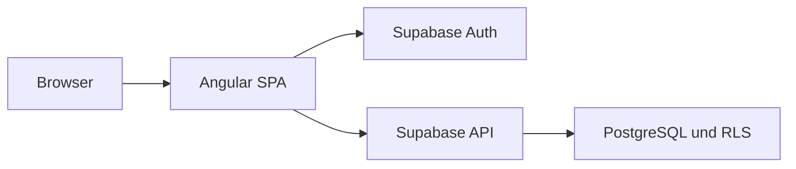

# Build und Deployment

Dieses Dokument beschreibt den Produktions-Build, die benötigte Supabase-Konfiguration und die Veröffentlichung der Join-Anwendung.

## Ziel

Der Deploymentprozess soll sicherstellen, dass:

- ein geprüfter Stand aus `main` veröffentlicht wird
- das Angular-Bundle reproduzierbar erzeugt wird
- keine geheimen Supabase-Schlüssel veröffentlicht werden
- alle SPA-Routen direkt und nach einem Reload funktionieren
- Authentifizierung und Gastzugang korrekt konfiguriert sind
- Datenbankschema, Tabellenrechte und RLS zum Frontend passen
- die veröffentlichte Anwendung nach dem Upload geprüft wird

## Deploymentarchitektur

Join besteht aus zwei getrennten Systemen:



| Bereich | Bereitstellung |
| --- | --- |
| Angular-Anwendung | statische Browserdateien |
| Routing | clientseitiges Angular-Routing |
| Authentifizierung | Supabase Auth |
| Datenzugriff | Supabase API |
| Datenbank | Supabase PostgreSQL |
| Zugriffsschutz | Grants und Row Level Security |
| Server-Rendering | nicht verwendet |
| eigener Node-Server | nicht erforderlich |

Join verwendet kein SSR und kein SSG. Auf dem Webserver wird daher kein laufender Angular- oder Node-Prozess benötigt.

## Deploymentziel

Für die Projektabgabe wird der erzeugte Browser-Build im vorgesehenen Bereich `angular-projects` der Developer Akademie veröffentlicht.

Das Repository enthält keinen vollständig automatisierten CI/CD-Prozess. Der finale Build und die Veröffentlichung erfolgen daher kontrolliert als manueller Deploymentvorgang.

Ein erfolgreiches lokales `ng serve` ist noch kein Deploymentnachweis.

## Voraussetzungen

Vor dem Build werden benötigt:

- aktueller und geprüfter `main`-Branch
- kompatible Node.js-Version
- npm
- vorhandene `package-lock.json`
- lokale Produktions-Environment-Datei
- aktive Supabase-Projektinstanz
- vollständiges Datenbankschema
- angewendete SQL-Migrationen
- konfigurierte Grants und RLS-Policies
- aktivierte Auth-Verfahren
- korrekte Auth-Redirect-URLs
- Zugriff auf das Deploymentziel

Versionen prüfen:

```bash
node --version
npm --version
ng version
```

Die im Lockfile festgelegten Paketversionen sind für den reproduzierbaren Build maßgeblich.

## Finalen Stand laden

Vor dem Deployment:

```bash
git switch main
git pull origin main
git status
```

`git status` muss verständlich sein. Ein Produktions-Build wird nicht aus einem unbekannten oder ungeprüften Arbeitsstand veröffentlicht.

Commit kontrollieren:

```bash
git log -1 --oneline
```

Der veröffentlichte Commit sollte für das Team nachvollziehbar dokumentiert werden.

## Abhängigkeiten reproduzierbar installieren

Für den finalen Build:

```bash
npm ci
```

`npm ci`:

- verwendet die `package-lock.json`
- installiert den festgelegten Abhängigkeitsstand
- meldet Abweichungen zwischen `package.json` und Lockfile
- vermeidet eine unbeabsichtigte Aktualisierung des Lockfiles

Wenn `npm ci` fehlschlägt, wird nicht ungeprüft das Lockfile ersetzt. Zuerst wird die Ursache der Abweichung geklärt.

## Environment-Konfiguration

Die Supabase-Konfiguration wird zentral über die Angular-Environment-Dateien bereitgestellt.

Lokale Dateien:

```text
src/environments/environment.ts
src/environments/environment.development.ts
```

Diese Dateien enthalten die projektspezifischen Werte und werden nicht committed.

Eine commitfähige Vorlage kann so aussehen:

```typescript
export const environment = {
  production: false,
  supabaseUrl: 'YOUR_SUPABASE_PROJECT_URL',
  supabaseAnonKey: 'YOUR_SUPABASE_ANON_KEY',
};
```

Für den Produktions-Build muss die verwendete Konfiguration den Produktivzustand abbilden:

```typescript
export const environment = {
  production: true,
  supabaseUrl: 'YOUR_SUPABASE_PROJECT_URL',
  supabaseAnonKey: 'YOUR_SUPABASE_ANON_KEY',
};
```

Die genauen File-Replacements werden in `angular.json` kontrolliert.

## Erlaubter Supabase-Key

Im Angular-Frontend ist erlaubt:

```text
anon public key
```

Nicht erlaubt:

```text
service_role key
```

Der öffentliche `anon`-Key ist Bestandteil des Browser-Bundles und kann technisch von Benutzern eingesehen werden. Das ist bei Supabase vorgesehen.

Die Sicherheit entsteht nicht dadurch, dass der `anon`-Key verborgen wird. Sie entsteht durch:

- Authentifizierung
- Tabellenrechte
- Row Level Security
- sichere Datenbankfunktionen
- korrekte Policies
- den Ausschluss des `service_role`-Keys

Der `service_role`-Key umgeht RLS und darf niemals in das Frontend gelangen.

## Prüfung auf versehentlich veröffentlichte Schlüssel

Vor dem Deployment:

```bash
git grep -n "service_role"
git grep -n "supabase"
git grep -n "anon"
```

Die Ergebnisse werden manuell geprüft. Das Wort `service_role` kann beispielsweise korrekt in einer Sicherheitsdokumentation stehen. Entscheidend ist, dass kein echter geheimer Wert im Repository enthalten ist.

Wenn ein geheimer Key committed wurde, reicht das Entfernen aus der aktuellen Datei möglicherweise nicht aus. Er kann weiterhin in der Git-Historie vorhanden sein.

Dann muss:

1. der betroffene Key in Supabase rotiert werden
2. die Anwendung auf den neuen Key umgestellt werden
3. geprüft werden, ob eine Bereinigung der Git-Historie erforderlich ist
4. das Team informiert werden

## Supabase-Client

Die Angular-Anwendung erzeugt den Supabase-Client zentral mit:

```text
environment.supabaseUrl
environment.supabaseAnonKey
```

Components erzeugen keine eigenen Supabase-Clients.

Der Zugriff erfolgt über die vorhandenen Services und Repositories. Dadurch bleiben Authentifizierung, Datenzugriff, Mapping und Fehlerbehandlung kontrollierbar.

## Datenbankschema

Vor der Veröffentlichung müssen alle für den finalen Code erforderlichen Migrationen angewendet sein.

Dazu gehören insbesondere:

- Kontakte
- Tasks
- Subtasks
- Kontaktzuweisungen
- Taskpositionen
- Relation zu Auth-Benutzern
- Fremdschlüssel
- Unique Constraints
- Trigger
- Grants
- RLS-Policies

Nur Änderungen in einer einzelnen Supabase-Weboberfläche sind kein ausreichender reproduzierbarer Deploymentstand. Die versionierten SQL-Migrationen sind die technische Grundlage.

Details stehen unter [Datenbank und Sicherheit](../architecture/database-security.md).

## Auth-Konfiguration

Der finale Auth-Ablauf umfasst:

- Registrierung mit E-Mail und Passwort
- E-Mail-Bestätigung
- Anmeldung
- Session-Wiederherstellung
- Abmeldung
- anonymen Gastzugang

Dazu muss die Supabase-Auth-Konfiguration zum Frontend passen.

Zu prüfen sind:

```text
Email provider aktiviert
E-Mail-Bestätigung passend zum finalen Ablauf konfiguriert
Anonymous Sign-ins für den Gastzugang aktiviert
Site URL auf die veröffentlichte Anwendung gesetzt
erforderliche Redirect URLs eingetragen
keine veralteten lokalen Redirects als einzige erlaubte Ziele
```

Der anonyme Gastzugang verwendet einen echten anonymen Supabase-Benutzer. Nach erfolgreicher Authentifizierung arbeitet diese Session mit dem für authentifizierte Nutzer vorgesehenen Zugriff.

Der öffentliche Browser-Key allein verleiht noch keine authentifizierte Sitzung.

## Auth-Redirect-URLs

Für E-Mail-Bestätigungen und andere Auth-Weiterleitungen muss die veröffentlichte Origin in Supabase erlaubt sein.

Beispielstruktur:

```text
https://<deployment-domain>/
```

Wenn Join unter einem Unterpfad veröffentlicht wird:

```text
https://<deployment-domain>/<projektpfad>/
```

Die tatsächlich verwendete URL wird aus dem Deploymentziel übernommen und nicht geraten.

Nach der Konfiguration werden mindestens geprüft:

- Link aus der Bestätigungs-E-Mail
- Weiterleitung zur Anwendung
- Wiederherstellung der Session
- Zugriff auf geschützte Routen
- Verhalten bei abgelaufenem oder ungültigem Link

## Tests vor dem Build

Vor dem Produktions-Build:

```bash
npm test -- --watch=false
```

Der final dokumentierte Ausgangsstand umfasst:

```text
214 von 214 erfolgreichen Tests
```

Wenn weitere Tests ergänzt werden, muss diese Zahl in der Dokumentation aktualisiert werden.

Ein fehlerhafter Testlauf wird nicht für das Deployment ignoriert.

Details stehen unter [Tests](../engineering/testing.md).

## Produktions-Build erstellen

Build starten:

```bash
npm run build
```

Der Befehl erzeugt das optimierte Angular-Bundle.

Dazu gehören abhängig von der Angular-Konfiguration:

- JavaScript-Bundles
- Styles
- `index.html`
- Assets
- gehashte Dateinamen
- optimierte Produktionsausgabe

Die genaue Ausgabe wird durch `angular.json` bestimmt.

Typischer Ausgabebereich:

```text
dist/<projektname>/browser/
```

Der tatsächlich gültige Pfad wird nach jedem Build über die Terminalausgabe und `angular.json` kontrolliert.

Nicht pauschal angenommen wird:

```text
dist/
```

wenn Angular die veröffentlichbaren Dateien in einem darunterliegenden `browser`-Ordner erzeugt.

## Buildausgabe prüfen

Nach dem Build wird geprüft:

```text
index.html vorhanden
JavaScript-Bundles vorhanden
Styles vorhanden
assets-Verzeichnis vorhanden
keine Environment-Quelldateien veröffentlicht
keine service_role-Werte enthalten
keine unerwarteten Testdateien enthalten
```

Die Veröffentlichung benötigt die vollständige zusammengehörige Buildausgabe. Nur `index.html`, einzelne JavaScript-Dateien oder eine JSON-Datei hochzuladen reicht nicht aus.

## Build-Budgets

In `angular.json` sind folgende Produktions-Budgets definiert:

| Budget | Warnung | Fehler |
| --- | ---: | ---: |
| initiales Bundle | `500kB` | `1MB` |
| einzelner Component-Style | `15kB` | `25kB` |

Eine Warnung beendet den Build nicht automatisch.

Sie bedeutet dennoch:

- Ursache prüfen
- ungenutzte Imports kontrollieren
- Paketgröße kontrollieren
- SCSS-Dopplungen kontrollieren
- Auswirkung dokumentieren
- entscheiden, ob die Warnung vor der Abgabe behoben werden muss

Ein Error-Budget verhindert den erfolgreichen Produktions-Build.

Budgets werden nicht ungeprüft erhöht, nur damit der Build wieder erfolgreich ist.

## Buildwarnungen

Besonders zu prüfen sind:

- ungenutzte Standalone-Imports
- überschrittene Bundle-Warnbudgets
- überschrittene Component-Style-Warnbudgets
- fehlende Dateien
- fehlerhafte Asset-Pfade
- veraltete APIs
- TypeScript-Warnungen
- inkonsistente Paketversionen

Eine bekannte Warnung wird nicht automatisch zu einem Fehler. Sie wird aber auch nicht als gelöst dokumentiert, solange sie weiterhin ausgegeben wird.

## SPA-Routing

Join verwendet clientseitiges Angular-Routing.

Beispiele:

```text
/
 /login
 /signup
 /summary
 /board
 /add-task
 /contacts
 /help
 /privacy-policy
 /legal-notice
```

Beim internen Navigieren übernimmt Angular die Route.

Bei einem direkten Aufruf oder Browser-Reload fragt der Browser die Route jedoch beim Webserver an:

```text
GET /board
```

Der Webserver muss unbekannte Anwendungsrouten auf `index.html` zurückführen.

Ohne SPA-Fallback kann Folgendes passieren:

```text
Navigation innerhalb der App funktioniert
    ↓
Reload auf /board
    ↓
404 vom Webserver
```

## Apache-Fallback

Wenn der Zielserver Apache verwendet und noch keinen SPA-Fallback bereitstellt, kann im Deploymentverzeichnis eine passende `.htaccess` erforderlich sein.

Beispiel für eine Anwendung im jeweiligen Deploymentverzeichnis:

```apache
<IfModule mod_rewrite.c>
  RewriteEngine On

  RewriteCond %{REQUEST_FILENAME} -f [OR]
  RewriteCond %{REQUEST_FILENAME} -d
  RewriteRule ^ - [L]

  RewriteRule ^ index.html [L]
</IfModule>
```

Diese Datei wird nur verwendet, wenn:

- das Zielsystem `.htaccess` unterstützt
- noch keine entsprechende Serverregel existiert
- das Deploymentverfahren eigene Serverregeln erlaubt

Eine vorhandene Plattformkonfiguration wird nicht ungeprüft durch eine zusätzliche `.htaccess` überschrieben.

## Unterpfad und Base-Href

Standardmäßig geht Angular häufig von einer Veröffentlichung an der Domainwurzel aus:

```html
<base href="/">
```

Wenn die Anwendung tatsächlich unter einem Unterpfad veröffentlicht wird, muss der Build zu diesem Pfad passen.

Beispiel:

```bash
ng build --base-href /<projektpfad>/
```

Diese Option wird nur verwendet, wenn die reale Deployment-URL einen Unterpfad enthält.

Eine falsche Base-Href verursacht typischerweise:

- JavaScript-404
- Stylesheet-404
- fehlende Assets
- leere Seite
- fehlerhafte Navigation

Nach dem Deployment werden die geladenen URLs im Network-Tab kontrolliert.

## Veröffentlichung

Für die Veröffentlichung wird der vollständige Inhalt des tatsächlichen Browser-Ausgabeverzeichnisses verwendet.

Prinzip:

```text
lokaler Produktions-Build
    ↓
vollständige Browser-Ausgabe
    ↓
Upload in das vorgesehene angular-projects-Ziel
    ↓
veröffentlichte URL öffnen
    ↓
Smoke-Test durchführen
```

Nicht hochgeladen werden:

- `src/`
- `node_modules/`
- Unit-Test-Quelldateien
- lokale Environment-Quelldateien
- Git-Verzeichnis
- Editor-Konfigurationen
- unkompilierter Angular-Quellcode als Ersatz für den Build

Join benötigt auf dem statischen Webserver kein `npm install` und kein `ng serve`.

## Vollständiger Deploymentablauf

```bash
git switch main
git pull origin main
git status
npm ci
npm test -- --watch=false
npm run build
git diff --check
git status --short
```

Danach:

```text
[ ] Buildausgabe lokalisieren
[ ] vollständige Buildausgabe hochladen
[ ] veröffentlichte Root-URL öffnen
[ ] direkte Routen testen
[ ] Reload auf direkten Routen testen
[ ] Auth-Abläufe testen
[ ] CRUD-Abläufe testen
[ ] Browserkonsole prüfen
[ ] Network-Tab prüfen
[ ] mobile Ansicht prüfen
```

## Smoke-Test nach dem Deployment

Nach jeder Veröffentlichung werden mindestens geprüft:

### Allgemein

```text
[ ] Anwendung lädt
[ ] keine leere Seite
[ ] Join-Logo und Assets laden
[ ] keine JavaScript-Fehler
[ ] keine Asset-404
[ ] kein ungewollter horizontaler Page-Scroll
```

### Routing

```text
[ ] Root-Route funktioniert
[ ] Login und Signup funktionieren
[ ] direkte Navigation auf /board funktioniert
[ ] Reload auf /board funktioniert
[ ] direkte Navigation auf /contacts funktioniert
[ ] Reload auf /contacts funktioniert
[ ] geschützte Route leitet ohne Session korrekt weiter
```

### Authentifizierung

```text
[ ] Registrierung funktioniert
[ ] E-Mail-Bestätigung verwendet die Deployment-URL
[ ] Login funktioniert
[ ] Gastzugang funktioniert
[ ] Session bleibt nach Reload erhalten
[ ] Logout beendet die Session
[ ] geschützte Routen sind danach nicht mehr zugänglich
```

### Kontakte

```text
[ ] Kontakte laden
[ ] Kontakt kann erstellt werden
[ ] Kontakt kann bearbeitet werden
[ ] Kontakt kann gelöscht werden
[ ] Auth-Relation verursacht keinen Fehler
```

### Tasks und Board

```text
[ ] Tasks laden
[ ] Task kann erstellt werden
[ ] Task kann bearbeitet werden
[ ] Task kann gelöscht werden
[ ] Subtasks können aktualisiert werden
[ ] Kontakte können zugewiesen werden
[ ] Statusänderung funktioniert
[ ] Reihenfolge bleibt nachvollziehbar
[ ] Suche und Empty States funktionieren
```

### Responsive Darstellung

```text
[ ] Smartphone
[ ] Tablet
[ ] Desktop
[ ] mobile Navigation
[ ] Dialoge
[ ] Dropdowns
[ ] sticky Aktionen
[ ] Scrollbereiche
```

## Browserkonsole

Nach dem Deployment werden geprüft:

- JavaScript-Fehler
- nicht behandelte Promise-Rejections
- Supabase-Fehler
- Auth-Fehler
- Asset-404
- Routing-Fehler
- CORS-Fehler
- Mixed-Content-Warnungen

Eine optisch sichtbare Anwendung kann technisch trotzdem fehlerhaft sein.

## Network-Prüfung

Im Network-Tab werden mindestens kontrolliert:

```text
index.html
JavaScript-Bundles
Stylesheets
SVG- und Bildassets
Supabase-Requests
Auth-Requests
Statuscodes
Request- und Responsefehler
```

Erwartete statische Dateien müssen mit erfolgreichen Statuscodes geladen werden.

Supabase-Requests dürfen keine unerwarteten `401`, `403`, `404` oder `500` zurückgeben.

## HTTPS

Die veröffentlichte Anwendung muss über HTTPS erreichbar sein.

Das ist insbesondere relevant für:

- sichere Auth-Sessions
- E-Mail-Redirects
- Browser-Sicherheitsregeln
- Vermeidung von Mixed Content

Alle eingetragenen Supabase-Redirect-URLs müssen das tatsächlich verwendete Protokoll und die korrekte Domain enthalten.

## RLS und Browser-Sicherheit

Das Frontend darf niemals als Sicherheitsgrenze behandelt werden.

Folgende Maßnahmen im Angular-Code reichen nicht als Zugriffsschutz:

- Route Guard
- versteckter Button
- deaktiviertes Formular
- nicht sichtbarer Menüpunkt
- clientseitige ID-Prüfung

Die tatsächliche Datenbanksicherheit wird durch Supabase-Grants und RLS umgesetzt.

Ein Angreifer kann Browserrequests unabhängig von der sichtbaren Oberfläche senden. Deshalb müssen unerlaubte Requests bereits in PostgreSQL abgewiesen werden.

## Gastzugang

Der Gastzugang darf nicht mit einem ungeschützten Datenbankzugriff verwechselt werden.

Ablauf:

```text
Gastzugang auswählen
    ↓
Supabase erzeugt anonymen Auth-Benutzer
    ↓
Session enthält Auth-JWT
    ↓
Requests laufen als authentifizierte Session
    ↓
RLS und Grants werden angewendet
```

Wenn Anonymous Sign-ins im Supabase-Projekt deaktiviert sind, kann der finale Gastzugang nicht funktionieren.

## E-Mail-Bestätigung

Bei aktivierter E-Mail-Bestätigung gilt:

```text
Registrierung
    ↓
Supabase erstellt Benutzer
    ↓
Bestätigungs-E-Mail wird versendet
    ↓
Benutzer öffnet den Link
    ↓
Supabase leitet zur erlaubten Deployment-URL
    ↓
Anmeldung oder Session-Wiederherstellung
```

Vor der Abgabe wird dieser Ablauf mit einer real erreichbaren E-Mail-Adresse geprüft.

Frontend-Unit-Tests können den echten Mailversand nicht bestätigen.

## Fehler nach dem Deployment

Bei einer leeren Seite werden zuerst geprüft:

```text
Browserkonsole
Network-Tab
Base-Href
JavaScript-404
Asset-404
verwendetes Deploymentverzeichnis
hochgeladene index.html
```

Bei einem 404 nach Reload:

```text
SPA-Fallback
.htaccess oder Plattformrouting
Base-Href
Deployment-Unterpfad
```

Bei Supabase-Fehlern:

```text
Supabase URL
anon public key
Auth-Session
Projektstatus
Tabellen
Migrationen
Grants
RLS-Policies
Trigger
Redirect-URLs
```

Bei funktionierendem Login, aber fehlenden Daten:

```text
JWT vorhanden
Request läuft als authenticated
SELECT-Policy vorhanden
Tabellenrechte vorhanden
Mapper erwartet richtige Spalten
Migrationen vollständig
```

## Rollback

Wenn ein Deployment einen kritischen Fehler enthält, wird der vorherige geprüfte Stand erneut veröffentlicht.

Dafür muss bekannt sein:

- welcher Commit zuletzt funktioniert hat
- welche Buildausgabe dazu gehört
- ob gleichzeitig Datenbankmigrationen veröffentlicht wurden
- ob eine Migration rückwärtskompatibel ist
- ob ein Datenbank-Rollback erforderlich oder gefährlich wäre

Ein Frontend-Rollback ist nicht automatisch ausreichend, wenn das Datenbankschema bereits inkompatibel verändert wurde.

Destruktive Datenbank-Rollbacks werden nicht ohne Sicherung und Teamentscheidung durchgeführt.

## Cache

Angular verwendet für Produktionsbundles gehashte Dateinamen. Dadurch können geänderte Bundles als neue Dateien veröffentlicht werden.

Die `index.html` verweist auf die jeweils aktuellen Bundle-Namen.

Nach einem Deployment mit unerwartetem altem Stand werden geprüft:

- Browsercache
- Plattformcache
- tatsächlich hochgeladene `index.html`
- Bundle-Dateinamen
- verwendeter Deploymentpfad

Nur den Browsercache zu leeren ersetzt keine Kontrolle der veröffentlichten Dateien.

## Nicht Teil des Deployments

Nicht als bereits umgesetzt dokumentiert sind:

- automatisierte CI/CD-Pipeline
- automatische Datenbankmigration beim Push
- automatische RLS-Regressionstests
- automatischer End-to-End-Test gegen die veröffentlichte Anwendung
- automatischer visueller Regressionstest
- serverseitiges Angular-Rendering
- eigener Node-Produktionsserver
- vollständiges Monitoring
- automatischer versionierter Rollback

Der Deploymentprozess bleibt für den finalen Projektstand manuell.

## Bekannte Grenzen

Der finale Deploymentaufbau besitzt folgende Grenzen:

1. Das Frontend hängt von der Verfügbarkeit des Supabase-Projekts ab.
2. Auth-Redirects müssen außerhalb des Repositories korrekt konfiguriert werden.
3. Der SPA-Fallback hängt von der Konfiguration des Zielservers ab.
4. Environment-Dateien werden lokal bereitgestellt und nicht automatisch durch eine CI/CD-Pipeline injiziert.
5. Datenbankmigrationen werden nicht automatisch beim Frontenddeployment ausgeführt.
6. E-Mail-Bestätigung benötigt einen realen manuellen Test.
7. Der Gastzugang benötigt aktivierte anonyme Supabase-Anmeldungen.
8. Unit-Tests prüfen kein reales Deployment.
9. Responsive Darstellung wird nicht durch jsdom abgesichert.
10. Ein dokumentierter automatischer Rollback ist nicht vorhanden.

Diese Grenzen werden nicht durch einen erfolgreichen Angular-Build verdeckt.

## Abgabe-Checkliste

```text
[ ] finaler main-Stand geladen
[ ] veröffentlichter Commit dokumentiert
[ ] npm ci erfolgreich
[ ] 214/214 Tests oder aktualisierter neuer Teststand erfolgreich
[ ] npm run build erfolgreich
[ ] Buildwarnungen geprüft
[ ] git diff --check sauber
[ ] git status verständlich
[ ] Environment verwendet richtige Supabase-Werte
[ ] ausschließlich anon public key im Frontend
[ ] kein service_role-Key veröffentlicht
[ ] Datenbankmigrationen vollständig
[ ] Grants und RLS geprüft
[ ] Auth-Redirect-URLs korrekt
[ ] Anonymous Sign-ins für Gastzugang aktiv
[ ] vollständige Browser-Buildausgabe veröffentlicht
[ ] Root-Route erreichbar
[ ] direkte Routen und Reload funktionieren
[ ] Registrierung geprüft
[ ] E-Mail-Bestätigung geprüft
[ ] Login geprüft
[ ] Gastzugang geprüft
[ ] Session-Restore geprüft
[ ] Logout geprüft
[ ] Kontakte-CRUD geprüft
[ ] Task-CRUD geprüft
[ ] Subtasks und Zuweisungen geprüft
[ ] Browserkonsole ohne neue Fehler
[ ] keine Asset-404
[ ] mobile und Desktopdarstellung geprüft
```

## Häufige Fehler vermeiden

- aus einem Entwicklungsbranch statt aus dem geprüften `main` deployen
- mit lokalen ungeprüften Änderungen builden
- `npm install` verwenden und dabei das Lockfile unbeabsichtigt verändern
- nur `index.html` hochladen
- den falschen `dist`-Ordner hochladen
- den übergeordneten Ordner statt des Browserinhalts veröffentlichen
- den `service_role`-Key im Frontend verwenden
- eine Route nur über interne Navigation testen
- den Reload auf `/board` oder `/contacts` nicht prüfen
- Base-Href bei einem Unterpfad ignorieren
- Auth-Redirect-URLs nur auf `localhost` stehen lassen
- den Gastzugang bei deaktivierten Anonymous Sign-ins veröffentlichen
- Frontend-Guards als Ersatz für RLS behandeln
- Datenbankänderungen nur manuell in einem einzelnen Supabase-Projekt vornehmen
- Buildwarnungen ungeprüft ignorieren
- einen erfolgreichen Build mit erfolgreichem Deployment gleichsetzen
- Browserkonsole und Network-Tab nicht prüfen
- ein Frontend-Rollback ohne Prüfung der Datenbankkompatibilität durchführen

## Weiterführende Dokumentation

- [Anwendungsarchitektur](../architecture/application.md)
- [Datenbank und Sicherheit](../architecture/database-security.md)
- [Authentifizierung und Routing](../architecture/authentication-routing.md)
- [Kontakte](../features/contacts.md)
- [Tasks und Board](../features/tasks-board.md)
- [Formulare und Validierung](../features/forms-validation.md)
- [Code-Konventionen](../engineering/conventions.md)
- [State- und Fehlerbehandlung](../engineering/state-error-handling.md)
- [Styling und Barrierefreiheit](../engineering/styling-accessibility.md)
- [Tests](../engineering/testing.md)
- [Entwicklungsworkflow](development-workflow.md)